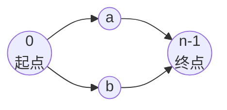
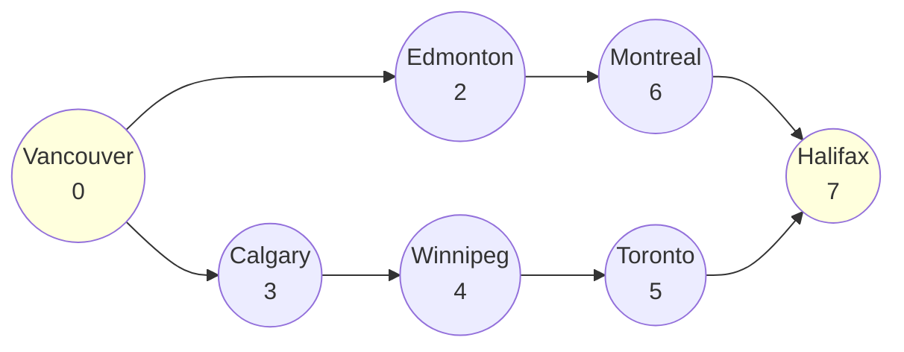

[[TOC]]

# 周游加拿大

## 题意

> 给定 $N \le 100$ 个城市（已按**自西向东**编号）和 $V$ 条双向直达航线，找一条从**最西边城市（编号 0）**出发、经过每个城市至多一次（起点除外，起点出现两次）的闭合旅行路线，使访问的**不同城市数**最多。输出该最大值；一条路线都找不到时输出 1。

旅行路线的形状：先自西向东走到最东边城市，再自东向西折返——**去程和回程方向一致（自西向东），且两条路径除起点外不共用任何城市**。

## 思路

**朴素思路**：直接在图上 DFS 找最长简单环。环的形态被两个约束绑死——

1. 环必须经过编号最小的城市 0；
2. 环上的边必须能拆成两条**编号严格递增**的链，两条链只在 0 和 $n-1$ 处汇合。

为什么必须递增？环从 0 出发先走「去程」到最东边、再走「回程」回来，两段路的走向都是自西向东（回程是逆向走的，但从 0 的视角看依然是从西往东编号递增的另一个分支）。因此整个环其实就是**两条从 0 到 $n-1$ 的、中间点互不相同的上升路径**拼起来的闭合曲线。

朴素 DFS 的状态空间太大（同一个点可能以「去程经过 / 回程经过」两种身份出现，无法用简单的 `visited` 排重），需要换成**成对 DP**。

**状态设计**：设 `dp[a][b]`（$a \le b$）= 去程当前停在城市 $a$、回程当前停在城市 $b$ 时，已被这两条链覆盖的**不同城市数**（计入起点 0，暂不计终点 $n-1$）。

**状态转移**：扩展两条链中「编号较小」的那个端点，保证它永远跳到比 $\max(a,b)$ 更大的城市，避免回头或越过另一条链的端点。

- 扩展去程 $a \to c$：要求 $c > \max(a,b)$ 且 $a$ 与 $c$ 之间有边，转移到 `dp[c][b] = dp[a][b] + 1`；
- 扩展回程 $b \to c$：要求 $c > b$ 且 $b$ 与 $c$ 之间有边，转移到 `dp[c][a] = dp[a][b] + 1`（去程端点 $a$ 与新端点 $c$ 比较后交换顺序）。

注意 $a = b$ 的中间态没有意义——两条链在中间汇合意味着它们共享了一个非起终点城市，违反「每城只访问一次」。所以除初始态 `dp[0][0] = 0` 外，DP 过程中只允许 $a < b$ 的状态存活。

**闭合答案**：当两条链都抵达终点（或一条已抵达、另一条停在 $b$ 且 $b$ 与终点相邻）时，加上终点本身这个城市，得到环大小：

- 去程停 $n-1$、回程停 $b < n-1$ 且 $(b, n-1)$ 有边：$ans = dp[n-1][b] + 1$；
- $n = 1$ 特判：答案为 1。

**复杂度**：状态 $O(N^2)$，每个状态向后扩展 $O(N)$ 个城市，总复杂度 $O(N^3)$；$N \le 100$ 时约 $10^6$ 量级，远在时限内。

### 样例可视化

以样例输入（8 城 9 边）为例，最优环为 `Vancouver → Edmonton → Montreal → Halifax → Toronto → Winnipeg → Calgary → Vancouver`，把它拆成两条上升链：

| 链 | 路径（按城市编号递增） | 对应 dp 维度 |
|---|---|---|
| 去程（A 链） | 0 (Vancouver) → 2 (Edmonton) → 6 (Montreal) | dp[a][b] 的 a |
| 回程（B 链） | 0 (Vancouver) → 3 (Calgary) → 4 (Winnipeg) → 5 (Toronto) → 7 (Halifax) | dp[a][b] 的 b |

DP 过程（列出关键状态，城市用编号表示；dp 值不含终点 Halifax=7，闭合时 +1 补回）：

| dp 状态 `(a, b)` | 含义 | 覆盖城市数（不含终点） |
|---|---|---|
| `(0, 0)` | 两条链都还在起点 | 0 |
| `(2, 3)` | 去程到 Edmonton、回程到 Calgary | 3 |
| `(6, 3)` | 去程到 Montreal、回程仍在 Calgary | 3 |
| `(6, 4)` | 去程到 Montreal、回程到 Winnipeg | 4 |
| `(6, 5)` | 去程到 Montreal、回程到 Toronto | 5 |
| `(7, 5)` | 去程到终点 Halifax、回程到 Toronto | 6 |
| 闭合 `(7,5) → +1` | 回程从 Toronto 直达终点 Halifax，补上 Halifax | **7** |

最终 `best = dp[7][5] + 1 = 7`，与样例输出一致。

## 代码

@include-code(./main.py, python)

## 复杂度

- 时间：$O(N^3)$ —— $N^2$ 个状态，每个状态 $O(N)$ 次转移。
- 空间：$O(N^2)$ —— 邻接矩阵 + dp 表。

## 边界与陷阱

- **$a = b$ 状态非法**：两条链在中间汇合即共享中间城市，必须禁止（起点 0 除外），否则会像两条链「合体」一样重复计数、得出偏大的答案。
- **转移的扫描范围**：去程扩展时新城市 $c$ 必须大于 $\max(a,b)$，否则会越过另一条链的端点，造成同一城市被两条链同时覆盖。
- **闭合时 +1**：dp 值不含终点 $n-1$，最后闭合环时要把终点这个城市补上。
- **无解特判**：输出 1（题目规定的兜底值）。
