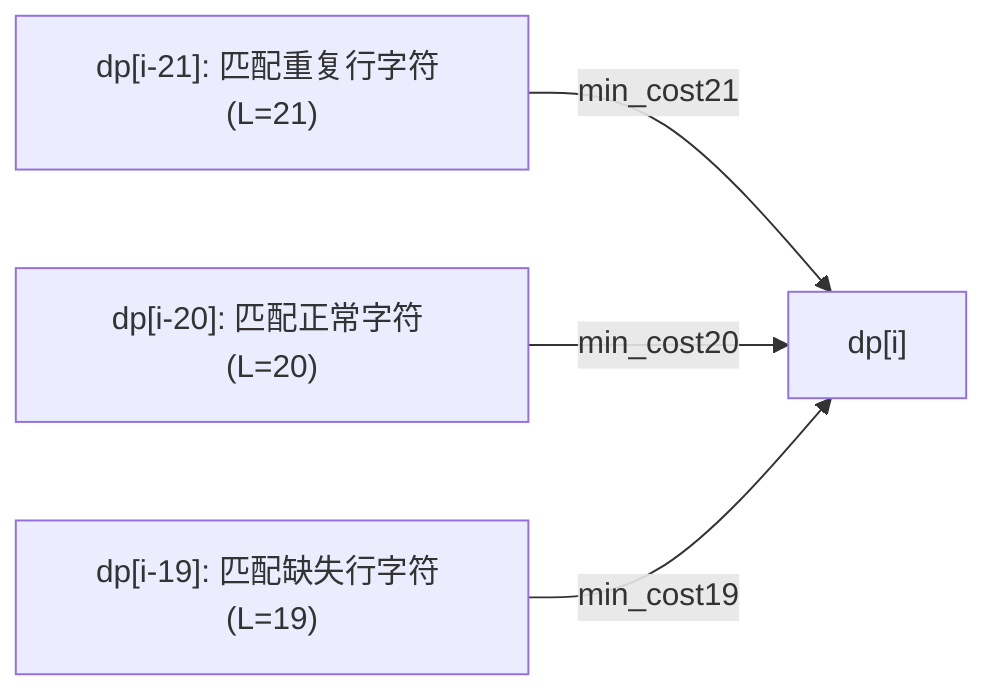

[[TOC]]

## 形式化题目

给定字符集 $\Sigma$ 包含 27 个字符（空格及 26 个小写英文字母），每个字符由 $20 \times 20$ 的 01 矩阵（字模）表示。

给定由 $N$ 行长为 20 的 01 串构成的图像序列。该序列由未知字符序列依次拼接而成，但在传输中每个字符均可能发生行损坏与位翻转：
1. 每个字符的行数可能为 19（恰好缺失一行）、20（行数未变）或 21（恰好有一行被重复一次，且重复行紧随其后）。
2. 当某行被重复为两行时，该行与字模对应行之间的差异仅按两者中差异较小的一行计算。
3. 图像序列中某些位置的位可能发生反转（$0 \leftrightarrow 1$）。

求一种将输入序列完整分割为连续字符图案的方案，使得所有字符图案与对应标准字模的总位差异（汉明距离）最小，输出识别出的字符序列。

## 正解

### 思路

本题是典型的**线性序列划分动态规划**问题。

#### 1. 状态定义

设 $dp[i]$ 表示成功识别并匹配输入前 $i$ 行图像时的最小总错误位代价。  
因为每个字符在受损后占用的行数只可能是 $19$、$20$ 或 $21$ 行，因此到达状态 $i$ 只能由以下三种前驱状态转移而来：
- $dp[i - 19]$：当前字符发生了缺失行错误，占 $19$ 行；
- $dp[i - 20]$：当前字符未发生行增删，占 $20$ 行；
- $dp[i - 21]$：当前字符发生了重复行错误，占 $21$ 行。

#### 2. 行间汉明距离预处理

每行图像均为 $20$ 位的 01 串，可以将其压缩为一个整数。两行的位差异数即为两整数按位异或后的二进制中 $1$ 的个数（内置 `bit_count()`）。  
预处理三维数组 $diff[i][c][r]$，表示输入序列的第 $i$ 行与字符 $c$ 的字模第 $r$ 行之间的汉明距离。

#### 3. 三种长度的匹配代价计算

对于输入的区间 $[i, i + L - 1]$（其中 $L \in \{19, 20, 21\}$）和候选字符 $c$：

- **正常匹配（$L = 20$）**：  
  每一行一一对应：
  $$\text{cost} = \sum_{r=0}^{19} diff[i+r][c][r]$$

- **缺失一行（$L = 19$）**：  
  枚举字模中被遗漏的行号 $k \in [0, 19]$。输入的前 $k$ 行对应字模的前 $k$ 行，输入的后 $19 - k$ 行对应字模的第 $k+1 \dots 19$ 行：
  $$\text{cost}(k) = \sum_{r=0}^{k-1} diff[i+r][c][r] + \sum_{r=k}^{18} diff[i+r][c][r+1]$$
  随着 $k$ 从 $0$ 递增到 $18$，每次更新只需 $O(1)$ 的增量调整，从而在 $O(20)$ 内求出 $\min_{k} \text{cost}(k)$。

- **重复一行（$L = 21$）**：  
  枚举字模中被重复复制的行号 $k \in [0, 19]$。输入中第 $k$ 行与第 $k+1$ 行均来源于字模第 $k$ 行，根据题意只计算损坏较小的那一行：
  $$\min(diff[i+k][c][k], diff[i+k+1][c][k])$$
  其他行保持对应关系。利用前后缀和数组，对每个 $k$ 可在 $O(1)$ 时间内计算出代价，总计 $O(20)$ 求出最优重复行。

#### 4. 路径回溯

在 DP 过程中用 `prev` 数组记录使得 $dp[i]$ 取得最小值的转移前驱位置与识别出的字符。DP 结束后，从 $N$ 出发逆向回溯，即可还原出完整的识别文本。

### 代码

Python 版：

@include-code(./main.py, python)

C++ 版（同一算法）：

@include-code(./main.cpp, cpp)

### 复杂度

- **时间复杂度**：
  - 预处理行汉明距离：输入共 $N$ 行，字符集大小 $|\Sigma| = 27$，字模高度 $H = 20$。每次位运算耗时 $O(1)$，预处理耗时 $O(N \cdot |\Sigma| \cdot H)$。
  - DP 转移：状态数为 $N$，每个状态枚举 3 种步长以及 27 个字符，每种形态的最小代价计算均为 $O(H)$，转移耗时 $O(N \cdot |\Sigma| \cdot H)$。
  - 总时间复杂度为 $O(N \cdot |\Sigma| \cdot H)$。当 $N \le 1200$ 时，总操作次数约为 $1.9 \times 10^6$，在 Python 3 环境下仅需约 $0.2\,\text{s}$。
- **空间复杂度**：
  - 保存预处理距离数组和 DP 状态记录需要 $O(N \cdot |\Sigma| \cdot H)$ 的空间，实测内存占用不超过 $25\,\text{MB}$。

## 总结

1. **结构化特征提取**：利用位运算与整数压缩，在常数时间内求出 20 位行间的汉明距离，极大地削减了字符比对的常数。
2. **局部对齐优化**：对于长度为 19 和 21 的变长匹配，通过滑动更新和前后缀和，将单字符各可能受损位置的枚举优化至 $O(H)$，使整体 DP 复杂度达到最优阶。

## 图示解析

