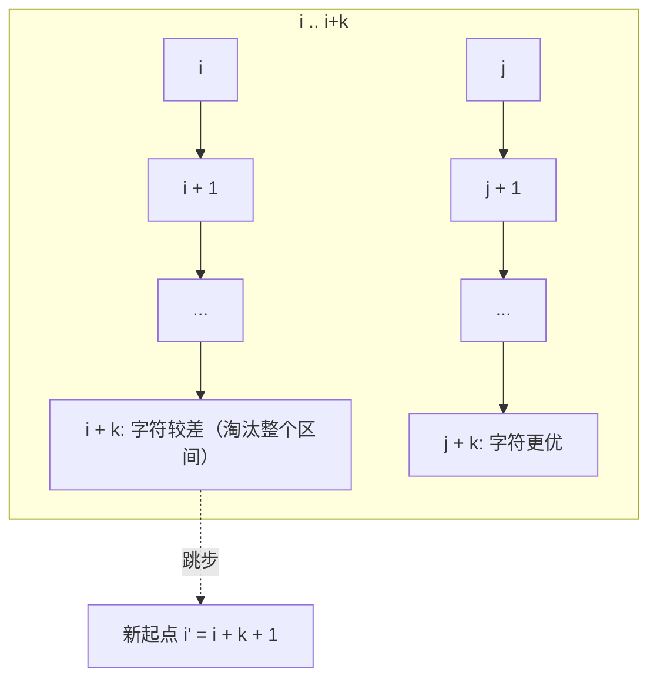

[[TOC]]

## 形式化题目

给定一个长度为 $L$ 的字符串 $S$。将 $S$ 视为环形字符串，定义起始于下标 $p$（$0 \leqslant p < L$）的循环同构串为顺时针依次读取 $L$ 个字符构成的字符串。

求所有 $L$ 个循环同构串中字典序最小的串在原字符串中的起始下标（0-indexed）。若存在多个起始位置对应的同构串字典序相同，输出最小的起始下标。

## 正解

### 思路

将环形字符串倍长为 $S' = S + S$，长度为 $2L$。从任意下标 $p \in [0, L-1]$ 开始的长度为 $L$ 的子串即对应从 $p$ 出发的循环同构串。

若使用朴素比较，两两对比候选子串需要 $O(L^2)$ 时间。在 $L \leqslant 100\,000$ 的约束下会超时。我们采用**双指针最小表示法**（Minimum Representation）优化至 $O(L)$：

维护两个候选起点指针 $i, j$（初始 $i = 0, j = 1$）与当前匹配的公共前缀长度 $k$（初始 $k = 0$）：

1. 比较 $S'[i + k]$ 与 $S'[j + k]$：
   - 若相等，说明当前公共前缀仍相同，令 $k \leftarrow k + 1$。
   - 若 $S'[i + k] > S'[j + k]$，说明在偏移量 $k$ 处，起点 $i$ 劣于起点 $j$。由于两串在 $[0, k-1]$ 范围内的字符完全一致，对于任意偏移量 $p \in [0, k]$，从 $i + p$ 出发的子串在第 $k - p$ 位字符上必然劣于从 $j + p$ 出发的子串。因此区间 $[i, i + k]$ 内的所有起点都不可能成为全局最优解，可以直接淘汰。令 $i \leftarrow i + k + 1$；若此时 $i = j$，则令 $i \leftarrow i + 1$ 保持指针分离，并将 $k$ 重置为 $0$。
   - 若 $S'[i + k] < S'[j + k]$，同理直接淘汰区间 $[j, j + k]$ 内的所有起点，令 $j \leftarrow j + k + 1$；若 $j = i$ 则令 $j \leftarrow j + 1$，并将 $k$ 重置为 $0$。
2. 循环直到 $i \geqslant L$、$j \geqslant L$ 或 $k \geqslant L$ 终止，返回 $\min(i, j)$。

下图展示了在偏移量 $k$ 处发现 $S'[i+k] > S'[j+k]$ 时，区间 $[i, i+k]$ 被批量淘汰并跳步的过程：

### 代码

@include-code(./main.py, python)

### 复杂度

- **时间复杂度**：$\mathcal{O}(L)$。指针 $i$ 与 $j$ 每次跳步都至少推进 $k + 1$，两个指针均单调向后移动且不超过 $2L$，$k$ 匹配的总递增次数受指针跳跃次数所限，因此总体字符比较次数不超过 $2L$。
- **空间复杂度**：$\mathcal{O}(L)$。存储倍长字符串 $S'$ 占用 $\mathcal{O}(L)$ 内存，辅助变量占用 $\mathcal{O}(1)$ 空间。

## 总结

- 环形问题的标准第一步是「破环成链」，即把原串自身拼接一次得到倍长串。
- 最小表示法的精髓在于**利用已匹配的公共前缀信息批量跳过劣势区间**，从而将原本平方阶的双重比较降至严格线性时间。
