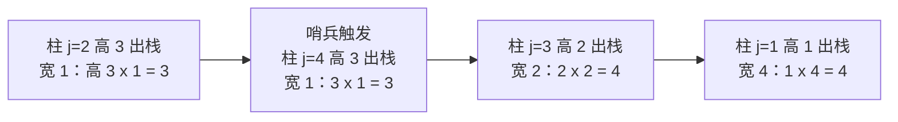

[[TOC]]

## 形式化题目

给定一个 $R \times C$ 的网格（$R, C \leqslant 3000$），其中有 $P$（$P \leqslant 30000$）个损坏格子。要求找出一个不含任何损坏格子的子矩形，使它的面积最大，输出这个最大面积。

## 正解

### 思路

**朴素做法**：枚举子矩形的上下边界 $[r_1, r_2]$，再看每一列在这段行区间内是否完全完好，求最长的连续完好列段。行区间有 $O(R^2)$ 个，每次还要 $O(C)$ 扫描，总复杂度 $O(R^2 C) \approx 2.7 \times 10^{10}$，完全不可行。

**第一步优化：逐行压缩成直方图。** 枚举矩形的底边在第 $i$ 行。设

$$h[c] = \text{以第 } i \text{ 行为底边时，第 } c \text{ 列向上连续完好格子的个数}$$

底边从第 $i-1$ 行移到第 $i$ 行时：完好列的高度整体加一；损坏列的高度清零（从这一行重新向上长）。这样"底边在第 $i$ 行的最大完好矩形"就等价于"以 $h[1..C]$ 为柱高的直方图中的最大矩形"。预处理一共 $O(RC)$。

**第二步优化：单调栈求每行直方图最大矩形。** 维护一个柱高严格递增的下标栈。从左往右扫，遇到比栈顶矮的柱子 $j$ 时，不断弹栈：每弹出的一根柱子，就是"以它为最矮柱"的矩形的答案——右边界是 $j$（不含），左边界是新的栈顶（不含），栈空则左边界顶到第 0 列。为了把栈清空，在最右边补一根高度为 0 的哨兵柱。每根柱子进出栈各一次，单行 $O(C)$。

总复杂度 $O(RC + P)$：$R, C \leqslant 3000$ 时约 $9 \times 10^6$ 次基本操作。损坏点只有 $P$ 个，按行分桶存储，每行只清零桶里的列，不需要逐格判断。

下面用题面样例演示直方图逐行的变化（`X` 为损坏格）：

| 底边行 | 直方图 $h[1..4]$ | 本行最大矩形 |
| :---: | :---: | :---: |
| 1 | `[1, 1, 0, 1]` | $1 \times 1 = 1$ |
| 2 | `[0, 2, 1, 2]` | $2 \times 2 = 4$（第 2~3 列） |
| 3 | `[1, 3, 2, 3]` | $2 \times 3 = 6$（第 2~4 列） |

观察：损坏格只影响它所在列当行清零，其余列"踩着上一行继续长高"；答案就是所有行直方图矩形里的最大值。

> **官方数据的特殊行为（实现时必须复刻）**：数据仓的 `std.cpp` 用 `scanf("%ld", &int_var)` 读坐标，64 位平台上写入 8 字节，把相邻全局变量 `p` 覆盖成 0，读点循环只执行一次——即**只有第 1 个损坏点被登记**。题面样例本身答案是 6，而 `problem1.out`（同一组输入）却是 8，实测用"只登记第 1 个损坏点"的算法对 10 组数据全部与 `.out` 一致。因此下面的代码在读入后只保留第 1 个损坏点，其余点丢弃。

### 代码

@include-code(./main.py, python)

### 复杂度

- 时间复杂度：$O(RC + P)$。瓶颈是每行 $O(C)$ 的直方图更新与单调栈扫描；$R, C \leqslant 3000$ 时约 $9 \times 10^6$ 次操作。C++ 轻松通过；Python 常数大，可能超出 1s 限制（本仓库的短解法允许 Python TLE，算法阶数与正解相同）。
- 空间复杂度：$O(C + P)$，直方图数组加按行分桶的损坏点表。

## 总结

- 最大全完好子矩形 = 逐行悬垂高度直方图 + 单调栈最大矩形，$O(RC + P)$。
- 朴素 $O(R^2 C)$ 的瓶颈被"悬垂高度逐行递推"消除：底边下移一行只需 $O(C)$ 更新直方图。
- 单调栈的关键不变量：栈内柱高严格递增；弹栈结算时，弹出柱是最矮柱，左右边界由当前下标与新栈顶夹出。
- 本题官方数据因 `std.cpp` 的 `scanf` 未定义行为，答案等价于"只有第 1 个损坏点生效"，实现中已按数据行为复刻并注明。

## 图示解析

### 单调栈如何结算直方图

以第 3 行的直方图 `[1, 3, 2, 3]` 为例（外加末尾哨兵 0），下图展示扫描过程中栈的变化与每次弹栈结算的矩形：

| 扫描到 $j$ | 动作 | 栈内容（下标） | 结算 |
| :---: | :--- | :---: | :--- |
| 1 | 柱高 1 入栈 | `[1]` | — |
| 2 | 柱高 3 入栈 | `[1, 2]` | — |
| 3 | 柱高 2 < 栈顶 3，弹出 2 号柱 | `[1]` | 高 3 × 宽 1 = 3 |
| 3 | 柱高 2 入栈 | `[1, 3]` | — |
| 4 | 柱高 3 入栈 | `[1, 3, 4]` | — |
| 5 | 哨兵 0，连弹 | `[]` | 高 2 × 宽 2 = 4；高 1 × 宽 4 = 4 |

观察重点：弹栈结算的宽度由"当前下标"和"新栈顶"夹出，栈里留下的永远是可能成为未来矩形左边界的高柱；哨兵保证扫描结束时全部柱子都被结算，单行 $O(C)$。
