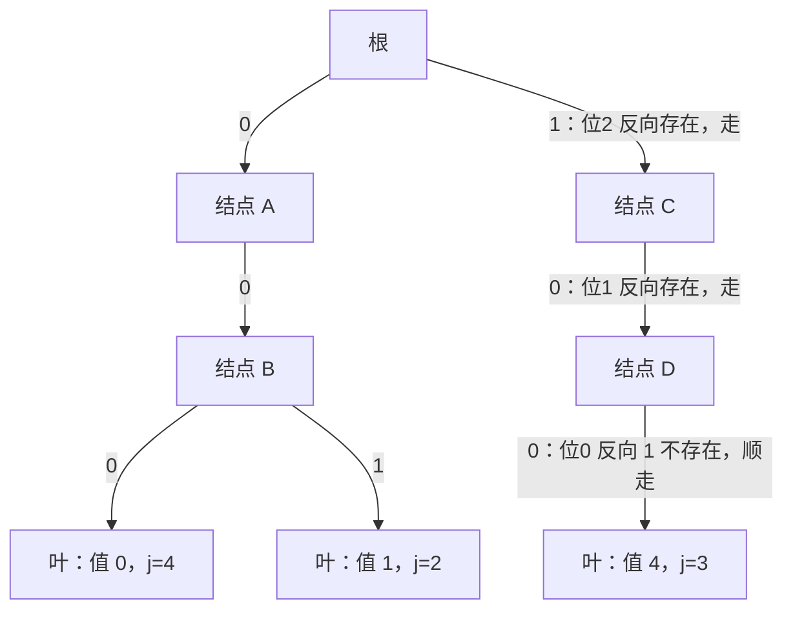

[[TOC]]

## 形式化题目

给定长度 $N$（$1 \leqslant N \leqslant 100\,000$）的整数序列 $a_1, a_2, \dots, a_N$，每个数互不相同且 $0 \leqslant a_i < 2^{21}$。求一个非空连续子段 $a_l \oplus a_{l+1} \oplus \cdots \oplus a_r$，按以下三层规则取最优：

1. 异或值最大；
2. 并列时，结尾 $r$ 最小（奶牛序号越小社会等级越高，"结尾奶牛社会等级最高"即序号最小）；
3. 仍并列时，子段最短（等价于同 $r$ 下 $l$ 最大）。

输出最大异或值及其起点 $l$ 与终点 $r$。样例 $a = [1, 0, 5, 4, 2]$ 中，子段 $[4, 5]$ 的异或 $4 \oplus 2 = 6$ 是全部子段里最大的，输出 `6 4 5`。

## 正解

### 思路

**朴素做法与瓶颈**：枚举全部 $\Theta(N^2)$ 个子段求异或，即便配合前缀异或把单段求值降到 $O(1)$，$N = 10^5$ 时仍有约 $5 \times 10^9$ 次配对，完全不可行。瓶颈在于：每个结尾 $r$ 都把全部起点重扫了一遍，前一个结尾的信息没有被复用。真正需要回答的子问题是——**在历史前缀集合 $\{p_0, \dots, p_{r-1}\}$ 中，快速找出与 $p_r$ 异或最大的成员**。

**第一层优化：前缀异或。** 记 $p_0 = 0$，$p_i = a_1 \oplus \cdots \oplus a_i$，异或的消去律给出

$$\mathrm{xor}(l, r) = p_r \oplus p_{l-1}$$

于是"选子段"变成"选配对 $(j, r)$，$0 \leqslant j < r$"，答案取 $(p_r \oplus p_j,\ j{+}1,\ r)$ 按三层规则的最优者；其中 $j = 0$ 对应起点 1，所以空前缀哨兵 $p_0 = 0$ 必须参与配对，否则起点为 1 的子段全部漏掉。但每个结尾仍要扫描 $O(r)$ 个历史前缀，总代价还是 $\Theta(N^2)$，需要更快的"最大异或查询"。

**第二层优化：01-Trie 上的贪心。** 把 $p_0, \dots, p_{r-1}$ 按 21 位二进制从高位到低位插入一棵 01-Trie（每层一个二进位，0/1 各一个儿子）。查询 $p_r$ 时逐层决策：设当前位为 $b$，若"反向位 $1-b$"的儿子存在就走过去（该位异或得 1），否则只能顺 $b$ 的儿子走（该位得 0）。贪心的正确性来自高位权重：第 $s$ 位为 1 的收益 $2^s$ **严格大于**所有低位之和 $2^s - 1$，所以"高位能取 1 就先取 1"不会被任何低位组合反超。单次插入、查询都是 $O(B)$，$B = 21$ 为值域位数，与 $N$ 解耦。

**平局规则怎么落地**——本题比一般"最大异或对"多了两层比较，各对应一个实现细节：

- **结尾最早**：按 $r = 1, 2, \dots, N$ 从左到右扫描，候选值**严格大于**当前答案才更新——并列时先扫到的（最小 $r$）自然保留。
- **同结尾最短**：固定 $r$ 后，能达到最大值 $V$ 的配对值是唯一的 $v = p_r \oplus V$，即所有并列的 $j$ 都指向**同一个前缀值** $v$、落在同一个叶子上。叶子在同值重复插入时直接覆盖为**更大的** $j$，起点 $l = j + 1$ 随之最大，子段最短。
- **子段非空**：**先查后插**——查询 $r$ 时树里只有 $p_0 \dots p_{r-1}$，保证 $j < r$ 且右端恰为 $r$；查完再把 $p_r$ 插入供更晚的结尾使用。

样例逐结尾推演（$p = [0, 1, 1, 4, 0, 2]$，表中"已有"列出查询时树里的前缀值及叶子登记的下标，"当前答案"记录扫描到的最优三元组）：

| 结尾 $r$ | $p_r$ | 树中已有的 $p_j\,(j < r)$ | 最优 $j$ | $p_r \oplus p_j$ | 当前答案（最大值 $l$ $r$） |
| --- | --- | --- | --- | --- | --- |
| 1 | 1 | $\{0\,(j{=}0)\}$ | 0 | 1 | 1 1 1 |
| 2 | 1 | $\{0\,(j{=}0),\ 1\,(j{=}1)\}$ | 0 | 1 | 1 1 1（并列，保最早结尾） |
| 3 | 4 | $\{0\,(j{=}0),\ 1\,(j{=}2)\}$ | 2 | 5 | 5 3 3 |
| 4 | 0 | $\{0\,(j{=}0),\ 1\,(j{=}2),\ 4\,(j{=}3)\}$ | 3 | 4 | 5 3 3（$4 < 5$） |
| 5 | 2 | $\{0\,(j{=}4),\ 1\,(j{=}2),\ 4\,(j{=}3)\}$ | 3 | 6 | **6 4 5** |

表里有两处平局细节值得注意：$r = 2$ 时候选值与已有答案同为 1，因"严格大于"不更新，最早结尾 $r=1$ 保留；$r = 3$ 时 $p_1 = p_2 = 1$ 两个下标并列得到 5，叶子已覆盖成 $j = 2$，所以取子段 $[3,3]$ 而不是 $[2,3]$——正是"最短"规则。$r = 5$ 时 $2 \oplus 4 = 6$ 刷新答案，叶子给出 $j = 3$，即 $l = 4, r = 5$，与样例输出一致。

下图展示 $r = 5$ 查询 $p_5 = 2 = 010_2$ 时的贪心走位（此时树中为 $p_0 \dots p_4$，值 0 的叶子已覆盖成 $j = 4$）：

三条带文字说明的边构成查询路径，三个决策位依次异或出 $1$、$1$、$0$：位 2 走反向 1（贡献 $2^2 = 4$）、位 1 走反向 0（贡献 $2^1 = 2$）、位 0 反向 1 不存在只能顺走（贡献 0），累计 $110_2 = 6 = 2 \oplus 4$，落点正是值 4 的叶子、下标 $j = 3$。读者可对照表格最后一行：贪心路径给出的“最优 $j$”与逐一枚举历史前缀得到的结果相同。

### 代码

@include-code(./main.py, python)

实现要点：

- Trie 用两个 `array('i')` 平坦存储：`CH` 每结点两个孩子槽（`CH[2u]` / `CH[2u+1]`），`IDX` 叶子登记该值最大下标，按需扩容——避免 Python 对象开销撑爆 128MB 内存。
- `CH[2 * u + (bit ^ 1)] or CH[2 * u + bit]` 一行完成"反向位存在就走、否则顺走"的贪心。
- 叶子 `IDX[u] = j` 覆盖式登记承担"同值取最大 $j$ → 最短子段"；主循环 `cand > best_v` 严格大于才更新承担"最早结尾"；`query` 在 `insert` 之前承担"子段非空"。三处对应题目的三层规则。
- `b`（即正文的 $p$）以 `b[0] = 0` 作空前缀哨兵，在主循环前单独 `insert(0, 0)`，对应起点 1。

### 复杂度

- **时间**：$O(N \cdot B)$，$B = 21$。$N$ 个前缀各一次 $O(B)$ 查询加一次 $O(B)$ 插入，合计约 $2NB \approx 4.2 \times 10^6$ 层操作（$N = 10^5$）。与 C++ 正解（前缀异或 + 01-Trie）同阶。
- **空间**：$O(N \cdot B)$ 结点上界，实际共享前缀远少于 $21N$；`array('i')` 每结点 8 字节孩子槽加 4 字节下标，实测峰值约 40MB，低于 128MB 限制。
- **实测**：数据仓全部 20 组真实数据（$N$ 从 1 到 $10^5$）输出全部一致，单组最大约 0.35s、峰值约 40MB。OJ 限时 1s，Python 在本地较快机器上 0.35s、OJ 上有 TLE 风险，属 python-oj-short 允许范围；算法复杂度与标准 C++ 正解同阶，不是暴力。

## 总结

- **前缀异或**把"选子段"化为"选配对"：$\mathrm{xor}(l,r) = p_r \oplus p_{l-1}$，空前缀哨兵 $p_0 = 0$ 对应起点 1，必须最先插入。
- **01-Trie 贪心**用 $O(B)$ 回答"与历史前缀的最大异或"：高位收益 $2^s$ 大于所有低位之和，反向位存在就走；**先查后插**保证 $j < r$、子段非空。
- **平局三规则**各有归宿：从左到右扫描 + 严格大于更新 → 最早结尾；叶子同值覆盖保最大 $j$ → 同结尾最短；插入顺序 → 非空。
- 边界：$N = 1$ 时只有哨兵可配对；前缀值可重复（样例 $p_1 = p_2 = 1$），靠"叶子保最大下标"正确处理，这正是本题区别于裸"最大异或对"的细节。
