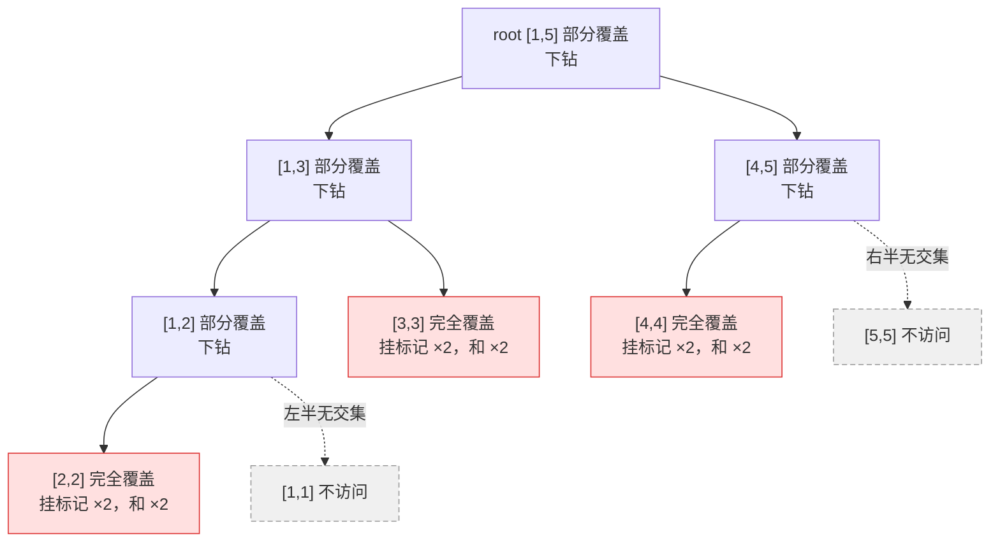

[[TOC]]

## 形式化题目

给定长度为 $n$ 的整数序列 $a[1..n]$ 与模数 $p$，在线执行 $m$ 次操作：

1. `1 x y k`：对所有 $i \in [x, y]$，令 $a[i] \gets a[i] \cdot k \bmod p$；
2. `2 x y`：输出 $\sum_{i=x}^{y} a[i]$ 对 $p$ 取模的结果。

样例（$n=5,\ m=5,\ p=38$）的逐步推演如下，它同时说明了取模的时机——乘法在每次更新时就地取模，求和答案在输出时取模：

| 步骤 | 操作 | 操作后的序列 | 本次输出 |
| :---: | --- | --- | --- |
| 初始 | — | `1 5 4 2 3` | — |
| 1 | `1 1 4 1`：$[1,4]$ 乘 $1$ | `1 5 4 2 3` | — |
| 2 | `2 2 5`：求 $[2,5]$ 的和 | `1 5 4 2 3` | $5+4+2+3=\mathbf{14}$ |
| 3 | `1 2 4 2`：$[2,4]$ 乘 $2$ | `1 10 8 4 3` | — |
| 4 | `1 3 5 5`：$[3,5]$ 乘 $5$ | `1 10 40 20 15` | — |
| 5 | `2 1 4`：求 $[1,4]$ 的和 | `1 10 40 20 15` | $71 \equiv \mathbf{33} \pmod{38}$ |

注意第 4 步：$[3,5]$ 整体乘 $5$ 时，$a[4]$ 从 $4$ 变成 $20$，正是继承了第 3 步乘 $2$ 的结果——乘法是**逐次复合**的，不是后者覆盖前者。

## 正解

### 思路

**朴素做法**：用普通数组维护序列，区间乘就循环把每个数乘一遍，区间求和就循环累加。单次操作最坏 $O(n)$，总计 $O(nm) = 10^{10}$，在 1000 ms 的时限下必然超时（只有 $n \leqslant 8, m \leqslant 10$ 的小数据能过）。

**瓶颈在哪**：逐点更新之所以非做不可，是因为朴素写法把同一个乘数复制了 $y-x+1$ 次。但换个角度想——被更新的每个数拿的是**同一个**乘数，而查询要的又是**区间和**，于是有分配律：

$$\sum_{i=L}^{R} (a_i \cdot k) = \Big(\sum_{i=L}^{R} a_i\Big) \cdot k$$

整段同乘 $k$ 时，段和直接乘 $k$ 就够了，逐点的乘数可以**先不下发**。这个“先欠着”的乘数，就是懒标记。

**换聚合单位**：改用线段树，每个节点 $i$ 维护它负责区间的和 `TREE[i]`，另存一个乘法懒标记 `TAG[i]`，表示“这段区间每个数还欠一次乘 `TAG[i]`”，初始为 $1$（乘法恒等元，表示不欠账）。三种节点操作：

1. **挂标记（懒的来源）**：更新区间与节点区间**完全重合**时就停在本节点——`TREE[i] *= k` 立刻把和改对，`TAG[i] *= k` 把欠账记下，孩子完全不用碰。
2. **下推标记（结算）**：只要即将访问某节点的孩子（继续下钻或查询），先把 `TAG[i]` 传下去：孩子的和乘 `TAG[i]`，孩子的标记也乘 `TAG[i]`（两次欠账复合成相乘），然后 `TAG[i]` 清回 $1$。这样孩子恢复“已结算”状态。
3. **回溯刷新**：孩子处理完，用左右孩子的和把 `TREE[i]` 重新加出来（`push_up`），保证每个节点的和始终等于区间真实值。

**为什么只需 $O(\log n)$**：线段树能把任意目标区间拆成 $O(\log n)$ 个**互不相交的完整节点**，乘法更新只需在这 $O(\log n)$ 个节点上挂标记；查询沿相交路径下降、一层最多进两个孩子，同样 $O(\log n)$。

下面这张图画出更新 `1 2 4 2`（把 $[2,4]$ 乘 $2$）在 $n=5$ 的线段树上的执行轨迹——红色节点是恰好被目标区间完整覆盖、因而挂上标记的位置；白色实线节点是部分覆盖、继续下钻的节点；灰色虚线节点与目标区间无交集，代码里的 `L <= mid` / `R > mid` 判断让它们根本不会被访问：

观察三点：其一，这次更新实际只访问了 7 个节点（实线部分），其中 3 个挂上标记，代价和区间长度 $3$ 没有关系，这就是对数复杂度的来源；其二，目标区间越大，命中的完整节点越靠上——更新 $[1,5]$ 只会在根节点挂一次标记，单点更新才会一路走到叶子，但无论哪种情形都是 $O(\log n)$ 个完整节点；其三，与目标区间无交集的一侧（虚线的 $[1,1]$、$[5,5]$）连进都不进，递归只发生在真有交集的孩子上。

**正确性要点**：每个节点维护不变量——`TREE[i]` 是区间真实和、`TAG[i]` 是区间欠着的乘法。挂标记时和与欠账同步乘（不变量保持）；下推只是把欠账转移给一层，父节点的和不变；回溯刷新用孩子重建父值。归纳可知任意时刻根的 `TREE[1]` 就是全序列和，`range_sum` 对完全覆盖片段求和即得答案。

**两处必须先下推的细节**：`range_mul` 和 `range_sum` 在进孩子之前都要先 `push_down`——否则会拿过期的孩子和去查询、回溯时还会用过期孩子把父节点刷错。另外新乘数先做 `k % p` 再打标记，`TREE` 与 `TAG` 就始终落在 $[0, p)$ 内；由于 $p \leqslant 571373$，两次相乘的中间量不超过约 $3.3 \times 10^{11}$，不会溢出。$n = 1$ 时整棵树只有一个叶子，三处递归都在 `l == r` 分支直接返回，不会访问不存在的孩子。

### 代码

@include-code(./main.py, python)

### 复杂度

- **时间复杂度**：建树 $O(n)$；每次区间乘或区间查询只沿相交路径下降，$O(\log n)$。总计 $O(n + m \log n)$，$n, m \leqslant 10^5$ 时约 $3.5 \times 10^6$ 次节点访问。
- **空间复杂度**：树与标记各开 $4n$ 的数组，$O(n)$，实测峰值内存约 55 MB（限制 128 MB）。

## 总结

区间乘法 + 区间求和是懒标记线段树的教科书模板。核心是利用分配律把“给每个数乘 $k$”压缩成“给段和乘 $k$ + 记一笔欠账”，再用 $O(\log n)$ 个完整覆盖节点承载这笔欠账；标记的复合只是相乘（恒等元为 1），比“区间加 + 区间乘”的仿射标记更简单。读懂这道模板，就掌握了懒标记的完整生命周期：**挂起 → 下推 → 结算 → 回溯刷新**。
