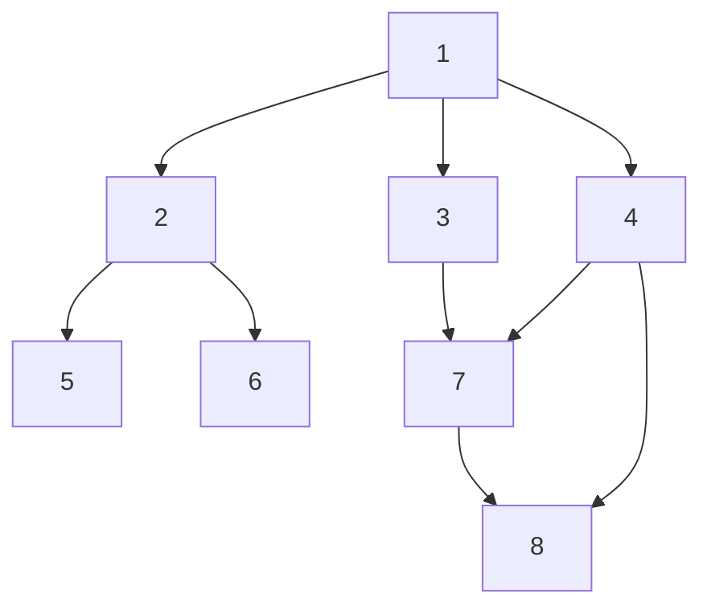

[[TOC]]

## 形式化题目

有 $n$ 篇文章（编号 $1 \sim n$）与 $m$ 条引用关系，第 $i$ 条为有向边 $X_i \to Y_i$，
含义是"文章 $X_i$ 的参考文献中有文章 $Y_i$"。

文章 $X$ 看过之后，它引用的文章都要看（已经看过的跳过）。从 $1$ 号文章开始阅读，
出一张阅读顺序表：每个能看到的文章恰好出现一次，当同一时刻有若干篇可看的文章时，
**先看编号较小的那篇**。

求两行输出：

- 第一行：按上述规则深度优先得到的阅读序列（DFS 先序）；
- 第二行：按上述规则广度优先得到的阅读序列（BFS）。

**注意两点**：图是有向的、且可能有自环与重边；从 $1$ 号文章出发**不可达**的文章
不输出（$1$ 号文章本身一定输出）。规模为 $n \leqslant 10^5$、$m \leqslant 10^6$。

以样例为例，边集为

$$1 \to 2,\ 1 \to 3,\ 1 \to 4,\ 2 \to 5,\ 2 \to 6,\ 3 \to 7,\ 4 \to 7,\ 4 \to 8,\ 7 \to 8,$$

从 $1$ 出发，DFS 会先一头扎到 $2$，再扎到 $2$ 的最小出边 $5$、$6$，回来后轮到 $3 \to 7 \to 8$，
最后才回头访问 $4$（因 $4$ 早已被 $1$ 引用过，但深搜把它排在最后），
得到 `1 2 5 6 3 7 8 4`；BFS 逐层展开则是 `1 2 3 4 5 6 7 8`。

## 正解

### 思路

把引用关系看成有向图的边，问题就是一次有向图遍历。难点全在"同一时刻可看的文章，
先看编号较小的那篇"这句话——它要求每个点的**出边在遍历时按终点编号升序展开**。

于是先建**邻接表**，再对每个点 `u` 把 `g[u]` 原地升序排序。排序只做一次，之后遍历时
顺着 `g[u]` 逐个走即可，"比较编号"这个动作就被消灭了：出边的物理顺序就是访问顺序。
这一点是本题的全部关键，剩下的 DFS / BFS 都是模板。

为什么不能省掉排序、或者改用别的方式挑最小邻居？因为要求是**静态**的：
图在读完输入后不再变化，编号的大小关系在任何时候都固定。一次性排序把
"每步挑最小"从"遍历时决策"变成"读表"，代价只付一次。

**DFS 有两种正确写法，但坑不一样**：

| 写法 | 形态 | 风险 |
| --- | --- | --- |
| 递归 | `dfs(u)` 里对每个未访问邻居递归 | $n = 10^5$ 的链状图会爆系统栈；Python 必须改迭代 |
| 显式栈模拟递归 | 栈里存 `(结点, 下一个待扩展的出边下标)` | 无栈溢出风险，且能严格对应递归先序 |

真正需要小心的是"小技巧版"显式栈：把邻居**倒序**压栈、出栈时才判重。这种做法虽然
多数情况下答案正确，但它的访问时刻和递归先序并不严格一致（判重发生在出栈时而非入栈时），
分析正确性的成本远高于收益。本解采用**携带出边下标**的显式栈：入栈时即输出、即标记，
弹出条件与递归的"出边走完"完全对应，正确性可以逐行对照递归版证明。

BFS 则没有争议：入队时标记并输出（出队时输出也一样，但入队时判重能保证每个点只入队
一次，队列长度上限恰好是 $n$）。

还有一个容易踩的坑：**两趟遍历必须各用一套访问标记**。DFS 跑完后所有可达点都已被标记，
若 BFS 复用同一个数组，BFS 会在起点处立刻结束，第二行只剩一个 `1`。

另外，只输出从 $1$ 可达的点，所以不需要（也不应该）对 $1 \sim n$ 其余点补跑搜索。

### 代码

@include-code(./main.py, python)

C++ 版本同一算法，DFS 同样是携带出边下标的显式栈：

@include-code(./main.cpp, cpp)

### 复杂度

设 $\sum d(u) = m$。

- 建图 $O(n + m)$；对每个点排序出边，总计 $O\!\left(\sum_{u} d(u) \log d(u)\right) \leqslant O(m \log n)$；
- DFS 与 BFS 各 $O(n + m)$——每个可达点进出一次，每条出边恰好被扫一次；
- 总时间 $O(n + m \log n)$，空间 $O(n + m)$。

$n = 10^5$、$m = 10^6$ 时，瓶颈是排序的约 $2 \times 10^7$ 次比较与 $10^6$ 条边的读写，
远低于 1000 ms / 128 MB。Python 版在顶格数据下受解释器常数影响，可能超出 1 s
（属允许范围），但算法与 C++ 版同阶，没有降级为暴力。

## 总结

- 本题是"有序邻居遍历"的模板题：**把局部贪心变成一次全局排序**，是处理
  "每次取最小 / 最大邻居"这类要求的通用套路，比用堆做在线决策更省常数、更好证明。
- 递归 DFS 在 $n = 10^5$ 的链上会爆栈，显式栈是标配；而"倒序压栈出栈判重"虽然短，
  与递归先序的对应关系不直观，教学上不如携带出边下标的写法。
- 同一张图跑两遍遍历时，访问标记必须重置——这类"共享状态忘了清"是本题最常见的失分点。
- 只输出可达点意味着不用补搜其余连通块，起点固定为 $1$ 也免去了多源处理的讨论。

## 说明

本题素材源（`new_ROJ/problems/2125/`）自带 `data.py` 数据生成脚本，10 个测试点是
用 `cyaron` 按题面范围**自行生成**的（点 1~2 为边界、3~6 为随机中小规模、7 为含不可达点的
大规模、8~10 为顶格 $n = 10^5, m = 10^6$ 的随机 / 链 / 菊花结构），题面文字亦为网络重建版本。
因此出题意图可能与官方原题（同题意为洛谷 P5318）存在偏差；本解法以题面文字为准，
并已在全部 10 个测试点上验证通过。

## 图示解析

这张图对比同一张样例图上的两种遍历：DFS 是"一条路走到底再回头"，
BFS 是"逐层推进"，两条序列的差别全部来自搜索方式，与排序无关。

- **DFS 序列 `1 2 5 6 3 7 8 4`**：从 $1$ 顺着最小出边 $2$ 深入，$2$ 的最小出边 $5$ 是叶子，
  回溯后走 $6$，再回到 $2$、回到 $1$，接着走 $3 \to 7 \to 8$（$8$ 已在 $7$ 处访问过），
  最后才处理 $1$ 的第三条出边 $4$。
- **BFS 序列 `1 2 3 4 5 6 7 8`**：$1$ 出队后把 $2, 3, 4$ 依次入队，之后每层各自展开——
  恰好就是编号升序，因为每层的出边都排过序，而"层"的顺序由队列先进先出固定。

注意 $8$ 在两条序列中都只在第一次到达时出现：$4 \to 8$ 与 $7 \to 8$ 是两条不同的边，
但终点是同一篇文章，判重只认文章编号。
