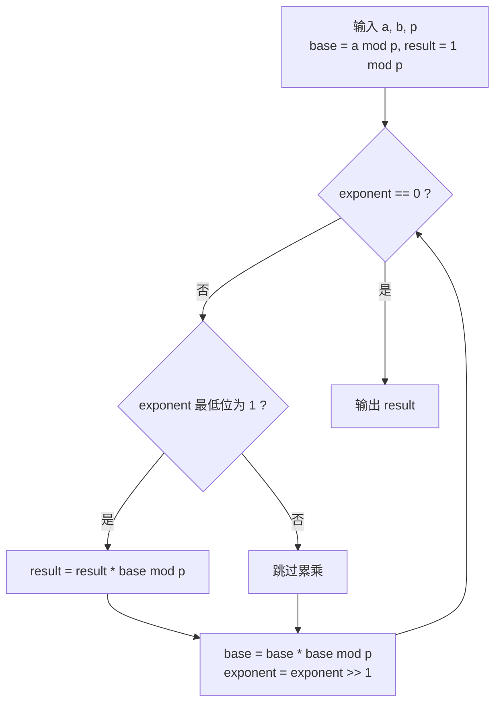

[[TOC]]

## 形式化题目

给定整数 $a, b, p$（$p \neq 0$），求 $a^b$ 除以 $p$ 的余数，即

$$a^b \bmod p,$$

结果取 $[0, p)$ 内的唯一代表元。约定 $0^0 = 1$，因此 $b = 0$ 时答案恒为 $1 \bmod p$；$p = 1$ 时答案恒为 $0$。

样例：$a = 3, b = 2, p = 7$，$3^2 = 9 = 1 \times 7 + 2$，输出 `2`。

## 正解

### 思路

**朴素想法**：按定义连乘。维护一个初值为 $1$ 的答案，循环 $b$ 次做 `ans = ans * a % p`。正确，但本题的数据范围是 $0 \leqslant a, b, p \leqslant 10^9$，$b$ 最大到 $10^9$——循环 $10^9$ 次模乘在任何语言下都超过 1 秒。所以瓶颈是**乘法次数**，而不是数值大小（取模已经保证了数值范围）。

**关键观察（指数可以按二进制拆开）**：设 $b = 2^{k_1} + 2^{k_2} + \dots$ 是 $b$ 的二进制展开，由幂的加法性质

$$a^b = a^{2^{k_1}} \cdot a^{2^{k_2}} \cdots$$

也就是说，只要手里有 $a^{2^0}, a^{2^1}, a^{2^2}, \dots$ 这一串"2 的幂次方"，答案就是其中下标出现在 $b$ 的二进制里的那些项的乘积。而这一串数字本身可以**递推**得到，因为

$$a^{2^{k+1}} = \left(a^{2^k}\right)^2,$$

每平方一次就前进一位，不需要重新从头连乘。

$b \leqslant 10^9 < 2^{30}$，二进制最多 30 位，于是乘法次数从 $O(b)$ 降到 $O(\log b)$。

**迭代过程**：维护三个量——

- `base`：当前位的底数 $a^{2^k} \bmod p$，初值 $a \bmod p$（$a$ 可能大于 $p$，先降下来）；
- `exponent`：还没消费的指数，初值 $b$；每轮把它右移一位；
- `result`：已经收编的位的乘积，初值 $1 \bmod p$（写 `1 % p` 而不是 `1`，$p = 1$ 时直接得到正确结果 $0$）。

每轮做三件事：最低位为 1 就把 `base` 乘进 `result`；`base` 自平方；`exponent` 右移一位。`exponent` 归零时 `result` 就是答案。

下面用 $a = 5, b = 13 = (1101)_2, p = 1000$ 逐步追踪（13 的二进制里第 0、2、3 位为 1，正好三种情况都能看到）。

| 轮次 | `exponent` 剩余 | 最低位 | `base`（当前位的 $5^{2^k} \bmod 1000$） | `result` 累乘 $\bmod 1000$ |
| --- | --- | --- | --- | --- |
| 初始 | $1101_2$ | — | $5$ | $1$ |
| 1 | $1101_2$ | $1$ | $5$ | $1 \times 5 = 5$ |
| 2 | $110_2$ | $0$ | $25$ | $5$（位为 0，不累乘） |
| 3 | $11_2$ | $1$ | $625$ | $5 \times 625 = 3125 \equiv 125$ |
| 4 | $1_2$ | $1$ | $625^2 \bmod 1000 = 625$ | $125 \times 625 = 78125 \equiv 125$ |
| 结束 | $0$ | — | — | $\mathbf{125}$ |

表格三列的含义分别是"还剩哪些指数位没处理""当前这一位是否为 1""这一位对应的幂"。重点观察两点：`base` 每轮平方升级，从 $5 \to 25 \to 625$（再平方回 $625$，因为 $625^2 = 390625$ 末三位仍是 625）；`result` 只在第 1、3、4 轮乘一次。手工验算 $5^{13} = 1220703125$，末三位 $125$，与表格一致。

图示说明单轮迭代的四个动作及其循环条件：循环次数等于 $b$ 的二进制位数，与 $b$ 的大小无关。

### 代码

@include-code(./main.py, python)

实现上有两处专门为边界服务：`result = 1 % mod` 让 $p = 1$ 与 $b = 0$ 两种退化情况自动落回正确值，不必额外特判；`base %= mod` 处理 $a \geqslant p$（真实数据中的 `ab5.in` 就是 $a = 927364012 > p = 237840192$）。`mod_pow` 是本题的核心概念（快速幂），单独成函数；读入与输出只有一次，直接写在 `solve` 里。

### 复杂度

- 时间：$O(\log b)$。循环轮数等于 $b$ 的二进制位数，$b \leqslant 10^9$ 时最多 30 轮，每轮一次判断加至多两次模乘；朴素的 $O(b)$ 是 $10^9$ 次模乘。
- 空间：$O(1)$，只有 `base`、`exponent`、`result` 三个整数。

对比：朴素做法 $O(b)$ 时间、$O(1)$ 空间；快速幂把时间压到 $O(\log b)$，空间不变。若用 C++ 实现需要 `long long`，因为 $p < 2^{30}$，中间乘积 $< 2^{60}$ 超出 `int`；Python 整数无溢出问题。

## 总结

本题是快速幂的入门模板：**指数按二进制拆分 + 底数逐位平方**。核心等式有两条——$a^{x+y} = a^x a^y$ 让二进制里的各个位可以分开处理，$a^{2^{k+1}} = (a^{2^k})^2$ 让这些位可以顺着算出来；再配合 $(xy) \bmod p = ((x \bmod p)(y \bmod p)) \bmod p$，中间量永远不超过 $p^2$。于是一次 $O(b)$ 的连乘被压成 $O(\log b)$ 的 30 轮循环。边界全部由 `1 % p` 和 `a % p` 两个初始化动作覆盖，无需分支特判。同一套代码稍作修改即可用于矩阵快速幂、模逆元（费马小定理）等后续题目。
