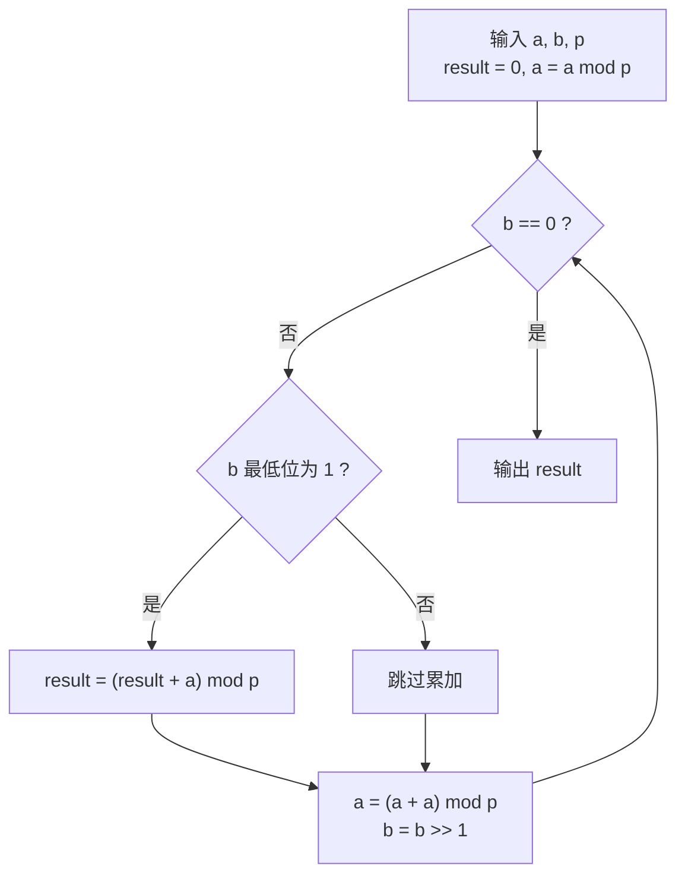

[[TOC]]

## 形式化题目

给定整数 $a, b, p$，求

$$a \cdot b \bmod p,$$

结果取 $[0, p)$ 内的唯一代表元。

样例：$a = 3, b = 4, p = 5$，$3 \times 4 = 12 = 2 \times 5 + 2$，输出 `2`。

## 正解

### 思路

**朴素想法**：算出 $a \times b$ 再对 $p$ 取模。在 Python 里这一句就是对的（`a * b % p`），因为 Python 整数是任意精度的。但在 C/C++ 里 `long long a, b; a * b` 会溢出——这才是题目真正要解决的问题。本题的数据范围是 $1 \leqslant a, b, p \leqslant 10^{18}$，$a \times b$ 最大约 $10^{36}$，远超 64 位整数 $9.22 \times 10^{18}$ 的上限；题名「64 位整数乘法」正是指"两个 64 位整数相乘、结果需要 128 位"这件事。所以瓶颈是**中间结果的位数**，而不是运算次数。

**关键观察（乘数可以按二进制拆开）**：设 $b$ 的二进制展开为 $b = \sum_k b_k 2^k$（$b_k \in \{0,1\}$），由乘法分配律

$$a \cdot b = \sum_{k:\ b_k = 1} a \cdot 2^k.$$

也就是说，只要手里有 $a \cdot 2^0, a \cdot 2^1, a \cdot 2^2, \dots$ 这一串"2 的幂倍"，答案就是其中下标出现在 $b$ 的二进制里的那些项之和。$b \leqslant 10^{18} < 2^{60}$，求和号里最多 60 项——一次大乘法就变成了最多 60 次加法。

**这一串数怎么来**：靠**翻倍**递推，

$$a \cdot 2^{k+1} = a \cdot 2^k + a \cdot 2^k,$$

"下一项就是当前项加自己"。注意这里的升级动作是**加法**而不是乘法。

**取模必须随时做**：光拆开还不够，$a \cdot 2^{59}$ 本身就已经是 $10^{36}$ 量级，照样溢出。补救办法是加法的取模性质

$$(x + y) \bmod p = \big((x \bmod p) + (y \bmod p)\big) \bmod p,$$

把 `result` 和 `a` 都保持在 $[0, p)$ 内。此时二者的和 $< 2p \leqslant 2 \times 10^{18}$，落在 `long long` 的安全范围内。

**迭代过程**：维护三个量——

- `result`：已经收编的位之和，初值 $0$（加法的单位元是 $0$，对应快速幂里的 $1$）；
- `a`：当前位对应的加数 $a_0 \cdot 2^k \bmod p$，初值 `a % p`（输入的 $a$ 可能不小于 $p$，先压回 $[0,p)$，后续加法才不越界）；
- `b`：还没消费的乘数，初值就是输入的 $b$；每轮右移一位。

每轮做三件事：最低位为 1 就把 `a` 加进 `result` 并取模；`a` 自加一次（翻倍）并取模；`b` 右移一位。`b` 归零时 `result` 就是答案。

**与快速幂的对照**：本题与 [[roj/3000]] 是同一个二进制拆分骨架，只是把"乘法"整体换成了"加法"。

| | `a^b mod p`（快速幂） | `a*b mod p`（龟速乘，本题） |
| --- | --- | --- |
| 拆谁 | 指数 $b$ 拆成 2 的幂之和 | 乘数 $b$ 拆成 2 的幂之和 |
| 累加用什么 | 乘法 `result * a` | 加法 `result + a` |
| 单位元 | $1$ | $0$ |
| 升级方式 | 底数自乘 `a * a` | 加数自加 `a + a` |
| 中间量上界 | $p^2$（$p=10^{18}$ 时溢出） | $2p$（安全） |

正是这个替换解决了溢出：快速幂的中间量 $p^2$ 在 $p = 10^{18}$ 时高达 $10^{36}$，而本题的 $2p$ 只有 $2 \times 10^{18}$。

下面用 $a = 7, b = 13 = (1101)_2, p = 100$ 逐步追踪（13 的二进制里第 0、2、3 位为 1，三种情况都能看到）。

| 轮次 | `b` 剩余 | 最低位 | `a`（本轮加数，$7 \cdot 2^k \bmod 100$） | `result` 累加 $\bmod 100$ |
| --- | --- | --- | --- | --- |
| 初始 | $1101_2$ | — | $7$ | $0$ |
| 1 | $1101_2$ | $1$ | $7$ | $0 + 7 = 7$ |
| 2 | $110_2$ | $0$ | $14$ | $7$（位为 0，不加） |
| 3 | $11_2$ | $1$ | $28$ | $7 + 28 = 35$ |
| 4 | $1_2$ | $1$ | $56$ | $35 + 56 = 91$ |
| 结束 | $0$ | — | — | $\mathbf{91}$ |

表格三列的含义分别是"还剩哪些乘数位没处理""当前这一位是否为 1""这一位对应的加数"。重点观察两点：`a` 每轮通过自加翻倍，$7 \to 14 \to 28 \to 56$；`result` 只在第 1、3、4 轮加一次，第 2 轮因最低位为 0 而跳过。手工验算 $7 \times 13 = 91$，与表格一致。

图示说明单轮迭代的四个动作及其循环条件：循环次数等于 $b$ 的二进制位数，与 $b$ 的大小无关。

### 代码

@include-code(./main.py, python)

实现上有两处专门为边界服务：`result = 0` 让 $a$ 是 $p$ 的倍数、$b = 0$ 等情况自动落回正确值（$a \times 0 = 0$ 与 $0$ 的倍数都是 $0$），不必特判；`a %= mod` 处理 $a \geqslant p$。`mod_mul` 是本题的核心概念（龟速乘），单独成函数；读入与输出只有一次，直接写在 `solve()` 里。

### 复杂度

- 时间：$O(\log b)$。循环轮数等于 $b$ 的二进制位数，$b \leqslant 10^{18} < 2^{60}$ 时最多 60 轮，每轮一次判断加至多两次加法取模。
- 空间：$O(1)$，只有 `result`、`a`、`b` 三个整数。

对比：直接相乘在 C++ 里会溢出（$O(1)$ 次乘法但中间量达 $10^{36}$）；朴素地"加 $b$ 次"虽然不溢出，但 $O(b)$ 在 $b = 10^{18}$ 时不可能跑完；龟速乘把时间压到 $O(\log b)$，同时把中间量压到 $2p$，两个问题一起解决。

## 总结

本题是「龟速乘」（二进制拆分乘法）的入门模板：**乘数按二进制拆分 + 加数逐位翻倍**。核心等式有两条——$a(x+y) = ax + ay$ 让二进制里的各个位可以分开处理，$a \cdot 2^{k+1} = a \cdot 2^k + a \cdot 2^k$ 让这些位可以顺着算出来；再配合加法的取模性质，中间量永远不超过 $2p$。于是一次会溢出的 $10^{36}$ 级乘法，被压成最多 60 次不溢出的加法。它与快速幂是同一个骨架、只把乘法换成加法，两者一起看能更清楚地看出「二进制拆分」这个思想的通用性。

> 数据勘误（供本题数据维护者参考）：本题数据 `data/mul*.in/out` 曾在 2024-05-19 的一次提交中被误覆盖——18 位输入被截断成 8 位前缀，答案也从 $a \cdot b \bmod p$ 变成了 $a^b \bmod p$（同目录 `std.cpp` 是快速幂代码），与题面不符。2026-10-01 已从该次提交之前的 git 历史恢复为原始 18 位数据，本文解 5 组全部一致。
