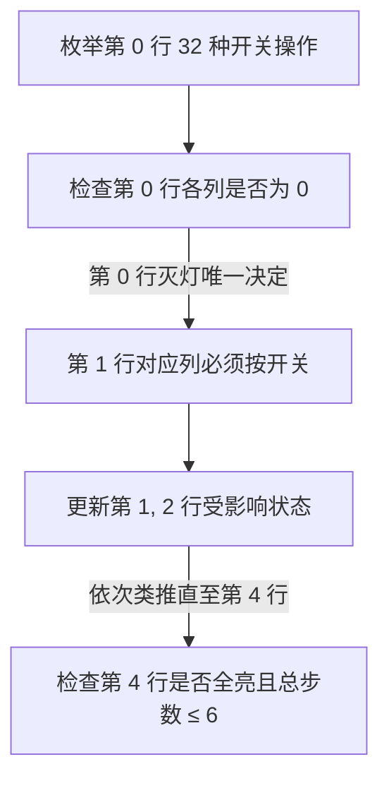

[[TOC]]

## 形式化题目

给定一个 $5 \times 5$ 的 $01$ 矩阵 $A$，其中 $1$ 表示亮灯，$0$ 表示灭灯。
定义一次操作为选择某个坐标 $(r, c)$，将自身及四连通邻居位置的值翻转（$0 \leftrightarrow 1$）。
求在不超过 $6$ 次操作的前提下，将矩阵中所有元素变为 $1$ 的最小操作次数。若无解或最少操作次数超过 $6$，则返回 $-1$。

## 正解

### 思路

#### 1. 独立性与无序性
- 每个开关最多只需要按一次：同一个位置按两次等价于没有按；
- 开关按下的先后次序不影响最终盘面状态。

#### 2. 自顶向下的唯一确定性
如果任由 25 个开关自由选择，搜索空间高达 $2^{25} \approx 3.35 \times 10^7$。然而，观察开关翻转对盘面的影响范围可以发现极强的单向依赖性：
- 假设第一行（第 $0$ 行）的操作方案已经固定。
- 此时第 $0$ 行各个位置的亮灭状态中，除了下一行（第 $1$ 行）对应的开关能够改变它以外，后续第 $2, 3, 4$ 行的开关都无法再影响第 $0$ 行。
- 因此，为了让第 $0$ 行所有未亮的灯变亮，**第 $1$ 行对应列的开关必须且只能被按下**！
- 同理，当第 $1$ 行的操作被唯一确定后，第 $1$ 行未亮的灯又唯一决定了第 $2$ 行的按键方案；
- 依此类推，直到第 $4$ 行（最后一行）被更新完毕。
- 最终，只需检查第 $4$ 行是否全部为亮灯。若是，则说明该方案能够使所有灯全亮；否则说明在当前第一行按法下无解。

#### 3. 位运算加速与剪枝
每一行只有 5 列，可以用一个 5 位的二进制整数表示（第 $c$ 位对应第 $c$ 列状态）。
当在第 $r$ 行执行操作掩码 `op` 时：
- 第 $r$ 行自身发生翻转：`op ^ (op << 1) ^ (op >> 1)`（滤除第 5 位以上的进位）；
- 第 $r+1$ 行受到翻转：直接异或 `op`；
- 下一行的必要操作为：`(~rows[r]) & 0b11111`。

第一行仅有 $2^5 = 32$ 种操作方案。在递推过程中，一旦累计步数超过 6，即可直接剪枝。

### 代码

@include-code(./main.py, python)

### 复杂度

- **时间复杂度**：对于每组数据，第一行共 $2^5 = 32$ 种可能，每种可能递推 $5$ 行，每行借助位运算在 $O(1)$ 时间内完成状态转移，运算量在常数级别。处理 $n$ 组数据的总时间复杂度为 $O(n \cdot 2^C \cdot R) = O(32 \times 5 \times n) = O(n)$，在 $n \le 500$ 时运行时间极短（$< 0.05\text{ s}$）。
- **空间复杂度**：仅需若干局部整数变量存储每行的二进制状态，空间复杂度为 $O(1)$。

## 总结

本题是典型的“第一行决定后续所有行”的递推解法。通过发现局部影响与单向传递的不变量，将看似庞大的全局指数级搜索（$2^{25}$）降维为局部的首行枚举（$2^5 = 32$），再配合位运算的并行位处理与 6 步限制剪枝，高效解决问题。
