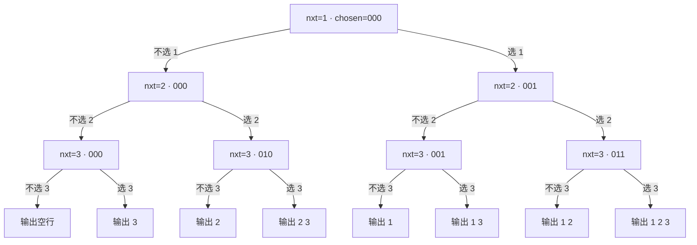

[[TOC]]

## 形式化题目

给定正整数 $n$（$1 \leqslant n \leqslant 15$），求集合 $\{1, 2, \dots, n\}$ 的**幂集**：把所有 $2^n$ 个子集各写成一行输出。

每个子集按元素**升序**写成一行，元素之间恰好一个空格；空集写成**空行**。子集（行）之间的先后顺序任意。

例如 $n = 3$ 时，$8$ 个子集可以按

$$\varnothing,\ \{3\},\ \{2\},\ \{2,3\},\ \{1\},\ \{1,3\},\ \{1,2\},\ \{1,2,3\}$$

的顺序输出；题面样例正是这个顺序。

## 正解

### 思路

**朴素想法**：按子集大小分组枚举——对每个 $k = 0, 1, \dots, n$，枚举所有大小为 $k$ 的组合。用
`itertools.combinations(range(1, n + 1), k)` 或手写组合递归都能写对。

**瓶颈不在速度，而在"决策单位选错了"**。按大小分组意味着递归函数要同时携带"已经选了几个数"和
"下一个可挑的下标"两个状态，还要为每个 $k$ 重新启动一次搜索、单独处理 $k = 0$ 的空集：
"选 $k$ 个"其实是"每个数选够 $k$ 次"，而**"某个数选不选"才是最小的决策单位**。
把决策单位换成后者，$k$ 就从参数降级成了隐含结果。

**关键观察**：每个整数只有两种命运（选 / 不选），$n$ 个整数独立决策，因此全部方案恰好是
一棵**深度为 $n$ 的满二叉决策树**的 $2^n$ 个叶子，每个叶子对应一个方案。要"输出全部方案"，
就是把这棵树完整遍历一遍：

- 递归深度 = 已经决策完的整数个数，不需要"已选个数"这个参数；
- 每个节点只有两条分支（不选 / 选），不需要"枚举候选下标"这一层循环；
- 所有 $k$ 在同一棵树里被一次遍历产出，$k = 0$ 不再需要特判。

下图是 $n = 3$ 的决策树。每条根到叶的路径代表一串"选 / 不选"的决定，叶子上的文字是该路径
对应的输出行；节点方括号里是 `chosen` 掩码的二进制（第 $i-1$ 位为 1 表示已选整数 $i$）。



读图要点：① 第 $i$ 层的两条边固定是"不选 $i$"和"选 $i$"，树形与 $n$ 无关；② 空集是**最左那条
全"不选"的路径**，它同样是正常叶子，所以代码里不需要为空集写特判；③ 因为先走"不选"再走"选"，
从上到下的叶子顺序正好是题面样例的顺序，**升序无需排序**——决策顺序是 $1, 2, \dots, n$，
沿路径收集到的下标天然递增。

$n = 3$ 时 8 个叶子的完整推演：

| 叶子（从上到下） | `chosen` 二进制 | 含 1 的位 | 输出行 |
| --- | --- | --- | --- |
| L0 | `000` | — | （空行） |
| L1 | `100` | 3 | `3` |
| L2 | `010` | 2 | `2` |
| L3 | `110` | 2, 3 | `2 3` |
| L4 | `001` | 1 | `1` |
| L5 | `101` | 1, 3 | `1 3` |
| L6 | `011` | 1, 2 | `1 2` |
| L7 | `111` | 1, 2, 3 | `1 2 3` |

表中 `chosen` 的**第 $i-1$ 位**对应整数 $i$：掩码既是"已选集合"的紧凑表示，又是子集的唯一标识，
不同的叶子掩码必然不同，所以整棵树遍历下来既不会漏方案也不会重复输出。

三个实现要点随之确定：

1. **状态用整数掩码 `chosen` 而非列表**。子集与掩码一一对应，掩码是不可变整数、只能整体传值，
   兄弟分支之间不共享状态——这正好绕开了回溯写法里最容易出错的一步。对照常见的
   `bool st[]` 标记数组回溯写法：它必须在返回前 `st[u] = false` 恢复现场，漏写就会污染兄弟分支；
   Python 版把这一步物理上删掉了：
   右分支传的是 `chosen | 1 << (nxt - 1)`，左分支传的还是原来的 `chosen`，互不影响。
2. **用生成器 `yield from` 而非累积到 `ans` 列表**。两条 `yield from` 一前一后串起"不选 nxt 的整棵
   子树"和"选 nxt 的整棵子树"，调用方拿到的就是排好序的完整方案序列，主流程只剩读入与打印。
3. **只在叶子处翻译掩码**。内部节点只做位运算，把 $O(n)$ 的"掩码 → 数字列表"开销集中到 $2^n$ 个叶子上。

同一模型的非递归写法是 `for mask in range(1 << n)`，再按位翻译；它与递归写法输出的方案集合完全相同，
只是把"二叉决策"藏进了二进制计数里，不如递归直观地展示枚举骨架，故正文只作对照、不单独实现。

### 代码

`schemes` 是决策树本体：`nxt > n` 时是叶子，把掩码翻译成升序列表；否则先产出"不选"子树、
再产出"选"子树。`solve` 只负责读入 `n`、拼接生成器、一次输出。

@include-code(./main.py, python)

### 复杂度

- **时间复杂度**：决策树共 $2^{n+1} - 1$ 个节点，每节点 $O(1)$ 位运算；$2^n$ 个叶子各做一次
  $O(n)$ 的掩码翻译；输出字符总数也是 $O(n \cdot 2^n)$。合计 $\Theta(n \cdot 2^n)$，
  与"必须写出 $2^n$ 个方案"的输出规模同阶，已达输出敏感最优。$n = 15$ 时约 $5 \times 10^5$ 次内层操作。
- **空间复杂度**：递归栈 $O(n)$；叶子列表随即被 `join` 消费、不累积，$O(n)$；输出缓冲区
  `"\n".join(...)` 约 576 KB。合计 $O(n \cdot 2^n)$，$n = 15$ 时实测峰值 17.5 MB。

## 数据说明

题面注明"本题有自定义校验器（SPJ），各行（不同方案）之间的顺序任意"。数据仓原始 5 个 `.out`
（对应 $n = 5, 8, 9, 12, 15$）只是同一段 60 字节的占位串：

```
This problem has multiple answers and will be judged by SPJ.
```

占位串不含任何参考方案，逐字节比对对任何解都必然失败。本次已将其替换为规范的幂集参考输出：
先用一份独立编写的位掩码枚举生成参考文本，与 `main.py` 的实际输出逐字节交叉验证（5 组全部相等）
后写回，仓库校验 5/5 PASS（$n = 15$ 为 32768 行、约 576 KB，耗时 0.06 s、峰值 17.5 MB）。

由于真题上行序由 SPJ 放开，另按 SPJ 语义对 $n = 1 \dots 15$ 全量自检：

1. 输出行数恰好为 $2^n$；
2. 每行数字升序、互不相同、都落在 $[1, n]$；
3. 行内无连续空格，行首行尾无空格；
4. 全部方案去重后与 $\bigcup_{k=0}^{n} C(n, k)$ 作为集合完全相等。

结果 $n = 1 \dots 15$ 全部通过；$n = 3$ 的实际输出与题面样例逐字节一致（连行序都相同）。

## 总结

- 指数型枚举的最小决策单位是"**第 $i$ 个数选不选**"，而不是"挑第几个数"；决策树是深度 $n$ 的满二叉树，
  $2^n$ 个叶子与 $2^n$ 个子集一一对应，一次遍历即得到全部方案。
- **升序是免费的**：按 $1, 2, \dots, n$ 的次序决策，路径上的数字天然递增，
  输出前不需要任何排序。
- 用**不可变位掩码**`chosen` 当状态，兄弟分支各自持值、互不干扰，从写法上消除了"忘记回溯"的 bug；
  这也是 Python 版与 `bool st[]` 回溯版最实质的差别。
- 空集不是边界特例，而是"全走不选分支"的那个叶子；但终止条件必须写成 `nxt > n` 而不是"路径为空"，
  否则空集会被剪掉。
- 复杂度 $\Theta(n \cdot 2^n)$ 与输出规模同阶，已达输出敏感最优；本解的行序恰好与题面样例
  逐字节一致，真题上行序任意（SPJ），换任何顺序都不影响判定。
