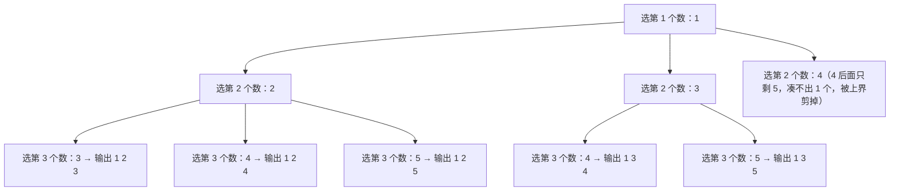

[[TOC]]

## 形式化题目

给定两个整数 $n, m$（$n>0$，$0 \le m \le n$，$n+(n-m) \le 25$），要求从 $1 \sim n$ 这 $n$ 个整数中选出 $m$ 个，输出全部 $\binom{n}{m}$ 个组合方案，满足：

- 每个方案内部的 $m$ 个数严格升序，相邻两数用一个空格隔开；
- 方案之间按字典序从小到大排列（逐位比较，例如 `1 3 5 7` 排在 `1 3 6 8` 前面）；
- 特别地，$m=0$ 时没有可选的数，输出一个空行（只有换行符）。

## 正解

### 思路

#### 1. 组合与排列的区别：顺序无关，但要"规定"一个顺序

枚举子集时如果不管顺序，同一个集合 $\{1,2,3\}$ 会被 $3!$ 种排列重复输出。组合枚举的惯用手法是**强制每个方案内部升序**——即规定"后选的数必须比先选的大"，这样每个集合恰好对应唯一一种选法。而"内部升序 + 从小到大选第一个数"恰好就是字典序，所以按这个规则深搜，输出的顺序天然就是题目要求的顺序，不需要额外的排序。

#### 2. 递归状态：`start` 记录"下一个能选的最小数"

设递归函数 `combine(n, m, start)` 表示"从 `start..n` 中再选出 $m$ 个数"。每一层：

- 若 $m = 0$：一个数都不用再选，当前路径就是一个完整方案，输出；
- 否则枚举本层要选的数 `first ∈ [start, n-m+1]`，然后递归 `combine(n, m-1, first+1)`——**起点取 `first+1`**，保证后面的数都严格大于 `first`（组合不允许重复选同一个数）；
- 上界 `n-m+1` 是一个小剪枝：若 `first > n-m+1`，剩下的 `n-first` 个数不足以凑出 $m-1$ 个，整个分支可以直接跳过。

以样例 $n=5, m=3$ 为例，递归树的前三层如下（每个节点标出当前已选序列）：

观察这棵树：从根到叶的每条路径就是一个方案，树的**先序遍历顺序**恰好是 `1 2 3, 1 2 4, 1 2 5, 1 3 4, 1 3 5, ...`——与样例输出完全一致。这说明只要让"同一层内枚举的数递增"，深搜的输出顺序就自动满足字典序，无需排序。

#### 3. 边界：$m = 0$

$m=0$ 时空组合也是一个方案，对应输出一个空行（样例数据 `25 0` 的答案正是单个换行）。上面的递归在 $m=0$ 时直接产出空元组 `()`，用 `' '.join` 拼接得到空字符串，输出一个空行，边界自动被覆盖。

### 代码

@include-code(./main.py, python)

代码里 `combine` 是一个生成器：`yield ()` 对应叶子"输出一个方案"，`yield (first, *rest)` 把本层选的 `first` 拼到子组合前面。主流程 `solve()` 只做读入、把每个组合转成空格分隔的行、统一输出。

### 复杂度

设输出规模 $S = \binom{n}{m} \cdot m$（方案数乘以每个方案的长度），任何正确的解法都至少要 $\Omega(S)$ 时间把答案打印出来。

- **时间复杂度**：递归树上每个叶节点对应一个方案，输出一个方案需要 $O(m)$；内部节点总数与叶节点同阶。总时间 $O(\binom{n}{m} \cdot m)$，即"输出的字符数"级别，已是下界，与正解同阶。在 $n+(n-m) \le 25$ 的约束下最大规模约为 $\binom{25}{12} \approx 5.2 \times 10^6$ 行（本题数据最大 $\binom{20}{15} = 15504$ 行），完全可承受。
- **空间复杂度**：递归深度为 $m+1$，每层只存常数个变量，栈空间 $O(m)$；生成器逐个产出方案，不保存全部结果，额外空间 $O(1)$。

## 总结

组合型枚举的关键是**给"无序的集合"规定一个规范顺序**：强制方案内部升序（后选数严格大于先选数），既消除了同一集合的重复枚举，又让深搜的先序遍历顺序恰好等于字典序。递归参数 `start` 是整个算法的灵魂——它同时承担了"去重"和"保证输出顺序"两个职责；上界 $n-m+1$ 则保证只进入能凑齐剩余个数的分支。

题面留下的思考题"非递归怎么做"：把每个方案看成一个 $01$ 串（第 $i$ 位表示是否选 $i$），从最小方案 `1 2 ... m` 出发，每次找最后一个可以增大的位置把它加一并重排后缀，即可用迭代逐个产出方案；等价地，也可以用一个 $1 \sim 2^n$ 的整数做位掩码，逐个检验 popcount 是否为 $m$（详见《算法竞赛进阶指南》0x08 节的讨论）。
