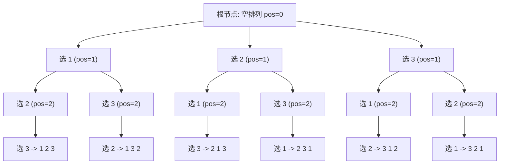

[[TOC]]

## 形式化题目

给定正整数 $n$（$1 \leqslant n \leqslant 9$），输出由集合 $\{1, 2, \dots, n\}$ 中所有元素构成的全排列。所有排列必须按字典序从小到大输出，且每个排列中的每个数字后附带一个空格。

## 正解

### 思路

将全排列的生成看作从左到右依次为 $n$ 个位置填入数字的过程。定义递归状态 `dfs(pos)` 表示当前正在决定第 `pos` 个位置（$0 \leqslant \text{pos} \leqslant n$）填入哪个数字。

1. **递归终止条件**：当 $\text{pos} = n$ 时，说明 $0 \sim n-1$ 位置已全部填满，当前记录的路径即为一个完整排列，输出当前排列并返回。
2. **分支与决策**：在当前位置，从小到大遍历数字 $i \in [1, n]$：
   - 若数字 $i$ 尚未被使用，则标记 $i$ 已被占用，将 $i$ 记录在当前位置，并递归调用 `dfs(pos + 1)` 填下一个位置。
   - 递归返回后，取消对数字 $i$ 的占用标记（即“回溯恢复现场”），以便后续分支能使用该数字。
3. **字典序保证**：由于每次枚举可用数字时均按照 $1$ 到 $n$ 的递增顺序尝试，搜索树的遍历天然满足字典序由小到大的先后次序。

下图展示了 $n = 3$ 时搜索树的前两层决策分支及回溯过程：

### 代码

@include-code(./main.py, python)

### 复杂度

- **时间复杂度**：搜索树中深度为 $k$ 的节点数对应选排列数 $P(n, k) = \frac{n!}{(n-k)!}$。树中所有状态节点的总数为 $\sum_{k=0}^{n} \frac{n!}{(n-k)!} = \mathcal{O}(n \cdot n!)$。在每个叶子节点构造长度为 $n$ 的结果耗费 $\mathcal{O}(n)$，总时间复杂度为 $\mathcal{O}(n \cdot n!)$。当 $n = 9$ 时，$9 \cdot 9! \approx 3.26 \times 10^6$，在 Python 中耗时约 0.3 秒，远低于 1000 ms 的限制。
- **空间复杂度**：递归栈深度和当前路径数组大小均为 $\mathcal{O}(n)$。收集全部排列字符串的缓冲区占用 $\mathcal{O}(n \cdot n!)$ 空间，在 128 MB 限制内完全充裕。

## 总结

排列型枚举的核心在于「位置决策」与「状态标记」：通过按字典序枚举当前位置可选数字，并在递归深入与回溯之间维护元素的可用状态，能够以极简的代码结构保证排列的完备性与有序性。
