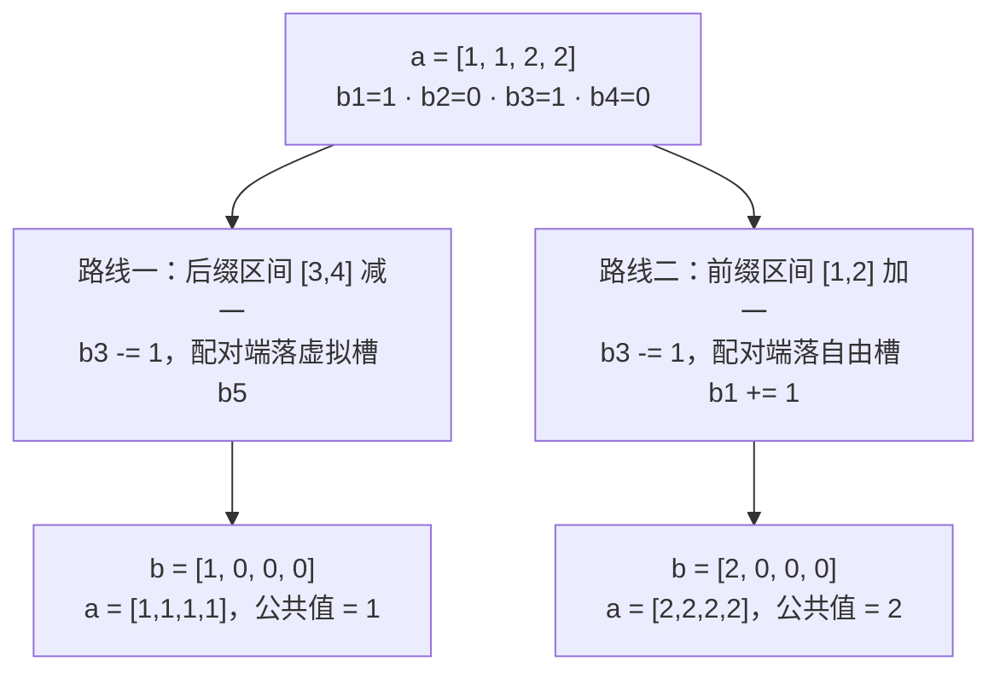

[[TOC]]

## 形式化题目

给定长度为 $n$ 的数列 $a_1, a_2, \dots, a_n$。每次操作选择一个区间 $[l, r]$，把区间内所有数同时加一或同时减一。

求：

1. 使数列所有数变成同一个值所需的最少操作次数；
2. 在操作次数最少的前提下，最终数列（即那个公共值）有多少种可能。

样例：$a = [1, 1, 2, 2]$，把区间 $[3, 4]$ 减一变成 $[1,1,1,1]$，或把区间 $[1, 2]$ 加一变成 $[2,2,2,2]$，都只需 $1$ 次操作；两种不同的最终结果对应答案 $1$ 与 $2$。

## 正解

### 思路

**朴素想法**：每次操作把一个区间整体 ±1，最小操作次数似乎要靠搜索或模拟贪心。困难来自**一次区间操作同时改动 $r-l+1$ 个位置，决策对象太分散**。

**关键转化：看差分**。令 $b_i = a_i - a_{i-1}$（约定 $a_0 = 0$）。"数列全部相等" $\Leftrightarrow$ 相邻差全为零，即 $b_2 = b_3 = \dots = b_n = 0$；而 $b_1 = a_1$ 只决定最终的公共值，本身不必归零。一次区间操作在差分数组上的效果非常干净：

| 区间操作 | 差分数组上的效果 |
| --- | --- |
| $[l, r]$ 整体 $+1$（$r < n$） | $b_l \mathrel{+}= 1$，$b_{r+1} \mathrel{-}= 1$ |
| $[l, r]$ 整体 $-1$（$r < n$） | $b_l \mathrel{-}= 1$，$b_{r+1} \mathrel{+}= 1$ |
| $[l, n]$ 整体 $\pm 1$（后缀） | 只有 $b_l$ 变化，另一端落在虚拟槽 $b_{n+1}$ |
| $[1, r]$ 整体 $\pm 1$（前缀） | 只有 $b_{r+1}$ 变化，另一端落在 $b_1$ |

也就是说，**一次区间操作 = 在差分数组上选两个槽位，一个 $+1$、一个 $-1$**，且允许其中一端落在两个"自由槽"上：$b_1$（只影响公共值）和虚拟槽 $b_{n+1}$（什么都不影响）。于是问题变成：槽位 $b_2 \dots b_n$ 上有若干正数和负数，每次操作让一个正槽 $-1$、同时一个负槽 $+1$（或把单边的变化甩给自由槽），最少几步能把它们全部清零？

设约束槽位中正数之和为 $p$、负数绝对值之和为 $q$：

- **下界 $\max(p, q)$**：一次操作无论怎么选，正总量 $p$ 至多减少 $1$，负总量 $q$ 也至多减少 $1$，所以清零至少需要 $\max(p, q)$ 步。
- **$\max(p, q)$ 步一定够**：前 $\min(p, q)$ 步每次挑一正一负配对，各消 $1$；剩下 $|p - q|$ 的单边缺口，每步用后缀/前缀区间操作消掉，配对端甩给自由槽。自由槽不参与"全部相等"的约束。

所以最少操作次数为 $\text{ops} = \max(p, q)$。

**第二问：方案数**。在 $\max(p, q)$ 步内，配对部分是确定的，唯一自由的是那 $k = |p - q|$ 步单边操作。以 $p > q$ 为例：每个待消的正槽 $b_l$，既可以用后缀区间 $[l, n]$ 减一（配对端落 $b_{n+1}$，公共值不变），也可以用前缀区间 $[1, l-1]$ 加一（配对端落 $b_1$，整个数列抬高 $1$）。$k$ 步里选几步走"落 $b_1$"的路，公共值就比"不动 $b_1$ 的目标值"整体高 $0, 1, \dots, k$，都能取到且互不相同，因此方案数为

$$k + 1 = |p - q| + 1.$$

样例中差分为 $b_1 = 1,\ b_2 = 0,\ b_3 = 1,\ b_4 = 0$，约束槽只有 $b_3 = 1$，$p = 1,\ q = 0$：最少操作 $\max(1, 0) = 1$ 次，缺口 $k = 1$，方案数 $1 + 1 = 2$——恰好对应"后缀减一得 $1$"与"前缀加一得 $2$"两种结果。

### 代码

@include-code(./main.py, python)

### 复杂度

- 时间：读入与一次差分扫描，$O(n)$；$n \le 10^5$ 轻松通过（本机全部测例约 $0.03$ s）。
- 空间：$O(n)$ 存放数列与差分；$a_i < 2^{31}$，Python 整数无溢出问题。

## 总结

- **区间操作题先看差分**：区间 ±1 在差分数组上只是"两个端点单点反号变化"，把对区间的贪心/搜索压缩成对槽位的计数。
- 全部相等 $\Leftrightarrow$ $b_2 \dots b_n$ 全零；$b_1$（决定公共值）与 $b_{n+1}$（虚拟槽）是两个可自由吸收变化的槽。
- 最少操作次数 $\max(p, q)$：配对消减贴合下界，单边缺口甩给自由槽。
- 方案数 $|p - q| + 1$：$|p-q|$ 步单边操作每步可分配给"改公共值"的前缀区间，公共值可偏移 $0 \dots |p-q|$，共 $|p-q|+1$ 种。

## 图示解析

以样例 $a = [1, 1, 2, 2]$（差分 $b_1{=}1,\ b_2{=}0,\ b_3{=}1,\ b_4{=}0$）为例，展示两条最少操作路线在差分数组上的落点：

两条路线都只用了 $\max(p, q) = 1$ 次操作，且都把唯一非零的约束槽 $b_3$ 清零；差别只在配对端落在哪个自由槽——落 $b_5$ 公共值不变，落 $b_1$ 公共值抬高 $1$。观察重点：**约束槽在两条路线下都归零，能变化的只是公共值**，而这正是方案数 $|p-q|+1$ 的直观来源。
