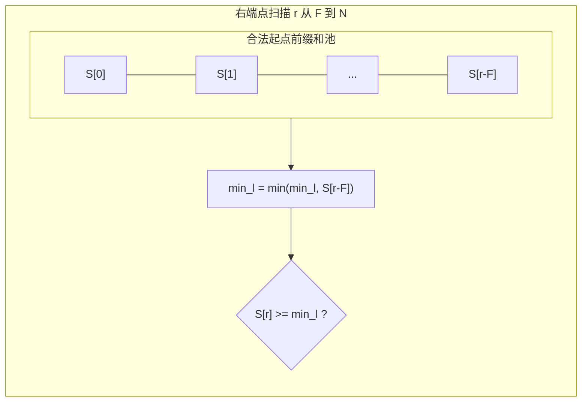

[[TOC]]

## 形式化题目

给定一个长度为 $N$ 的正整数序列 $A = [a_1, a_2, \dots, a_N]$ 和一个整数 $F$。

求一个长度不小于 $F$ 的连续子段 $A[l \dots r]$（即 $1 \leqslant l \leqslant r \leqslant N$ 且 $r - l + 1 \geqslant F$），使得子段中元素的平均值：

$$\frac{\sum_{i=l}^r a_i}{r - l + 1}$$

达到最大。最终输出该最大平均值乘以 $1000$ 后的向下取整结果 $\lfloor \text{ans} \times 1000 \rfloor$。

## 正解

### 思路

直接枚举所有长度 $\geqslant F$ 的连续子段并计算平均值需要 $O(N^2)$ 的时间复杂度，在 $N = 100000$ 时会超时。

注意到“平均值能否达到 $v$”具有单调性：若存在子段的平均值 $\geqslant v$，则对于任意 $v' < v$，该子段的平均值显然也 $\geqslant v'$。因此可以通过**二分答案**将最优化问题转化为判定性问题。

#### 1. 判定条件的转化

对于给定的实数 $mid$，判断是否存在区间 $[l, r]$ 满足：

- $r - l + 1 \geqslant F$
- $\frac{\sum_{i=l}^r a_i}{r - l + 1} \geqslant mid$

将不等式变形：

$$\sum_{i=l}^r a_i \geqslant mid \times (r - l + 1) \iff \sum_{i=l}^r (a_i - mid) \geqslant 0$$

令 $b_i = a_i - mid$，记前缀和 $S_k = \sum_{i=1}^k b_i$（定义 $S_0 = 0$）。则区间 $[l, r]$ 的和为 $S_r - S_{l-1}$。问题等价于：

是否存在 $r$ 和 $l$ 满足 $r - l + 1 \geqslant F$（即 $l-1 \leqslant r - F$），使得：

$$S_r - S_{l-1} \geqslant 0 \iff S_r \geqslant S_{l-1}$$

#### 2. $O(N)$ 线性扫描判定

固定右端点 $r$（$F \leqslant r \leqslant N$），合法左端点前缀下标 $p = l - 1$ 的取值范围是 $0 \leqslant p \leqslant r - F$。

为了使 $S_r - S_p$ 尽可能大，应使减数 $S_p$ 尽可能小。令：

$$\min\_S = \min_{0 \leqslant p \leqslant r - F} S_p$$

当 $r$ 从 $F$ 增加到 $N$ 时，新加入候选集合的下标仅有 $p = r - F$。我们可以维护一个动态变量 $\min\_S$：在每个 $r$ 处，先用 $S_{r-F}$ 更新 $\min\_S = \min(\min\_S, S_{r-F})$，再检查是否 $S_r \geqslant \min\_S$。若满足则判定成功。

这样，单次判定只需 $O(N)$ 时间。

#### 3. 算法可视化

以样例 $A = [6, 4, 2, 10, 3, 8, 5, 9, 4, 1]$，$F = 6$ 为例，扫描过程中维护窗口左侧前缀最小值：

在二分范围 $[1, 2000]$ 内，以精度 $\text{eps} = 10^{-5}$ 终止二分，总时间复杂度为 $O(N \log \frac{\max A}{\text{eps}})$，可以在时限内通过全部测试点。

### 代码

Python 版：

@include-code(./main.py, python)

C++ 版（同一算法）：

@include-code(./main.cpp, cpp)

### 复杂度

- **时间复杂度**：单次判定遍历序列一次，耗时 $O(N)$。二分区间长度为 $2000$，精度阈值为 $10^{-5}$，二分迭代次数约为 $\log_2(2000 / 10^{-5}) \approx 28$ 次。总时间复杂度为 $O(N \log \frac{V}{\text{eps}})$，其中 $V = \max a_i$。在 $N = 10^5$ 时，总操作量约 $3 \times 10^6$，耗时远低于 1 秒。
- **空间复杂度**：存储输入数组和前缀和数组需要 $O(N)$ 额外空间。

## 总结

解决“最大平均值连续子段”问题的核心是将平均值减去基准量 $mid$，转化为**和非负**问题。通过前缀和配合单调更新前缀最小值，消除了固定长度下限带来的多余枚举，将判定复杂度压至 $O(N)$。这种“二分答案 + 偏移量前缀和 + 前缀极值”是处理实数域最值和平均值区间的经典范式。
