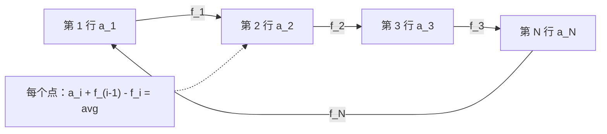

[[TOC]]

## 形式化题目

$N \times M$ 的棋盘上有 $T$ 个被标记的格子。一次操作是交换两个**相邻**格子，相邻指同行相邻列或同列相邻行，且首尾也相邻（第 $1$ 列与第 $M$ 列相邻、第 $1$ 行与第 $N$ 行相邻）。

记 $a_i$ 为第 $i$ 行的标记数、$c_j$ 为第 $j$ 列的标记数。要求选择尽量多的目标：

- **行要求**：操作后 $a_1 = a_2 = \dots = a_N$；
- **列要求**：操作后 $c_1 = c_2 = \dots = c_M$。

按下述规则输出：能同时满足输出 `both`、只能满足行输出 `row`、只能满足列输出 `column`、都不能满足输出 `impossible`；若不是 `impossible`，再输出该前提下的最小交换次数。

约束：$1 \leqslant N, M \leqslant 10^5$，$0 \leqslant T \leqslant \min(N \times M, 10^5)$。

主样例 `2 3 4` 配坐标 $(1,3), (2,1), (2,2), (2,3)$ 的计数如下。行计数 $[1,3]$ 可以均分成 $[2,2]$；列计数 $[1,1,2]$ 的总和 $4$ 不能被 $M = 3$ 整除，所以列要求无解，答案为 `row 1`。

| | 第 1 列 | 第 2 列 | 第 3 列 | 行计数 |
| --- | --- | --- | --- | --- |
| 第 1 行 | · | · | ★ | 1 |
| 第 2 行 | ★ | ★ | ★ | 3 |
| 列计数 | 1 | 1 | 2 | $T = 4$ |

交换 $(1,1)$ 与 $(2,1)$ 后行计数变成 $[2,2]$，只花了 $1$ 次。

## 正解

### 思路

**朴素想法**：直接模拟交换——每次挑一对相邻摊点尝试交换，直到行（或列）计数全相等。这条路走不通的原因很具体：状态空间是“$T$ 个标记放在 $N \times M$ 个格子里”的全部摆放方式，属于组合级别（$N = M = 10^5$ 时天文数字）；而且题面还要求“先最大化能满足的要求个数”，连目标都不唯一，搜索更是无从下手。唯一的出路是**先分类、再计数**：可行性用整除判断，最小次数用闭式公式算。下面分五步把公式推出来。

**第一步：只保留计数。**

被标记的格子彼此没有区别，交换一个有标记的格子与一个空格，效果就是“把一个标记搬到相邻格”。所以棋盘的形状无关紧要，全部信息就是两个计数数组 $a_1..a_N$ 和 $c_1..c_M$：扫一遍 $T$ 个坐标累加即可，$O(T)$。$N \times M$ 可以到 $10^{10}$，正因为只存计数，才不需要建整张棋盘。

**第二步：行与列解耦。**

看一次交换到底改变了什么：

- 交换**同一行的相邻两列**（横向）：第 $y$ 列计数 $-1$、第 $y+1$ 列计数 $+1$，而两格仍在同一行，**所有行计数都不变**；
- 交换**同一列的相邻两行**（纵向）：行计数改变、**列计数不变**。

两类操作互不干扰，于是可以分开算：设只满足行要求的最小次数为 $C_r$、只满足列要求的最小次数为 $C_c$，则同时满足两者恰好是 $C_r + C_c$。上界是“先做完行、再做列”（两套操作不互相破坏）；下界是任何合法方案里纵向交换次数本身就 $\geqslant C_r$、横向本身就 $\geqslant C_c$。

可行性同样各看各的：行计数之和恒为 $T$，要全相等必须 $N \mid T$；列要求必须 $M \mid T$。这直接决定了输出 `both` / `row` / `column` / `impossible`。

**第三步：一维问题是“环形均分纸牌”。**

以行为例，目标值是 $avg = T / N$。设 $f_i$ 表示从第 $i$ 行**净搬出**到第 $i+1$ 行的标记数（可正可负，下标按环取模）。第 $i$ 行收了 $f_{i-1}$、送出 $f_i$，最后要剩 $avg$：

$$a_i + f_{i-1} - f_i = avg \quad\Longrightarrow\quad f_i = f_{i-1} + a_i - avg .$$

下面这张图把这条式子画出来：每条边 $i$ 上的流量就是 $f_i$，每个点上的守恒式就是上式。



读图要点：$f_i$ 是**净流量**而不是“搬运次数”，一次搬运会给它 $\pm 1$；环上的守恒式是递推关系，只要定下任意一条边的流量，整圈 $f$ 就被唯一确定。

**第四步：代价是流量绝对值之和。**

边 $i$ 上的每一次搬运都只搬一格，所以这条边上至少要搬运 $|f_i|$ 次，总次数 $\geqslant \sum_i |f_i|$；反过来，沿每条边朝净流向搬够 $|f_i|$ 次就能实现（净流量为正说明这条边总体在净输出，按输出方向顺序搬运不会出现“无标记可搬”，否则真实流量就超出净流量了）。所以

$$\text{代价} = \min_{f}\sum_{i=1}^{N} |f_i| .$$

**第五步：对 $K$ 取中位数。**

把递推展开。记前缀和 $S_i = a_1 + \dots + a_i$，则

$$f_i = f_0 + \sum_{k=1}^{i}(a_k - avg) = K + b_i, \qquad b_i = S_i - i \cdot avg .$$

$b_i$ 完全由计数决定，唯一的自由度是 $K = f_0$（第一条边的流量）。于是

$$\text{代价} = \min_{K \in \mathbb{Z}} \sum_{i=1}^{N} |K + b_i| = \min_{x} \sum_i |b_i - x| .$$

这是“数轴上到 $N$ 个点的距离和最小”的子问题：$x$ 取 $b$ 的**中位数**时最小。因为下标成环，$K$ 不受“第一条边不许有流量”的约束（那是线性版均分纸牌的限制），可以自由选到 $b$ 中的某个元素，所以排序后取 `counts[n // 2]`（数组已被改写成 $b$）即可；长度是偶数时两个中位点代价相同，取右中位点无需特判。

用主样例的行计数 $[1,3]$ 走一遍完整公式（$avg = 2$）：

| 位置 $i$ | $a_i$ | 前缀和 $S_i$ | $b_i = S_i - i \cdot avg$ |
| --- | --- | --- | --- |
| 1 | 1 | 1 | $-1$ |
| 2 | 3 | 4 | $0$ |

表中第三列是本题唯一需要的中间量：它把原计数变成了一串“相对目标的盈亏累加”。$N = 2$ 所以 $b$ 只有两个元素 $[-1, 0]$，排序后取 `counts[2 // 2] = counts[1] = 0` 作 pivot，代价 $= \lvert -1 - 0 \rvert + \lvert 0 - 0 \rvert = 1$，与题面的 `row 1` 一致。

**环上取中位数与线性版的差别**：注意 $b_N = S_N - N \cdot avg = T - T = 0$ 恒成立，而线性版均分纸牌要求贴着第 $1$ 行的那条边没有流量，即 $f_N = 0$，于是 $K$ 被迫取 $0$，代价退化成一个固定值 $\sum_i |b_i|$。环形版可以自由挑 $K$，取中位数只会更小或相等。以 $N = 4$、$T = 8$、$avg = 2$、计数 $[0,0,4,4]$ 为例：$b = [-2,-4,-2,0]$，排序后 $[-4,-2,-2,0]$，中位数是 $-2$（代码取 `counts[n // 2]` 即下标 2 的 $-2$），环形代价 $0+2+0+2 = 4$；而线性版只能取 $K = 0$，代价 $2+4+2+0 = 8$，翻了一倍——让第 4 行直接把标记送给第 1 行（首尾相邻）才是对的。

### 代码

@include-code(./main.py, python)

实现上有三处值得对应回推导：

- `ring_cost(counts, total)` 对应第三步到第五步的全部推导，被行、列各调用一次；名字本身就是“环形最小代价”这层概念，所以单独成函数。
- 函数开头 `if total % n: return None` 用 `None` 而不是 `-1` 或 `0` 作哨兵，把“不可行”和“代价为 $0$”（例如 $T = 0$）区分开，调用点判 `is None` 即可。
- `counts[i - 1] = prefix - i * avg` 把计数数组**原地**改写成 $b$ 数组：$b_i$ 只依赖标量前缀和，原始计数用完就丢，省掉第二次 $O(n)$ 分配。

`solve()` 只负责读入、调用、分类输出：两个 `is None` 判断对应“最多能满足几个要求”，四个分支与题面的四个字符串一一对应；读入用 `iter(map(int, ...))` 流式推进，不建二维结构。

### 复杂度

- 时间：$O(T + N \log N + M \log M)$。建计数 $O(T)$；`ring_cost` 求前缀与绝对偏差和都是 $O(n)$，唯一的超线性部分是排序。
- 空间：$O(N + M)$，只有两个计数数组（原地改写成 $b$）。

对比：朴素模拟的状态数是 $\binom{NM}{T}$ 级别，指数爆炸；本解把它换成“扫一遍坐标 + 两次排序”。这里的 $N \log N$ 项来自取中位数之前的排序，换用 `nth_element` 式的线性选择可以降到 $O(T + N + M)$，但对本题的限制来说没必要。

顺带一提，本解与 [货仓选址](https://roj.ac.cn/problem/3013) 共用“取中位数使绝对偏差和最小”这一步：那里是给点选中位数，这里是给前缀和数组选中位数。

## 总结

本题的难点全在**建模**，不在实现。三块拼图依次是：

1. **标记搬家**：交换相邻摊点 = 把标记搬到相邻格，所以棋盘只需压成行、列两个计数数组；
2. **行/列解耦**：横向交换只动列计数、纵向交换只动行计数，因此两个要求可以各自判断可行性（$N \mid T$、$M \mid T$）并各自最优，代价直接相加；
3. **环形均分纸牌**：设每条边的净流量 $f_i$，守恒式给出 $f_i = K + b_i$；代价 $\sum |f_i|$ 对 $K$ 是绝对偏差和，取 $b$ 的中位数最优。

于是“最少交换次数”这个看似无从下手的最优化问题，变成了排序后取中位数再求和，总复杂度只有两次排序。

## 图示解析

下面这张图把整篇推导压缩成一条主线：从输入到计数、从解耦到公式、再到四种输出。

```text
输入 T 个坐标
     │  只统计数量，丢弃位置细节
     ▼
┌───────────────────────┐        ┌───────────────────────┐
│ 行计数 a_1..a_N       │        │ 列计数 c_1..c_M       │
└───────────┬───────────┘        └───────────┬───────────┘
            │  横向交换只动列 → 两维解耦      │
            ▼                                ▼
      N | T ? 否 → 行不可行            M | T ? 否 → 列不可行
            │ 是                             │ 是
            ▼                                ▼
   b_i = S_i - i*avg  排序取中位数   同理
            │                                │
            └────────────┬───────────────────┘
                         ▼
        both  C_r + C_c ／ row  C_r ／ column  C_c ／ impossible
```

图中主线只有一条：**把二维棋盘压成一维计数 → 证明两维独立 → 一维用环形均分纸牌公式 → 分类输出**。最容易记错的是最后一格：只有两个方向都可行时才把 $C_r$ 与 $C_c$ 相加输出 `both`；只有一个方向可行时，另一个方向不做任何交换，不要顺手把它也算进去。
