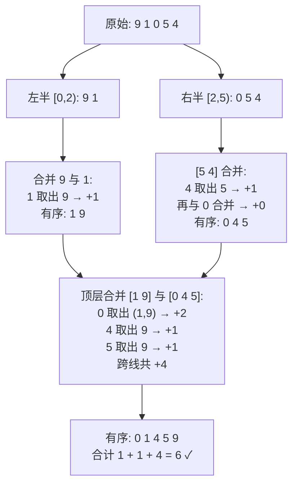

[[TOC]]

## 形式化题目

给定一个含 $n$ 个**互不相同**整数的序列 $a_1, a_2, \ldots, a_n$。每次操作只能交换**相邻**的两个元素，目标是把序列排成严格升序。求最少操作次数。

多个用例依次给出，读到 $n = 0$ 时终止。$n < 5 \times 10^5$，$0 \le a_i \le 999999999$。

## 正解

### 思路

**一句话本质**：只交换相邻元素的排序，最少交换次数就等于序列的**逆序对数**——用归并排序在合并两个有序半段时顺便把逆序对数统计出来，复杂度 $O(n \log n)$。

先看朴素做法：既然每次交换只动相邻两个元素，那就模拟冒泡，或者干脆双重循环枚举所有对 $(i, j)$，数一数有多少个 $i < j$ 且 $a_i > a_j$。$n < 5 \times 10^5$ 时这样的 $O(n^2)$ 枚举约 $1.25 \times 10^{11}$ 对，必然超时。**瓶颈在于：每一对元素的关系被重复看了一遍又一遍，而交换的过程根本不需要真的模拟。**

**为什么答案是逆序对数？** 逆序对指满足 $i < j$ 且 $a_i > a_j$ 的下标对。观察一次相邻交换 $a_i \leftrightarrow a_{i+1}$（不妨 $a_i > a_{i+1}$）：

- 对其他任何元素 $a_k$，它与 $a_i$、$a_{i+1}$ 的相对左右位置都没变，逆序状态不变；
- 唯一变化的是这一对本身：从"逆序"变成"有序"，逆序对数恰好减 1。

所以任何排序方案的交换次数 $\geqslant$ 初始逆序对数（每次交换最多消掉 1 个逆序对，而升序序列逆序对数为 0）；冒泡排序的每次交换消掉的又恰好是 1 个，能取到这个下界。**最少交换次数 = 初始逆序对数**，连交换的具体位置都不用关心。

**问题？** 怎么在 $O(n \log n)$ 内数出逆序对？

分治。按位置把序列切成左右两半，逆序对 $(i, j)$ 分成三类：

| 类型 | $i$ 与 $j$ 的位置 | 怎么统计 |
| --- | --- | --- |
| 左内部 | 都在左半 | 递归统计 |
| 右内部 | 都在右半 | 递归统计 |
| 跨中线 | $i$ 在左半、$j$ 在右半 | 合并两个有序半段时顺便统计 |

前两类交给递归。关键是第三类：先让左右两半各自有序，再归并合并。合并时两个指针分别扫左半 $buf[i]$ 与右半 $buf[j]$，一旦右半的 $buf[j]$ 更小、需要先进入结果，就说明**左半还没被取走的 $mid - i$ 个元素全都大于 $buf[j]$**（左半已有序），它们各自与 $buf[j]$ 构成一个跨中线逆序对——一次减法就把这一整段计数完毕，不用逐对枚举。

用样例序列 $9\ 1\ 0\ 5\ 4$ 看整个分治结构（每个节点标出该层的合并与跨中线贡献）：

顶层合并的精算（左半有序 $[1, 9]$，右半有序 $[0, 4, 5]$）——「取出」后括号里是被它跳过的左半剩余元素：

| 步骤 | 左半剩余 | 右半剩余 | 取出 | 跨中线计数 |
| --- | --- | --- | --- | --- |
| 1 | `1 9` | `0 4 5` | $0$（右） | $0$ 小于左半全部 2 个 → **+2** |
| 2 | `1 9` | `4 5` | $1$（左） | +0 |
| 3 | `9` | `4 5` | $4$（右） | 小于左半剩余 1 个 → **+1** |
| 4 | `9` | `5` | $5$（右） | 小于左半剩余 1 个 → **+1** |
| 5 | `9` | — | $9$（左） | +0 |

顶层跨线共 $2 + 1 + 1 = 4$，加上左半内部的 $1$ 与右半内部的 $1$，答案 $6$ ✓。第二个用例 $1\ 2\ 3$ 已然有序，无任何逆序对，输出 $0$ ✓。

**实现细节：**

- 递归函数 `inversions(lo, hi)` 返回 $a_{lo..hi-1}$ 的逆序对数：区间长度 $\le 1$ 直接返回 0，否则 = 左递归 + 右递归 + `merge_count(...)`。
- 合并用预分配缓冲区 `buf`：先把 `a[lo:hi]` 整段拷进 `buf`，再双指针写回 `a`，保证归并后该段有序、不影响上层统计。
- 判断"取左半"的条件是 `buf[i] <= buf[j]`：本题元素互不相同，取不取等号不影响计数，但写 `<=` 让相等元素保持稳定，通用性更好。
- 答案上界是 $\binom{n}{2} \approx 1.25 \times 10^{11}$，C++ 需要 `long long`；Python 的 `int` 天然无溢出。
- 多用例读到 $n = 0$ 为止：一次性读入全部 token，逐用例迭代解析。

> 另一条等价路线是**树状数组 + 离散化**：值域高达 $10^9$，先把权值映射到排名，再从左往右插入，每个元素查询"已插入的数里比它大的个数"（或倒序查"比它小的个数"），复杂度同为 $O(n \log n)$。本文选归并：不需要离散化，代码也更短。

### 代码

@include-code(./main.py, python)

### 复杂度

设单个用例长度为 $n$。

- **时间**：$O(n \log n)$。递归满足 $T(n) = 2T(n/2) + O(n)$，正是归并排序的标准递推；合并中"一次减法统计一段"保证了合并本身是线性开销。
- **空间**：$O(n)$——原数组、等长缓冲区 `buf`，外加 $O(\log n)$ 的递归栈。
- 所有元素互不相同，无需离散化；$n = 5 \times 10^5$ 时 Python 侧存在超时风险（本地实测含读入约 0.7s，接近 OJ 1s 限时），但算法与 C++ 正解同阶，同样的逻辑用 C++ 落地即稳过。

## 总结

- 相邻交换排序的最少交换次数 = **逆序对数**：一次相邻交换恰消 1 个逆序对，升序终态逆序对数为 0，下界可达。
- 归并排序统计逆序对：逆序对按位置分三类，前两类递归，跨中线的一类在合并两个有序半段时由"右半取出一个元素 → 左半剩余全部比它大"一次性计 $mid - i$ 个。
- 复杂度 $O(n \log n)$ / $O(n)$，是逆序对问题的通用套路；等价替代是树状数组 + 离散化。
- 大答案要当心：$n(n-1)/2$ 在 $n = 5 \times 10^5$ 时超出 32 位整数范围。
