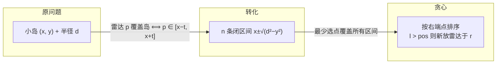

[[TOC]]

## 形式化题目

给定 $n$ 个平面上的点 $(x_i, y_i)$（题目保证 $y_i \ge 0$）和一个半径 $d$。要在 $x$ 轴上放置若干个等半径 $d$ 的圆（圆心在 $x$ 轴上），使得每个给定点都落在至少一个圆内（距离 $\le d$）。求最少需要多少个圆；若存在某个点满足 $y_i > d$，则输出 $-1$。

## 正解

### 思路

**第一步：把"雷达"翻译成"区间"。**

一个位于 $x$ 轴上位置 $p$ 的雷达，能覆盖小岛 $(x, y)$ 当且仅当两点距离不超过 $d$：

$$
(p - x)^2 + y^2 \le d^2 \iff x - \sqrt{d^2 - y^2} \le p \le x + \sqrt{d^2 - y^2}
$$

也就是说，**能覆盖这个小岛的所有雷达位置，恰好构成 $x$ 轴上的一段闭区间** $[x - t,\ x + t]$，其中 $t = \sqrt{d^2 - y^2}$。若 $y > d$，则 $d^2 - y^2 < 0$，区间不存在——没有任何位置能覆盖它，直接输出 $-1$。

到此，原问题变成一个纯粹的区间问题：

> 平面上有 $n$ 条线段，选最少的点，使得每条线段都至少包含一个选出的点。

**第二步：区间选点的经典贪心。**

朴素想法是枚举所有候选点（每条线段的 $2n$ 个端点），对每个点统计能覆盖多少条线段——这是 $O(n^2)$ 的，$n \le 1000$ 可以过，但我们想要更本质的做法。

经典贪心：把 $n$ 条线段按**右端点**从小到大排序，从左往右扫描。维护"当前已放置雷达的最右位置 $pos$"（初始为 $-\infty$）：

- 若当前线段的左端点 $l > pos$，说明它与之前所有已放雷达都接触不到，必须新开一个雷达；贪心把它放在这条线段的**右端点** $r$ 处（越靠右，越有机会顺带覆盖后面还没处理的线段），并更新 $pos = r$，答案加一。
- 若 $l \le pos$，当前线段已被 $pos$ 处的雷达覆盖，直接跳过。

**为什么按右端点排序 + 放右端点是最优的？** 用交换论证：考虑排序后第一条未被覆盖的线段，设其右端点为 $r$。任何可行方案都必须有某个点落在 $\le r$ 的位置来覆盖它；把方案中这个点右移到 $r$，它仍然覆盖这条线段（因为该线段右端点是 $r$），且不会使任何"右端点 $\ge r$ 的未覆盖线段"失去覆盖。因此存在一个最优解，第一个雷达就放在 $r$ 上。删去被它覆盖的线段后对剩余线段归纳，即得贪心解最优。

**样例走一遍**（$n=3, d=2$）：

| 小岛 | 坐标 | 可放雷达区间 $[x-t, x+t]$ |
| --- | --- | --- |
| A | $(1, 2)$ | $[1, 1]$ |
| B | $(-3, 1)$ | $[-3-\sqrt3,\ -3+\sqrt3] \approx [-4.73, -1.27]$ |
| C | $(2, 1)$ | $[2-\sqrt3,\ 2+\sqrt3] \approx [0.27, 3.73]$ |

按右端点排序为 B（$-1.27$）、A（$1$）、C（$3.73$）：

1. 扫到 B：$l \approx -4.73 > -\infty$，新放雷达于 $-1.27$，答案 $= 1$；
2. 扫到 A：$l = 1 > -1.27$，与 B 处雷达不相交，新放雷达于 $1$，答案 $= 2$；
3. 扫到 C：$l \approx 0.27 \le 1$，已被覆盖，跳过。

最终答案 $2$，与样例输出一致。

### 代码

Python 版：

@include-code(./main.py, python)

C++ 版（同一算法）：

@include-code(./main.cpp, cpp)

### 复杂度

- 时间复杂度：排序 $O(n \log n)$，扫描 $O(n)$，总计 $O(n \log n)$。$n \le 1000$ 下远在限时时限之内。
- 空间复杂度：$O(n)$ 存储区间。
- 浮点精度：$d^2 - y^2 \ge 0$ 时开方不会出现定义域问题；区间端点用浮点存储，坐标范围不超过 $10^6$，双精度误差远小于区间相交判断需要的精度（判断的是 $l > pos$ 的严格不等，端点重合时取等也能被同一雷达覆盖，不影响答案）。

## 总结

- 核心转化：雷达覆盖小岛 $\iff$ 雷达位置落在以岛为中心的对称区间 $[x-\sqrt{d^2-y^2},\ x+\sqrt{d^2-y^2}]$ 内，几何覆盖问题变成区间选点问题。
- 算法：按右端点排序，$l > pos$ 时在右端点新放雷达，贪心正确性由交换论证保证。
- 无解判定：只要有一个岛 $y > d$ 输出 $-1$。
- 复杂度 $O(n \log n)$，是最少点覆盖所有区间的经典模型（与"区间调度/选最少区间"同族）。
