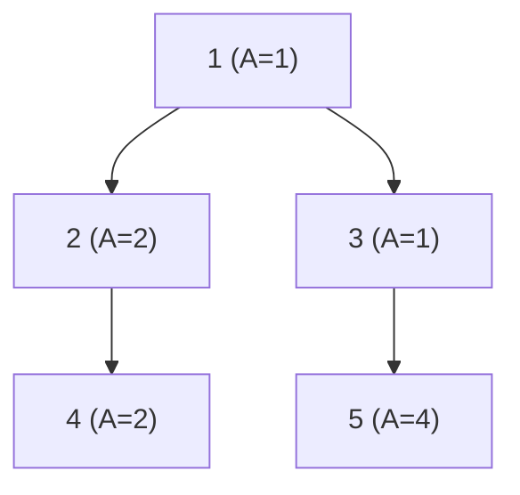

[[TOC]]

## 形式化题目

给出一棵 $n$ 个节点的有根树，根为 $R$，点 $i$ 有权值 $A[i]$。要把所有点排成一个染色序列 $v_1, v_2, \dots, v_n$（$v_t$ 是第 $t$ 次染色的点），满足偏序约束

$$\text{对每个 } b \ne R \text{ 及其父节点 } a，\ a \text{ 必须排在 } b \text{ 之前。}$$

在这个序列上代价为 $\sum_{t=1}^{n} t \cdot A[v_t]$，求最小代价。

## 正解

### 思路

**先看清代价在数什么。** 把 $t$ 拆成「前面已经染了几个点」再加 $1$，就得到

$$\sum_{t=1}^{n} t \cdot A[v_t] = \sum_{i=1}^{n} A[i] + \sum_{i \ne j} [\,v_i \text{ 排在 } v_j \text{ 之前}\,] \cdot A[v_j].$$

右边第一部分是常数，第二部分说明：**每一对「谁在谁前面」的有序关系，都要为排在后面的那个点付一次它的权值**。后面算增量时直接数有序对，不必重算整条序列。

**一个诱人但错误的局部贪心。** 每一步在所有「父亲已染色」的候选点里挑权值最大的先染，看起来很合理，但它是错的。例如根为 $1$ 的树：

```text
1 (A=1)
├── 2 (A=1)
│   └── 3 (A=100)
└── 4 (A=50)
```

先染 $1$ 后候选是 $\{2, 4\}$，局部贪心挑 $A=50$ 的 $4$，得顺序 $1,4,2,3$，代价 $1+100+3+400 = 504$；最优是 $1,2,3,4$，代价 $1+2+300+200 = 503$。失败的根因是：**点 $2$ 虽然权值小，但它是 $A=100$ 的点 $3$ 的必经之路**。为了提前一个大权值点而把它的祖先往后拖，反而抬高了那个大权值点的乘数。所以决策不能以单点为单位。

**关键观察一：每个点一定紧跟在它的父块之后。** 设 $u$ 与父节点 $p$ 之间有别的点 $w$。把 $u$ 与紧邻其前的 $w$ 交换，$u$ 的轮数少 $1$、$w$ 的轮数多 $1$，代价变化恰好是 $A[u] - A[w]$，与轮数无关。于是只要 $A[u] \geqslant A[w]$ 就可以把 $u$ 一直前移到 $p$ 之后而不变差。反复交换得到：**一个点应当和它的父节点（以及父节点所属的那一整段）连续染色**。把这样的连续段叫做一个**块**。

**关键观察二：块按平均值降序排列最优。** 两个块 $X, Y$ 之间没有先后约束时，比较两种紧邻顺序：

| 顺序 | 跨块贡献 |
| --- | --- |
| $X$ 紧接在 $Y$ 前面 | $|X| \cdot \text{total}[Y]$ |
| $Y$ 紧接在 $X$ 前面 | $|Y| \cdot \text{total}[X]$ |

两种顺序的块内代价相同，差别只在跨块项：$X$ 在前时每一对 $(x \in X,\ y \in Y)$ 都让 $y$ 排在后面，共 $|X|$ 个 $x$ 各为 $\text{total}[Y]$ 付一次；$Y$ 在前时同理为 $|Y| \cdot \text{total}[X]$。因此 $X$ 在前不劣于 $Y$ 在前，当且仅当

$$\frac{\text{total}[X]}{|X|} \geqslant \frac{\text{total}[Y]}{|Y|}.$$

即**块按平均值（权值和 ÷ 点数）降序排最优**。

**把两个观察合成一个贪心。** 块顺序由平均值决定，而每个子块又必须紧跟父块——于是反复执行：

1. 在所有非根块中，取平均值最大的块 $B$（根块必须最先，不参与挑选）；
2. 由观察一，$B$ 一定紧跟它的父块 $P$，把 $B$ 并入 $P$，新块的平均值变成加权平均 $\frac{\text{total}[P] + \text{total}[B]}{\text{size}[P] + \text{size}[B]}$；
3. 合并后 $P$ 变大了，下一轮重新比较——「排序」和「连续性」就这样交替满足。

共合并 $n-1$ 次，最后只剩根块。

**增量怎么算。** 合并 $B$ 进 $P$ 时，新增的有序对恰好是「$B$ 的每个点排在 $P$ 的每个点之后」，按第一节的按对计费，这一批后来者一共贡献

$$\text{total}[B] \times \text{size}[P].$$

再加上初始的 $\sum_i A[i]$（每个点自己那一轮）。用并查集维护块的合并，这个增量每次 $O(1)$ 就能算出。

下面用样例走一遍。树的结构与权值如下：



初始 `cost = ΣA = 10`，每个块 size 为 1、total 为该点的 $A$，然后逐轮合并：

| 轮次 | 当前非根块 (total,size) | 选中块 | 父块根 | 父块 size | 增量 | 累计 cost |
| --- | --- | --- | --- | --- | --- | --- |
| 1 | 2(2,1) 3(1,1) 4(2,1) 5(4,1) | 5 | 3 | 1 | $4 \times 1 = 4$ | 14 |
| 2 | 2(2,1) 3(5,2) 4(2,1) | 3 | 1 | 1 | $5 \times 1 = 5$ | 19 |
| 3 | 2(2,1) 4(2,1) | 2 | 1 | 3 | $2 \times 3 = 6$ | 25 |
| 4 | 4(2,1) | 4 | 1 | 4 | $2 \times 4 = 8$ | 33 |

观察重点有三处。第一轮选中的是权值最大的叶子——$A=4$ 的点 $5$，它紧跟父节点 $3$，于是 $3$ 这块的 total 变成 $1+4=5$、size 变成 $2$——**块的平均值 $2.5$ 已大于任何单点**，所以第二轮它又被选中，并入根块。第三轮点 $2$ 并入时根块已有 $3$ 个点，增量为 $2 \times 3$；第四轮点 $4$ 并入时根块已有 $4$ 个点，增量为 $2 \times 4$。最终答案 $33$，与样例一致。

对应的染色顺序是 $1, 3, 5, 2, 4$，代价 $1 + 2 \cdot 1 + 3 \cdot 4 + 4 \cdot 2 + 5 \cdot 2 = 33$，与逐步累加的增量吻合。

### 代码

代码用 `belong` 做并查集（只有块根满足 `belong[x] == x`），`up[x]` 记录点 $x$ 的父节点落在哪个块，`size`/`total` 就是表格里那两列；`up[root] = root` 表示根块没有父块。`cost` 从 `sum(weight)` 起步，主循环每轮加一次 `total[best] * size[parent_block]`，与上面的表格逐行对应。

Python 版：

@include-code(./main.py, python)

C++ 版（同一算法）：

@include-code(./main.cpp, cpp)

### 复杂度

- 时间复杂度：$O(n^2)$。主循环执行 $n-1$ 轮，每轮扫描 $n$ 个点找块根并取最大平均值块，单轮 $O(n)$；并查集合并与路径压缩均摊近似 $O(\alpha(n))$，被 $O(n)$ 的扫描吸收。$n \leqslant 1000$ 时约 $10^6$ 次基本操作。
- 空间复杂度：$O(n)$。`belong`、`up`、`size`、`total`、`father`、`weight` 各占 $O(n)$，无递归栈。

## 总结

本题的核心是**把决策单位从「点」提升到「块」**。局部比较单点权值会失败，因为子节点的染色时机无法脱离它的祖先独立决定；交换论证给出两条结论——每个点与父块连续染色，块按平均值降序排列——合起来就是 Horn 的贪心合并：反复把平均值最大的非根块并入父块，并用「按对计费」在合并时 $O(1)$ 累加 $\text{total}[B] \times \text{size}[P]$。实现时用并查集维护块根与块的父块，注意根块不参与挑选、`up[root] = root` 表示没有父块。复杂度 $O(n^2)$，$n \leqslant 1000$ 足够。

## 图示解析

下图给出从题意到答案的主线：先建立「按对计费」的代价模型，再由交换论证得到两条块级性质，最后合成贪心合并流程。

```text
  输入：有根树 + 权值 A[i]
        |
        v
  代价改写：sum t*A[v_t] = sum A[i] + sum_{有序对} A[后者]
        |                                    (按对计费)
        v
  局部贪心（每步选最大权值可染点） --反例--> 失败：祖先被拖后会抬高大权值点
        |
        v
  交换论证
   |- 观察一：每个点紧跟在父块之后   -> 块内连续
   `- 观察二：块按平均值降序最优     -> 块间有序
        |
        v
  贪心合并：反复取平均值最大的非根块 B，并入父块 P
        |     cost += total[B] * size[P]
        |     并查集维护 belong / up / size / total
        v
  合并 n-1 次后只剩根块 -> 输出 cost
```

读者应重点关注两处：中间的反例说明为什么必须放弃「按单点权值贪心」，而下面两条观察分别对应「块的内部」和「块的外部」——前者决定了「谁和谁必须绑在一起」，后者决定了「绑好的块谁先谁后」，二者缺一不可。最后的累加公式直接来自最上面的按对计费，所以整个过程只需要并查集，不需要每次重算完整染色序列。
