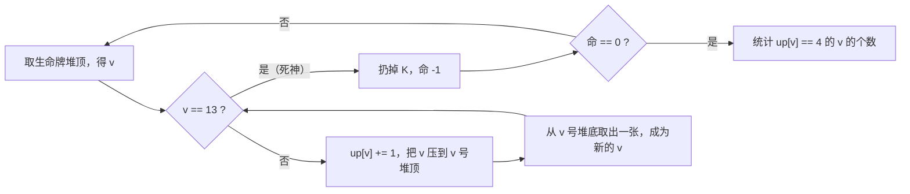

[[TOC]]

## 形式化题目

一副去掉大小王的扑克共 52 张，均分成 13 堆并编号 $1 \sim 13$，每堆 4 张。第 13 堆称为**生命牌堆**，其余各堆的编号对应牌的点数：$A=1$、$2 \sim 9$ 为原值、$10$ 记作 `0`、$J=11$、$Q=12$、$K=13$。

每堆牌按"从上到下"有序。初始所有牌背面朝上。反复执行：

1. 从生命牌堆的**最上面**取出一张牌，记其点数为 $v$；
2. 若 $v=13$（$K$，称为死神），则把这张牌扔掉，生命数减一，回到第 1 步；
3. 否则把这张牌翻成正面朝上，压到编号 $v$ 的堆的**最上面**；再从该堆的**最下面**取出一张牌，把它的点数记为新的 $v$，回到第 2 步。

生命数从 4 减到 0 时结束。求终局时有多少个点数 $v \in \{1, 2, \dots, 12\}$（即 $A \sim Q$），其 4 张牌全部正面朝上。

## 正解

### 思路

题面把规则写得完整而确定，没有需要"求最优"或"猜"的成分，因此这是一道**照着规则模拟**的题：把 13 个牌堆建成 13 个双端队列即可，不需要额外算法。

**第一步：把牌堆选成双端队列。** 每堆牌的操作只有两种，恰好落在队列的两端：

- "压到最上面" → 从**队首**插入，即 `appendleft`；
- "从最下面取出一张" → 从**队尾**弹出，即 `pop`。

这是本题唯一的建模难点。放牌与抽牌在**不同的两端**，两端写反会得到完全不同的答案。队列用 `collections.deque`，两端操作都是 $O(1)$。

队列元素需要同时记住点数和朝向。因为"压到最上面"这个动作必然把牌翻成正面朝上，而牌一旦翻开就不会再翻回去，所以**队内每一张牌的朝向由它的来源唯一决定**：

- 输入时放进去的原始牌 → 背面；
- 之后被压进去的牌 → 正面。

**第二步：把"朝向"压缩成一个计数器。** 我们只关心终局时每个点数有几张正面朝上的牌，并不关心某张具体的牌在哪。注意放牌的目标堆由点数唯一决定：一张点数为 $v$ 的牌若被翻开，它一定被压入 $v$ 号堆。于是可以开一个数组 `up[1..13]`，**每执行一次"翻开点数 $v$ 并压入 $v$ 号堆"，就让 `up[v]` 加一**。终局时 `up[v]` 就是点数 $v$ 的正面朝上张数，答案即

$$\sum_{v=1}^{12} [\,up[v] = 4\,]$$

（$v=13$ 是 $K$，不参与计数。）

这个压缩是精确的，不是近似：每个点数总共只有 4 张牌，正面朝上的张数必然 $\leqslant 4$，而 `up[v]` 恰好等于"$v$ 号堆里正面朝上的张数"（理由见下面的正确性说明）。

**第三步：写循环。** 外层跑 4 条命，内层沿着牌链走，`while v != 13` 就是"抽到死神则本轮结束"的守卫——$K$ 不进任何队列，直接被扔掉，这正是题面"扔掉 K"的含义。

用样例第 1 条命的前几步看看数据是怎么流动的：

| 步 | 抽到的牌（来源） | 放到 | 从该堆底抽到 | 计数 |
| --- | --- | --- | --- | --- |
| 1 | A（生命牌堆顶） | 1 号堆顶 | A | `up[A]=1` |
| 2 | A（1 号堆底） | 1 号堆顶 | A | `up[A]=2` |
| 3 | A（1 号堆底） | 1 号堆顶 | 5 | `up[A]=3` |
| 4 | 5（1 号堆底） | 5 号堆顶 | 5 | `up[5]=1` |
| 5 | 5（5 号堆底） | 5 号堆顶 | 4 | `up[5]=2` |
| ⋮ | ⋮ | ⋮ | ⋮ | ⋮ |
| 21 | K（11 号堆底） | —— 死神：直接扔掉 —— | 本轮结束 | 命 $-1$ |

第 1 条命在第 21 步抽到 $K$ 结束；第 2 条命只抽了一张，恰好就是 $K$，立刻结束。四条命走完后每堆的终局状态如下（**加粗**表示正面朝上）：

| 堆号 | 1 | 2 | 3 | 4 | 5 | 6 | 7 | 8 | 9 | 10 | 11 | 12 | 13 |
| --- | --- | --- | --- | --- | --- | --- | --- | --- | --- | --- | --- | --- | --- |
| 堆内 4 张（上→下） | **A** **A** **A** **A** | **2** **2** **2** **2** | **3** **3** **3** **3** | **4** **4** **4** **4** | **5** **5** **5** **5** | **6** **6** **6** **6** | **7** **7** **7** **7** | **8** **8** **8** **8** | **9** **9** **9** 9 | **0** **0** **0** **0** | **J** **J** **J** Q | **Q** **Q** J Q | （空） |
| 正面张数 | 4 | 4 | 4 | 4 | 4 | 4 | 4 | 4 | 3 | 4 | 3 | 2 | 0 |

$A$、$2 \sim 8$、`0` 这 9 个点数都凑满了 4 张正面牌，所以样例答案是 9。

用一张流程图概括这个不断重复的动作：

图中的关键点是：$K$ 永远不会进入 `up` 计数、也不会被压回任何堆，"命 $-1$" 之后直接回到最外层重新抽生命牌，因此内层 `while` 只需要判断点数是否等于 13。

### 正确性说明

要说明代码算的就是题目要求的答案，只需要两条性质。

**性质 1（每张牌最多被翻开一次）。** 一张牌被翻开的唯一途径是"被压到某堆的最上面"。而每次从堆底抽牌时，抽到的必然是原始牌：设某堆此刻已经压入了 $k$ 张正面牌，则它已经因压入而弹出过 $k$ 张原始牌，队列长度仍是 4，所以队尾那张永远是尚未被动过的原始牌。于是牌一旦被压入，就再也不会出现在队尾，`pop` 永远取不到它。因此"$v$ 号堆里正面朝上的张数"就等于"点数 $v$ 被压入的次数"，`up[v]` 记录的正是它。

**性质 2（模拟必然终止）。** 每次迭代先 `appendleft` 一张、再 `pop` 一张，`value` 号堆的长度不变，但因为它弹出的必然是原始牌，该堆未被动过的原始牌数严格减少 1。$K$ 被丢弃，剩余牌数只减不增。所以每条命至多走完所有 13 堆的全部原始牌（52 张）就会抽到 $K$ 而终止，四条命内模拟必然结束，不存在死循环。

### 代码

@include-code(./main.py, python)

三点实现说明：

- `VALUE` 用 `enumerate("A234567890JQK", 1)` 一次生成 13 个牌面的映射，正好是 $A=1$、$2 \sim 9$ 原值、`0` 代表 10、$J=11$、$Q=12$、$K=13$。键用 `bytes`，直接匹配 `sys.stdin.buffer.read().split()` 切出来的牌面，省一次解码。
- 第 13 堆既是生命牌堆、又是点数 13 对应的堆，所以 `piles[DEATH]` 这一个队列同时承担两个角色；$K$ 被"扔掉"体现在它从不入队。
- 内层循环里的 `piles[value].appendleft(value)` 后紧跟 `up[value] += 1`，就是"把 $v$ 翻开压入 $v$ 号堆"这一步的完整语义。

### 复杂度

- 时间复杂度 $O(1)$：模拟的总步数是常数。每次迭代都使 `value` 号堆少一张原始牌，而 $K$ 被直接丢弃，故每条命最多消耗完 13 堆的全部原始牌，即至多 $13 \times 4 = 52$ 步（实测随机牌局最多 48 步），四条命合计仍是常数级；读入与统计同样是 $O(13)$ 级别的常数。
- 空间复杂度 $O(1)$：13 个队列共 52 个元素，外加一个长度为 14 的计数数组。

### 边界情况

- 生命牌堆就是 $K$ 堆，所以抽到 $K$ 有两种来源：直接从生命牌堆顶抽到（如样例第 2 条命），或从别的堆底抽到 $K$。两者在代码里都由同一个 `while value != DEATH` 处理，不需要分支。
- $K$ 数量恰好为 4、生命数也恰好为 4，两个 4 相互对应，所以模拟结束时生命牌堆必然已经清空，不会出现"没牌可抽"的情况。
- 点数 10 在输入里写作 `0`，映射表已经处理；它计入 $A \sim Q$ 的统计范围。
- 若某个点数的 4 张牌从未全部翻开（样例中的 9、J、Q），`up[v] < 4`，`up[v] == 4` 为假，不会误计。

## 总结

本题是"确定性状态机"类模拟题：状态就是 13 个牌堆的内容与朝向，转移由题面唯一确定。

解题的关键只有两个判断——**容器要支持两端操作**（双端队列，堆顶 `appendleft`、堆底 `pop`），以及**只需要记住"每个点数翻开了几张"**，不必追踪每张具体牌的位置。想清楚第二点后，代码就从"维护 52 张牌的朝向"坍缩成"维护一个长度 13 的计数器"，逻辑与题面一一对应。
