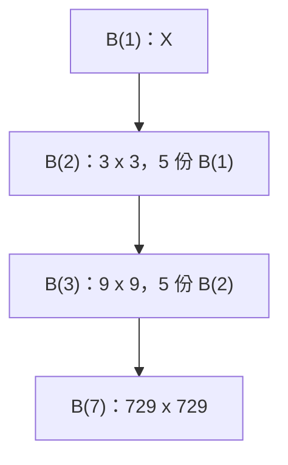

[[TOC]]

## 形式化题目

定义图形 $B(1)$ 为单个字符 `X`。当 $n \geqslant 2$ 时，$B(n)$ 是一个 $3^{n-1} \times 3^{n-1}$ 的字符方阵：把 $B(n-1)$（边长为 $3^{n-2}$ 的方阵）整体复制五份，分别放在方阵的左上、右上、正中、左下、右下五个位置，其余位置全部为空格。要求对每个输入的 $n$（$1 \leqslant n \leqslant 7$）输出 $B(n)$（行尾空格不输出），每组输出后另起一行输出一个 `-`。

## 正解

### 思路

**第一步：确定画布尺寸。** 由递归定义可以直接推出：$B(n)$ 的边长是 $B(n-1)$ 的 $3$ 倍，所以 $B(n)$ 的边长为 $3^{n-1}$。$n \leqslant 7$ 时边长最大 $3^6 = 729$，总字符量约 $729^2 \approx 5.3 \times 10^5$，输出规模完全可控。

**第二步：想清楚"整体复制"在行上意味着什么。** 递归定义是二维的"五个位置放五份副本"，但最终要按行输出。观察副本位置：五份副本在竖直方向上恰好占满三条水平带——

- 上带（高 $3^{n-2}$）：左上、右上两份副本左右并排；
- 中带（高 $3^{n-2}$）：只有正中一份副本，水平居中；
- 下带（高 $3^{n-2}$）：左下、右下两份副本左右并排。

于是"二维拼接"就退化成了三个一维的行操作：

| 水平带 | 每一行的构造 |
| --- | --- |
| 上带 / 下带 | `上一级行 + 空白带 + 上一级行`（空白带宽 = 上一级边长） |
| 中带 | `空白带 + 上一级行 + 空白带`（副本居中） |

**第三步：一个必须注意的实现细节。** 拼接时每一行要始终补齐到整图宽度。如果把 B(2) 的行按"去掉行尾空格"的形式存下来（例如第 2 行存成 `" X"` 而不是 `" X "`），再拿去拼 B(3)，副本的列位置就会整体错位——右侧副本的内容全部左移。所以 `fractal` 返回的每一行都是定宽的，行尾空格统一留到输出前用 `rstrip()` 去掉。

**第四步：递归实现。** 边界 $n = 1$ 返回单字符 `"X"`；$n \geqslant 2$ 时先递归拿到 $B(n-1)$ 的所有行，再按上表拼出三条水平带。由于测试数据里同一个 $n$ 会出现很多次，用 `functools.cache` 记忆化，7 级图案只构造一次，后续询问直接复用。

以 $B(2)$ 为例（这里用 `·` 代替空格，定宽 3）：

```
X·X
·X·
X·X
```

拼 $B(3)$ 时：上带 = 每行 `row + ··· + row`，中带 = 每行 `··· + row + ···`，下带与上带相同，得到题面样例中的 9 行图案。可以逐行对照验证。

### 代码

@include-code(./main.py, python)

### 复杂度

设 $s = 3^{n-1}$ 为边长。构造 $B(n)$ 需要把三份上一级图案的 $O(s)$ 行各拼接一次，每次拼接的字符串长度为 $O(s)$，总时间与空间都是 $O(s^2)$；$n = 7$ 时约 $5.3 \times 10^5$ 个字符，加上记忆化后全组数据只构造各级图案一次。时间上限 1000 ms、内存 128 MB 均可轻松通过。

## 图示解析

### 五份副本 → 三条水平带

下图展示 $B(3)$ 的构成：$B(2)$ 的九行先被"上带拼两份、中带居中一份、下带拼两份"地展开成三条水平带（`·` 表示空格）。

```
带 1（上）  X·X···X·X      row + ··· + row
            ·X·····X      ·X· + ··· + ·X·  ← 定宽拼接，两份副本不错位
            X·X···X·X      X·X + ··· + X·X

带 2（中）  ···X·X        ··· + X·X + ···
            ····X         ··· + ·X· + ···
            ···X·X        ··· + X·X + ···

带 3（下）  与带 1 完全相同
```

观察重点：每条带的三行都由**同一份** $B(2)$ 的对应行变换而来，行内只是做字符串拼接。这解释了为什么递归可以只操作"行的列表"而不需要真正的二维数组——二维的五个副本位置被竖直方向的三条带 + 水平方向的左/中/右偏移完全描述。

### 递归层级



观察重点：每一级只依赖上一级的完整图案，$B(1)$ 到 $B(7)$ 是一条单向链；`@cache` 之后整条链只算一次，同一 $n$ 被询问多次时开销为纯输出。

## 总结

- 盒子分形 $B(n)$ 是边长 $3^{n-1}$ 的字符方阵，由五份 $B(n-1)$ 分别放在四角与正中构成。
- 二维的"五份副本"按竖直方向分成三条水平带后，每一行都只是对上一级对应行做字符串拼接：上/下带 `row + gap + row`，中带 `gap + row + gap`。
- 实现关键：递归返回的每一行必须保持定宽（补齐空格），拼接才不会错位；行尾空格输出前再去掉。
- 用 `functools.cache` 记忆化各级图案，应对数据中同一 $n$ 的多次询问；总时间复杂度 $O(9^{n-1})$，与输出量同阶。
