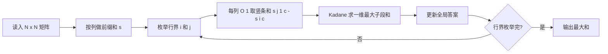

[[TOC]]

## 形式化题目

给定一个 $N \times N$ 的整数矩阵 $a$，元素取值范围为 $[-127, 127]$。子矩形是矩阵内任意大小不小于 $1 \times 1$ 的连续子阵列，其和为其中所有元素之和。要求找出和最大的子矩形，输出这个最大和。

## 正解

### 思路

**朴素做法的瓶颈。** 一个子矩形由上边界 $i$、下边界 $j$、左边界 $l$、右边界 $r$ 四个数决定，直接枚举再用双重循环累加求和，一共 $O(N^6)$ 次操作。$N \le 100$ 时约 $10^{12}$，完全不可行。优化要分两步：先消灭"求和"这一层，再消灭"合并"这一层。

**第一步：把二维问题压成一维。** 枚举上边界 $i$ 和下边界 $j$，此时所有行界被固定的子矩形，其实只是"每一列选一段连续竖条"的拼接。既然行界固定，第 $c$ 列上被截出的竖条和就是一个定值：

$$\text{colsum}(c) = \sum_{r=i}^{j} a_{r,c}$$

那么行界为 $[i, j]$ 的子矩形，就是在一维数组 $\text{colsum}(0), \text{colsum}(1), \dots, \text{colsum}(n-1)$ 中选一段连续区间，其和为 $\sum_{c=l}^{r} \text{colsum}(c)$。也就是说，**固定的行界 + 任意列界 = 一维最大子段和问题**。

$$\text{ans} = \max_{0 \le i \le j < N} \; \Big( \max_{l \le r} \sum_{c=l}^{r} \text{colsum}_{[i,j]}(c) \Big)$$

若每次都用 $O(N)$ 重新累加 $\text{colsum}$，行界枚举 $O(N^2)$ 种，每次求和 $O(N^2)$，总 $O(N^4)$。用**列前缀和** $s_{r,c} = \sum_{k=0}^{r-1} a_{k,c}$（注意 $s_0$ 整行置 $0$ 作哨兵），任意竖条和都能 $O(1)$ 查出：$\text{colsum}(c) = s_{j+1,c} - s_{i,c}$。

**第二步：一维部分用 Kadane 算法。** 一维最大子段和有一个 $O(N)$ 的贪心：从左到右扫描，维护"以当前位置结尾的最大子段和 $cur$"——若 $cur < 0$，前面累积的部分只会拖后腿，不如丢弃，令 $cur$ 重新从当前元素出发；即 $cur = \max(cur, 0) + x$。全局答案取所有 $cur$ 的最大值。它只需扫一遍列，所以每种行界的代价是 $O(N)$，加上 $O(N^2)$ 种行界枚举，总复杂度 $O(N^3)$。$N = 100$ 时约 $10^6$ 次基本操作，非常轻松。

**用样例走一遍。** 样例矩阵为：

$$\begin{pmatrix} 0 & -2 & -7 & 0 \\ 9 & 2 & -6 & 2 \\ -4 & 1 & -4 & 1 \\ -1 & 8 & 0 & -2 \end{pmatrix}$$

取行界 $i = 1$（第 2 行）、$j = 3$（第 4 行），把这三行按列压成一维：

| 列 $c$ | 0 | 1 | 2 | 3 |
| --- | --- | --- | --- | --- |
| 竖条和 | $9+(-4)+(-1)$ | $2+1+8$ | $-6+(-4)+0$ | $2+1+(-2)$ |
| $\text{colsum}(c)$ | $4$ | $11$ | $-10$ | $1$ |

对 $[4, 11, -10, 1]$ 跑 Kadane：$cur$ 依次为 $4 \to 15 \to 5 \to 6$，最大值 $15$，恰好是题面给出的答案（对应子矩形第 0~1 列，即 $4 + 11 = 15$）。可以验证其余行界压出的最大子段和都不超过 $15$。

**整体流程**如下：

### 代码

@include-code(./main.py, python)

代码里几个实现点与推导一一对应：

- `s = list(accumulate(...))`：用 `itertools.accumulate` 从第 0 行全零哨兵开始逐行累加，一行代码建出列前缀和表，`s[j][c] - s[i][c]` 就是行区间 $[i, j)$ 的竖条和；
- 内层 `accumulate(..., lambda cur, x: cur + x if cur > 0 else x)`：这正是 Kadane 递推 $cur = \max(cur, 0) + x$ 的最短写法——$cur > 0$ 就接上，否则从 $x$ 重新开始；
- 外层 `max(... for i in range(n) for j in range(i+1, n+1))`：枚举所有 $O(N^2)$ 种行界，取全局最大。

### 复杂度

- 时间：行界 $O(N^2)$ 种，每种行界内一维扫描 $O(N)$，总 $O(N^3)$。$N = 100$ 时约 $10^6$。
- 空间：列前缀和表 $O(N^2)$。

## 总结

- 最大子矩阵问题的标准套路：**枚举行界压缩成行，列前缀和 $O(1)$ 取竖条和，一维部分交给 Kadane**，复杂度 $O(N^3)$。
- 两个可迁移的技巧：
  - "固定一个维度、把二维压成一维"是处理二维区间问题的通用降维手段；
  - Kadane 的本质是贪心：前缀和为负就整段丢弃，因为负前缀对后面的段只减不增。
- 注意 $s_0$ 全零哨兵让行界 $[i, j)$ 的竖条和统一写成 $s_j - s_i$，避免单独处理从第 0 行开始的情形。
