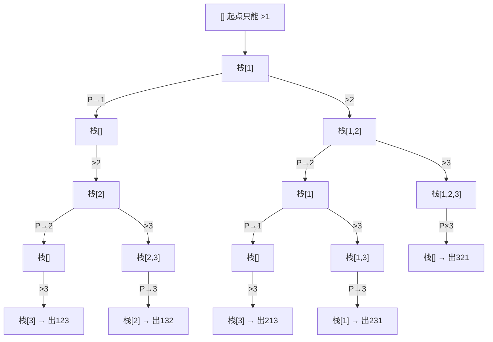

[[TOC]]

## 形式化题目

火车 $1, 2, \ldots, n$ 依次进站。车站是一条栈结构的死胡同：任一时刻可以执行两种操作之一——

- **进栈**：右侧下一节火车（编号递增）进站；
- **出栈**：栈顶火车出站，编号记入出站序列。

每列火车必须恰好进站、恰好出站一次。所有可能的出站序列构成集合 $S_n$（$|S_n|$ 为卡特兰数），按**字典序**输出 $S_n$ 的**前 20 个**元素，每个元素一行、无空格。

样例：$n = 3$ 时 $S_3 = \{123, 132, 213, 231, 321\}$，共 $C_3 = 5$ 个；$n = 5$ 时前 20 个以 `12345` 开头、`23145` 结尾（对应真实数据 `p1`）。

## 正解

### 思路

**第一步：把题目翻译成操作序列。** 忽略具体编号，整个进站出站过程就是由 $n$ 次「进栈」（记为 `I`）和 $n$ 次「出栈」（记为 `O`）排成的操作序列，且必须满足：每个前缀中 `O` 的个数不超过 `I` 的个数（栈不能空着出），总数恰好各 $n$ 个——这正是**合法括号序列**的结构，所以 $S_n$ 的大小是卡特兰数 $C_n$（$n = 20$ 时约 $6.5 \times 10^9$，绝不可能全部枚举完再排序，必须按字典序"边搜边出"）。

**第二步：确定字典序的分支顺序。** 出站序列由操作序列决定；要按字典序枚举出站序列，只要在每个状态点**优先尝试能让"已出站部分更小"的操作**。比较两种操作的第一个分歧点：先执行「出栈」会把当前栈顶的（编号更早的）火车送出去，而先「进栈」会把编号更大的火车压在它上面——此后出站序列的下一个数只会更大。因此在每个状态**先递归「出栈」分支，再递归「进栈」分支**，DFS 到达叶子（$n$ 列全部出站）的顺序就是出站序列的字典序，直接按到达顺序输出即可，无需排序。

用 $n = 3$ 把这条搜索树画出来（`P` = 出栈，`>` = 进栈；叶子按 DFS 到达顺序恰好是 `123, 132, 213, 231, 321`）：

树中每个内部节点都标了操作与效果；先 `P` 后 `>` 的统一顺序让五片叶子从左到右按字典序排列。可以对照样例逐片验证：例如 `231` 这个叶子，走的是 `>1 >2 P(2) >3 P(3) P(1)`——栈底压着 1 期间先把 2、3 送出去，正好产出 `2,3,1`。

**第三步：利用"只要前 20 个"剪枝。** 题面只要求前 20 种，所以收满 20 个出站序列后可以立刻放弃整棵剩余搜索树（`if len(ans) == LIMIT: return`）。DFS 是"先深入再回头"的，这一句写在函数开头，能一口气砍掉当前扩展点之后的所有分支——$n = 20$ 时搜索在遇到第 20 个叶子后基本立刻结束，远快于枚举到某一深度再判断。

**为什么"先出栈"不会漏掉字典序更小的序列？** 反证：若最优字典序路径在状态 $s$ 处先执行了「进栈」，把路径换成先「出栈」——出站序列在分歧点的第一个不同位置上，前者是栈顶编号 $x$，后者是"先送出 $x$、之后再经过若干次进栈送出更大编号"，即前者在该位置更小，与最优矛盾。所以每个状态的首选分支必是「出栈」。

### 代码

代码中 `next_in` 是下一节待进站火车的编号，`stack`/`out` 即栈与已出站序列；`dfs` 开头的 `LIMIT` 剪枝与两个分支的先后顺序对应上文第二、三步。

@include-code(./main.py, python)

### 复杂度

- 时间复杂度：$O(n \cdot \min(20, C_n))$——只输出前 20 个序列，每个长 $n$；收满 20 个后整树剪枝，实际访问的状态数由第 20 个叶子的位置决定，远小于完整搜索树的 $O(C_n)$ 状态量（$n \leqslant 20$ 时完整树也承受不住，剪枝是必要的）。
- 空间复杂度：$O(n)$：递归深度至多 $2n$ 层（每个状态一次操作），`stack`/`out` 各 $O(n)$，`ans` 至多存 20 个长 $n$ 的串。

## 总结

本题把「火车栈」翻译成合法括号结构：出站序列个数是卡特兰数，$n = 20$ 时大到不能全枚举，必须 DFS 按字典序边搜边出。两个关键点：① 每个状态**先递归「出栈」、再递归「进栈」**，叶子到达顺序即为字典序（证明：若最优路径先「进栈」，换成先「出栈」在第一个分歧位只会更小）；② 收满题面要的 20 个后**立即整树剪枝**。递归回溯时用 `append`/`pop` 原地复原栈与出站序列，避免每层复制。实测真实数据 `p1`（$n = 5$，输出 `12345`…`23145` 共 20 行）完全一致，约 0.02 s、峰值 14.6 MB，远低于 1000 ms / 128 MB 限制。
