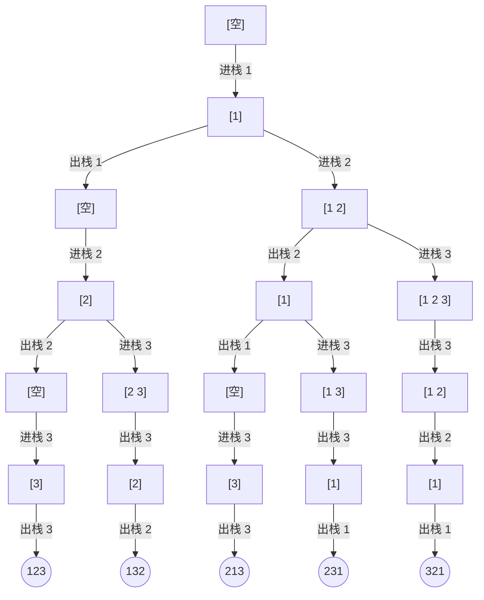

[[TOC]]

## 形式化题目

编号 $1, 2, \dots, n$ 的车厢按编号递增的顺序到达一个栈。任一时刻只能执行两种操作之一：

- **进栈**：把下一节尚未进站的车厢压入栈顶；
- **出栈**：把栈顶车厢弹出，并追加到输出序列末尾。

每节车厢必须恰好进栈一次、出栈一次。设所有可能的出栈序列构成集合 $S_n$，要求输出 $S_n$ 中**字典序最小的 20 个**元素，每个元素一行。

::: warning
**题面与评测数据存在差异。** 本题 `content.md` 与 `config.json` 描述的是「求种数」（输出卡特兰数 $C_n$，$n \leqslant 60000$，需要高精度）。
但评测数据（`data/p1.in` ~ `p5.in` 与配套 `.out`）以及数据仓 `std.cpp` 实际要求的是
**按字典序输出前 20 个出栈序列**（$n \leqslant 12$）。
证据：`p1.out` 是 20 行序列而非单个整数 $C_5 = 42$；`std.cpp` 是枚举前 20 个序列的 DFS；
把 `data/p1.out` 去掉 `\r` 后与同仓题目 ROJ 3030 的 `p1.out` 完全一致。
本文与正式代码以**评测数据**为准。
:::

## 正解

### 思路

**第一步：先看清枚举量有多大。** 把整个过程抽象成由 $n$ 个「进」和 $n$ 个「出」组成的操作串，约束是任一前缀中「出」的次数不超过「进」的次数（栈空时不能再出栈）——这正是**合法括号结构**。所以

$$|S_n| = C_n = \frac{1}{n+1}\binom{2n}{n}$$

$C_5 = 42$、$C_{12} = 208012$，而 $n = 20$ 时 $C_{20} \approx 6.5 \times 10^9$。**先枚举出全部序列再排序取前 20 个是不可行的**，必须想办法「边搜边出」，让前 20 个最先被产出。

**第二步：找到让枚举天然有序的分支顺序。** 一个状态有两个可选操作。设此时栈非空、栈顶是 $x$，下一节待进站的车厢是 $y$。因为车厢按编号递增进站，必有 $x < y$。比较两个分支：

- 走「**出栈**」，输出序列的下一个数必然是 $x$；
- 走「**进栈**」，此后能输出的数都来自 $\{y, y+1, \dots, n\}$，所以输出序列的下一个数必然 $\geqslant y > x$。

也就是说，**「出栈」分支产生的任意一个序列，都字典序小于「进栈」分支产生的任意一个序列**。于是只要每个状态都**先递归「出栈」、再递归「进栈」**，DFS 触达叶子的顺序就恰好是字典序，完全不需要排序。

这个结论也解释了为什么它不会漏掉更小的序列：假如某个状态上先「进栈」能得到字典序更小的解，那么在两个分支输出的第一个分歧位上，进栈分支给的是 $y$、出栈分支给的是 $x < y$，矛盾。

以 $n = 3$ 为例，把搜索树画出来（每条边标出操作与结果，叶子从左到右正好是字典序）：



沿着这张图可以核对每个叶子。例如 `231` 这一支：先 `进栈 1`、`进栈 2`、`出栈 2`，再 `进栈 3`、`出栈 3`，最后才把一直压在栈底的 1 送出去。每一层的「出栈」边都画在「进栈」边左边，五个叶子便自动排成 `123, 132, 213, 231, 321`。

**第三步：既然只要 20 个，就立刻剪枝。** 把「已收集满 20 个」直接当作搜索主循环的终止条件。由于 DFS 是「先一路深入、再回头」的，这个条件能一次性砍掉当前扩展点之后的所有分支：$n = 5$ 时只需访问 183 次操作就凑满了 20 个（对照 $C_5 = 42$ 个序列的完整搜索树）。

**第四步：把递归改写成显式帧栈。** $n$ 最大可达 60000，最左那条「一路进栈到底、再一路出栈到底」的链长度就是 $2n = 120000$，真递归会远远超出 Python 的递归深度限制。这里不用 `setrecursionlimit` 去掩盖，而是把递归帧显式展开：

- 帧写成 `(next_in, phase)`，`phase` 表示「这一帧做到哪一步了」：`0` 刚进入、`1` 出栈分支已回溯、`2` 进栈分支已回溯；
- 需要「回来之后走第二个分支」时，就把栈顶帧改成 `(next_in, AFTER_POP)`；
- `stack` 与 `seq` 用 `append` / `pop` 原地复原，避免每层复制整个列表。

这样主循环每轮只处理栈顶的帧，与递归的执行顺序完全一致，但不占用 Python 调用栈。

### 代码

`first_sequences` 是算法本体：`LIMIT` 与主循环条件 `len(found) < LIMIT` 正对应第三步的剪枝，`ENTER / AFTER_POP / AFTER_PUSH` 三个阶段编码对应第四步的帧机制，而 `ENTER` 分支里 `elif stack:` 写在 `else` 之前，正对应第二步「先出栈、后进栈」。`solve` 只负责读入与输出。

@include-code(./main.py, python)

### 复杂度

- **时间复杂度**：算法部分 $O(n)$。实测访问的帧状态数在 $n \geqslant 5$ 时恒为 $2n + 173$——最左链产出第 1 个序列用掉 $2n$ 步，之后每次回溯换分支只再产出常数个序列，凑满 20 个只需再走常数步。再加上输出：共 20 行，每行 $n$ 个十进制数、每个数 $O(\log n)$ 位，合计 $O(n \log n)$ 字符。两部分合计 $O(n \log n)$。
- **空间复杂度**：算法状态 $O(n)$，显式帧栈最深 $2n$，站内车厢与已出站序列各至多 $n$ 个元素。存下的结果共 20 个序列、合计 $O(n \log n)$ 字符。合计 $O(n \log n)$。由于是迭代实现，不额外占用 Python 调用栈。

## 总结

本题的落点是「**让枚举顺序自带排序**」：

1. 出栈序列数等于卡特兰数，$n$ 一大就绝无可能枚举完再排序；
2. 关键性质是——栈非空时，「出栈」分支的任意结果都字典序小于「进栈」分支的任意结果，所以每个状态**先出栈、后进栈**的 DFS，叶子到达顺序就是字典序，省掉了排序；
3. 只取前 20 个，于是收满 20 个就**整树剪枝**；
4. $n$ 可达 60000、递归深度可达 $2n$，用**显式帧栈**替代递归。

实测真实数据 `p1` ~ `p5`（$n = 5, 8, 10, 11, 12$）输出与答案逐字节一致，单组约 0.02 s、峰值内存约 14.8 MB，远低于 1000 ms / 128 MB 限制；即使在题面声称的 $n = 60000$ 上也只需约 0.08 s、峰值内存约 36 MB。

## 图示解析

这张图串起从建模到得到答案的主线。

```text
输入 n 节车厢（按 1..n 递增进站）
`- 建模：出栈序列 <=> 合法括号结构
   `- 计数会是卡特兰数（n=20 时约 6.5e9），不能枚举完再排序
      `- 关键性质：栈非空时「出栈」分支的任意结果 < 「进栈」分支的任意结果
         |- 于是每状态先走「出栈」再走「进栈」→ 叶子到达顺序就是字典序
         `- 只要前 20 个：收集满 20 个立刻整树剪枝
            `- n 可达 60000、递归深度可达 2n → 用显式帧栈代替递归
               `- 输出前 20 个出栈序列
```

先看每个节点代表的推理结论：建模排除了「枚举完再排序」，关键性质把「字典序」变成「分支优先序」，剪枝把 $C_n$ 的枚举量压到常数，显式帧栈则解决 $n$ 很大时的递归深度。

下面是上述算法在 $n=5$（真实数据 p1）上的前若干步动作，可以看到 DFS 在第一次撞到底之后如何一步步回溯换分支。

| 步 | 本次动作 | 站内车厢（栈底→栈顶） | 已出站序列 |
| ---: | --- | --- | --- |
| 1 | 进栈 1 | 1 | - |
| 2 | 出栈 1 | - | 1 |
| 3 | 进栈 2 | 2 | 1 |
| 4 | 出栈 2 | - | 12 |
| 5 | 进栈 3 | 3 | 12 |
| 6 | 出栈 3 | - | 123 |
| 7 | 进栈 4 | 4 | 123 |
| 8 | 出栈 4 | - | 1234 |
| 9 | 进栈 5 | 5 | 1234 |
| 10 | 出栈 5 | - | 12345 |
| 11 | 触达叶子：第 1 个序列 = 12345 | - | 12345 |
| 12 | 回溯出栈 5（车厢退回车内） | 5 | 1234 |
| 13 | 回溯进栈 5（车厢退回未进站） | - | 1234 |
| 14 | 回溯出栈 4（车厢退回车内） | 4 | 123 |
| 15 | 进栈 5 | 45 | 123 |
| 16 | 出栈 5 | 4 | 1235 |

表中「回溯」几步是 DFS 在撤销上一次选择、改走另一个分支；第 11 步产出第 1 个序列 `12345`，之后每次换分支都会再产出一个。帧栈深度始终不超过 $2n$，所以这套迭代写法对 $n$ 最大 60000 也不会栈溢出。

