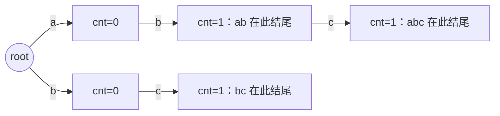

[[TOC]]

## 形式化题目

给定 $N$ 个字符串 $S_1,\dots,S_N$（模式串）和 $M$ 次询问，每次询问给一个字符串 $T$（询问串），求有多少个 $S_i$ 满足 $S_i$ 是 $T$ 的前缀（即 $T$ 以 $S_i$ 开头）。所有字符串仅含小写字母，且**输入字符串的总长度不超过 $10^6$**。样例中 `abc` 的前缀里有 `ab` 和 `abc` 两个模式串，故答案为 $2$。

## 正解

### 思路

**一句话本质**：把 $N$ 个模式串插进一棵 Trie，每个结点记一个「在此结尾」的计数；每个询问串 $T$ 从根往下走一遍，路径上每个结点都对应 $T$ 的一个前缀，把这些结点的计数加起来就是答案。

先想朴素做法：对每个询问 $T$，逐个枚举 $S_i$ 并检查它是否是 $T$ 的前缀。单次检查 $O(\min(|S_i|, |T|))$，总代价 $O(M \cdot N \cdot L)$——样例级别够用，但放到 $10^6$ 的总长度上限下就是 $10^{10}$ 量级的比较，不可接受。瓶颈在于：每个询问都把 $N$ 个模式串重新扫一遍，而 $N$ 个串之间大量共享前缀（比如样例里 `ab` 和 `abc`），这些信息被重复利用了零次。

Trie 正是把「共享前缀」沉淀成「共享结点」的结构。插入 $S_i$ 时从根出发逐字符下走：边存在就复用，边不存在就新建儿子；同时维护

- `children[i][c]`：结点 $i$ 沿字符 $c$ 的边走向的儿子编号；
- `cnt[i]`：有几个 $S_i$ **恰好**在结点 $i$ 结尾（同一串重复出现会累加）。

由于建 Trie 前不知道结点总数，这里用「动态数组 + 儿子字典」的方式存树，`len(children)` 顺便就是下一个新结点的编号。

回答询问 $T$ 时同样从根下走：走到结点 $v$，说明从根到 $v$ 的路径字符恰是 $T$ 的一个前缀，于是把 `cnt[v]` 累加进答案。以样例为例，插入 `ab`、`bc`、`abc` 后的 Trie 如下：

图中的路径就是模式串本身，`cnt` 只挂在「有串恰好在此结尾」的结点上。观察重点：

- 询问 `abc` 的走法是 root →(a)→ →(b)→ →(c)→，路径上每个结点都对应 `abc` 的一个前缀，把它们的 `cnt` 累加得 $0+1+1=2$（`ab` 与 `abc`），与样例输出一致——「前缀的前缀」（`ab`）被自动统计进去；
- 询问 `efg` 时第一步就没有边 `e`，直接得 $0$：一旦某条边不存在（$T$ 的某个前缀根本不是任何 $S_i$ 的前缀），更长的串更不可能是答案，无需继续。

### 代码

@include-code(./main.py, python)

### 复杂度

设输入字符串总长度 $L \leqslant 10^6$（即 $\sum |S_i| + \sum |T|$）。

- **建 Trie**：每个字符常数次字典操作，$O(L)$；结点数不超过 $L+1$，空间同样 $O(L)$。
- **每次询问**：$T$ 每个字符走一步，$O(|T|)$；全部询问合计 $O(\sum |T|)$。

总时间 $O(L)$，与 C++ 正解同阶。Python 侧风险主要在常数：约 $10^6$ 次循环里的字典 `.get` 是主要开销，实测最大数据（4.3 MB 输入）约 0.06s，远低于 $10\times$ 放宽的时限；内存 33 MB，也在 128 MB 限制内。

### 两个实现细节

**为什么用 `bytes` 而不是 `str` 读入？** `sys.stdin.buffer.read().split()` 直接产出 `bytes`，而迭代一个 `bytes` 对象产出的正是每个字节的整数编码（`ord(ch)`），免去了整篇 `decode` 和逐字符 `ord` 的开销，字典键也自然是整数。

**为什么询问走不到时直接 `break`？** 走到结点 $v$ 等价于「$T$ 的前 $k$ 个字符构成某个 $S_i$ 的前缀」。一旦第 $k$ 步走不动，$T$ 的前 $k$ 字符都不是任何模式串的前缀，那么 $T$ 的更长前缀更不可能是 $S_i$ 的前缀（$S_i \preccurlyeq T \Rightarrow S_i \preccurlyeq T$ 的任意更长前缀的前缀），后面不可能再有贡献。

## 总结

- 模型转换：把「逐对比较前缀」换成「在共享前缀树上走路」，比较次数从 $O(MN)$ 次串比较降到每人每字符一步。
- Trie 的两个要点：儿子用字典按需创建（不必 26 叉数组，总边数即总字符数）；计数挂在**结尾结点**而不是路径上，路径累加在询问时进行。
- 本题是 Trie 的裸模板：建树 $O(L)$、询问 $O(|T|)$，后续 AC 自动机、01-Trie 等都建立在这套骨架上。
