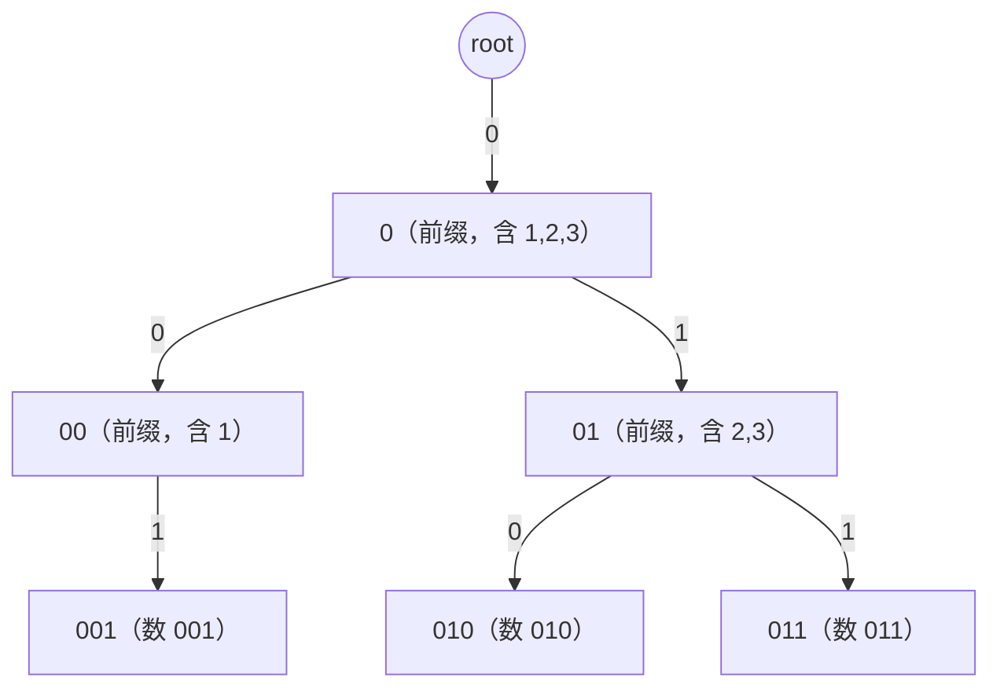

[[TOC]]

## 形式化题目

给定 $N$ 个整数 $A_1, A_2, \dots, A_N$，每个数都不超过 31 位二进制（$0 \leqslant A_i < 2^{31}$，最高位是第 30 位）。求

$$\max_{1 \leqslant i < j \leqslant N} \bigl(A_i \oplus A_j\bigr)$$

即在下标不同的一对数中，找出按位异或值最大的那一对，只输出这个最大值。样例给出 $A = [1, 2, 3]$，三对的异或值如下：

| 数对 | 二进制 | 异或值 |
| --- | --- | --- |
| $1 \oplus 2$ | $001 \oplus 010$ | $3$（$011$） |
| $1 \oplus 3$ | $001 \oplus 011$ | $2$（$010$） |
| $2 \oplus 3$ | $010 \oplus 011$ | $1$（$001$） |

最大的一个来自 $1 \oplus 2 = 3$，所以样例输出 `3`。观察第一条与第三条：$2$ 与 $3$ 只差最低位，反而异或最小；想让异或大，要让两个数在**尽量高的位**上取相反值。

## 正解

### 思路

**一句话本质**：把所有数按二进制从高位到低位插进一棵 01-Trie，再让每个数沿着树逐位贪心地走「相反位」；走不动才退回同位。走 31 步就得到以这个数为端点时能取到的最大异或值，全部取最大即答案。

先看朴素做法：枚举所有下标对算异或。数对总数是 $\binom{N}{2}$，$N = 10^5$ 时约 $5 \times 10^9$ 对，无论用什么语言都超时。瓶颈不在异或运算本身（它是 $O(1)$ 的），而在于**枚举了所有数对**——对每个 $A_i$ 都重新扫描了几乎所有其它的数。

要绕开它，就得让「找一个数的最佳搭档」不依赖其它数，能用 $A_i$ 自己的二进制位直接查出来。

**关键观察：高位优先。** 异或的每一位互不干扰：$A \oplus B$ 的第 $k$ 位只由 $A, B$ 的第 $k$ 位决定。而二进制是带权的，先比第 30 位、再比第 29 位。设已经确定了答案的高位前缀 $P$，当前要定第 $k$ 位：

- 若能凑出第 $k$ 位为 $1$，答案至少是 $P + 2^k$；
- 若第 $k$ 位只能为 $0$，答案至多是 $P + 2^k - 1$（低位全是 1 也补不回来）。

所以**每一步只要判断「能不能凑出 1」，能就一定要凑**，不需要回溯、不需要比较全局方案。这种“每一位做一次局部最优决策”的结构正适合用 Trie 承载：

- 把每个 $A_i$ 写成 31 位的 0/1 串，从第 30 位到第 0 位插入一棵二叉树（01-Trie），每位决定往 0 儿子还是 1 儿子走。一个数对应根到叶的一条长度 31 的路径，**二进制前缀相同的数共享同一条路径**。
- 查询 $A_i$ 时从根出发，走到第 $k$ 位就想：「有没有哪个数和 $A_i$ 的高位前缀完全相反？」这个问题的答案就是「$A_i$ 当前所在结点，走相反位的那条边存不存在」——一次数组访问。

下图是样例三个数 $1 = 001$、$2 = 010$、$3 = 011$ 取低 3 位建出的 01-Trie（高位全是 0，结构完全一样），结点标签是路径上的 0/1 前缀：



读图要点：$2$ 和 $3$ 在前两位完全相同，所以共享 `root → 0 → 01` 这条路径，只在最后一位分叉——这正是「前缀相同则共享结点」的含义，也是 Trie 能把 $O(N^2)$ 对数压成 $O(31N)$ 个结点的原因。查询 $2 = 010$ 时，贪心路线是：

| 步骤 | 看第几位 | $2$ 的该位 | 相反位 | 相反位存在？ | 决策 | 异或值前缀 | 走到的结点 |
| --- | --- | --- | --- | --- | --- | --- | --- |
| 1 | 第 2 位 | 0 | 1 | 否（根只有 0 儿子） | 只能走同位 0，该位 $=0$ | `000` | `0` |
| 2 | 第 1 位 | 1 | 0 | 是 | 走相反位 0，该位 $=1$ | `010` | `00` |
| 3 | 第 0 位 | 0 | 1 | 是 | 走相反位 1，该位 $=1$ | `011` | `001` |

第 1 步之所以走不动，是因为样例里所有数都小于 $2^2$，第 2 位统一为 0，无论如何也凑不出 1——这时只能接受这一位是 0；之后两位都成功取反，异或值前缀累积到 `011` 即 $3$，最后停在叶子 `001`，也就是数 $1$。所以 $2$ 的最佳搭档是 $1$，答案为 $2 \oplus 1 = 3$，与样例一致。

把 $1, 2, 3$ 都查一遍：$1$ 得到 $3$，$2$ 得到 $3$，$3$ 得到 $2$，取最大值仍是 $3$。

两个实现细节：

- **查询时会不会选中自己**？$A_i$ 与自身异或为 $0$，对应「所有位都走同位」的那条路径，结果最小；只要还存在任何能在某一位取反的数，贪心就会优先走上相反位的分支。$N = 1$ 时答案自然是 $0$，也是对的。
- **另一种等价做法**是按位确定答案：从高位往低位试着把答案的这一位置 1，把所有数截断到当前前缀丢进哈希集合，检查是否存在 $p \oplus cand$ 也在集合里。它同样只要 31 轮，但每轮都要重建集合，常数比 Trie 大。

对应到代码：`build_trie()` 做上面第一步（插树并返回扁平的 `array('i')` 儿子表），`best_xor()` 做第二步（每个数贪心一遍并取最大），`solve()` 只负责读入和输出。

### 代码

@include-code(./main.py, python)

### 复杂度

记 $B = 31$ 为二进制位数（常数）。代码里 $B$ 就是模块常量 `BITS`，儿子槽 `children[2p+b]` 表示结点 $p$ 走位 $b$ 的儿子，`NO_CHILD = 0` 是“这条边还没建出来”的哨兵。

- **时间复杂度**：建树每个数走 $B$ 层、查询每个数也走 $B$ 层，总时间 $O(BN) = O(N)$。朴素枚举是 $O(N^2)$，$N = 10^5$ 时两者相差约 $10^4$ 倍。
- **空间复杂度**：结点数最多 $BN + 1$，每个结点两个儿子槽，$O(BN) = O(N)$。Python 里用 `array('i')` 把儿子槽存成连续内存，$N = 10^5$ 时表本身约 24.8 MB，加上输入与中间列表，实测峰值 48.7 MB，低于 128 MB 限制。

Python 侧的风险只在常数，不在复杂度：最大数据实测 0.572s，相对 OJ 的 1000ms 限制有约 1.7 倍余量（仓库本地校验还会再放宽到 20s）。若换成「每个结点一个 dict」的写法，时间相近但内存会涨到 200 MB 以上，这是实现取舍而非算法差异。

## 总结

- **模型转换**：把「枚举所有数对」换成「为每个数在二进制前缀树上查一个最佳搭档」。数对数量 $O(N^2)$，而 Trie 的结点数是 $O(BN)$，量级彻底脱钩。
- **贪心依据**：高位权重大于所有低位之和，所以「第 $k$ 位能凑出 1 就必须凑」；这让每一步都无需回溯，31 步直接定出答案。
- **01-Trie 的两个要点**：每个数是一条长度 $B$ 的路径，前缀相同即共享结点；「找相反位」就是访问当前结点的另一条边。
- 本题是 01-Trie 的模板题，可持久化 01-Trie（区间异或最值）、最大异或路径（树上异或和 + 01-Trie）都建立在这套骨架上。

## 图示解析

把从输入到答案的主线压缩成一张图：

```text
A = [1, 2, 3]
        │
        ▼
  按 31 位二进制插入 01-Trie
        │          每个数一条长度 31 的路径
        │          相同前缀共享结点，共 O(31N) 个结点
        ▼
  对每个 A_i 从根逐位贪心（第 30 位 → 第 0 位）
        │
        ├── 想走的相反位儿子存在 → 异或值这一位 = 1，走相反位
        │
        └── 不存在             → 异或值这一位 = 0，只能走同位
        │
        ▼
  每个 A_i 得到一个候选值 ──取 max──▶ 答案
```

图的观察重点：整条流程只有「建树」和「逐位贪心」两个动作，没有分治、也没有回溯，每个数只与自己的一条贪心路线有关；每个数独立查询一次，所以总代价就是 $N$ 次 31 步的走树。图中「相反位存在 → 置 1」是唯一的判断，它的正确性由高位优先性质保证。
