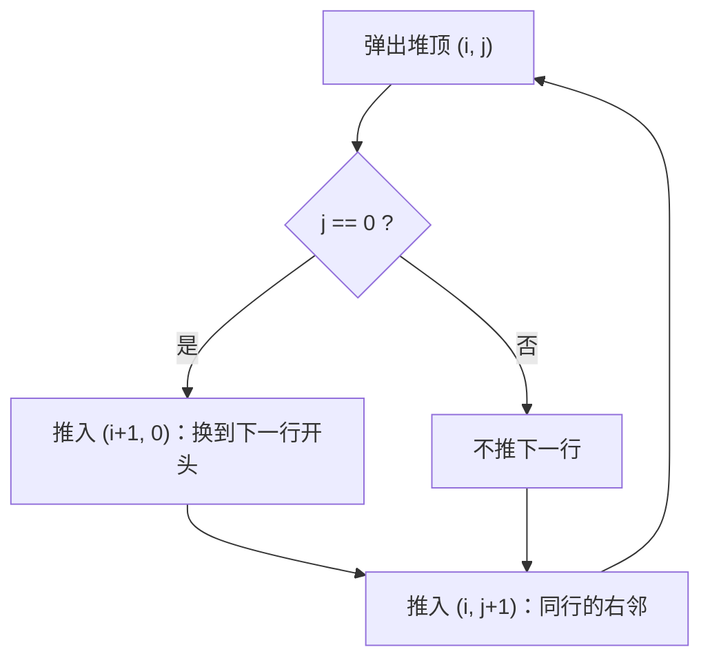

[[TOC]]

## 形式化题目

给定 $m$ 个长度均为 $n$ 的非负整数序列 $A_1, A_2, \dots, A_m$，其中 $A_k = (a_{k,1}, \dots, a_{k,n})$。从每个序列各选一个元素求和，得到 $n^m$ 个和（按重数计，不同的取法即使和相同也算两项），记这个多重集合为

$$S = \left\{\sum_{k=1}^{m} a_{k,i_k} \;\middle|\; 1 \leqslant i_k \leqslant n\right\}, \qquad |S| = n^m .$$

求 $S$ 中最小的 $n$ 个值，按非降序输出。相等的值按出现次数各占一个输出位置。

样例中 $A_1 = (1,2,3)$，$A_2 = (2,2,3)$，$3 \times 3 = 9$ 个和为

|  | $a_{2,1}=2$ | $a_{2,2}=2$ | $a_{2,3}=3$ |
| --- | --- | --- | --- |
| $a_{1,1}=1$ | 3 | 3 | 4 |
| $a_{1,2}=2$ | 4 | 4 | 5 |
| $a_{1,3}=3$ | 5 | 5 | 6 |

前 3 小是 $3, 3, 4$，即样例输出 `3 3 4`。

## 正解

### 思路

**朴素做法**：枚举 $n^m$ 种取法、求每个和、排序取前 $n$。$m = 1000$ 时 $n^m = 2^{1000}$，连生成都做不到。

**观察一：每轮只留前 $n$ 个数。** 先只看前两个序列，设 $F_2$ 是 $\{a_{1,x} + a_{2,y}\}$ 中最小的 $n$ 个和。再并入 $A_3$ 时，把 $F_2$ 换成完整的 $n^2$ 个和没有意义：如果某个和用到了 $F_2$ 中排在最小 $n$ 个之后的元素，那么「$F_2$ 的每个元素 $+ \min A_3$」已经给出了 $n$ 个不超过它的和，它进不了前 $n$。于是可以递推：

$$F_1 = \operatorname{sort}(A_1)[:n], \qquad F_{k+1} = \operatorname{top}_n\bigl\{\, F_k[x] + A_{k+1}[y] \,\bigr\},$$

答案就是 $F_m$。同理，每个序列里第 $n$ 个之后的元素永远用不上，先各自排序、截断到 $n$ 个。

**观察二：单轮「取前 $n$ 小」= 行列单调矩阵上的 $n$ 路归并。** 设两张表 $A, B$ 都已非降，把 $n^2$ 个和排成矩阵

$$M[i][j] = A[i] + B[j] \qquad (0 \leqslant i, j < n).$$

因为 $A, B$ 非降，矩阵在**行、列两个方向都单调不减**：$M[i][j] \leqslant M[i][j+1]$ 且 $M[i][j] \leqslant M[i+1][j]$。取前 $n$ 小就变成在这张矩阵上做多路归并：

- 小顶堆的初始元素只有左上角 $(M[0][0], 0, 0)$；
- 弹出堆顶（当前最小的候选和）写进答案，再把它的**右邻**和**下邻**推入堆（下一段给出不重不漏的推法）；
- 弹 $n$ 次结束。

之所以可以只推右邻和下邻，而不必事先建出整张 $n^2$ 的表，就是因为行列单调：每个格子不比自己左上方的格子小，「边界」始终能覆盖住所有还没被弹出的最小值。

**去重。** 每个格子有两个前驱，直接推两个邻居会让同一个格子多次入堆。这里不去维护「已入堆集合」，而是约定每个格子的唯一生成者：

- 第 $0$ 列的格子 $(i, 0)$：只在弹出 $(i-1, 0)$ 时**顺延**生成；
- 第 $j > 0$ 列的格子 $(i, j)$：只在弹出左邻 $(i, j-1)$ 时生成。

这样每个格子恰好被生成一次，代价是弹出 $(i,0)$ 时要多做一次「换行」判断：

图中的循环体对应代码里的 `for _ in range(n)`：每弹出一个最小和，最多放进两个新候选。右下方向一律不推，正是为了让每个格子只被生成一次。

用样例验证一遍：$A = (1,2,3)$，$B = (2,2,3)$。

| 轮次 | 堆中候选 $(和, i, j)$ | 弹出的和 | 注释 |
| --- | --- | --- | --- |
| 1 | $(3,0,0)$ | $3$ | 左上角，然后推 $(1,0)=4$ 与 $(0,1)=3$ |
| 2 | $(3,0,1),\ (4,1,0)$ | $3$ | $(0,1)$ 出堆，推 $(0,2)=4$ |
| 3 | $(4,0,2),\ (4,1,0)$ | $4$ | 和相同时用下标打破平局，取哪张都不影响值 |

弹出序列 $3, 3, 4$ 与样例一致。两次 $3$ 来自矩阵中两个不同的格子 $(0,0)$ 与 $(0,1)$，各占一个输出位置——这正是题目要求的多重集语义。

**正确性要点**：任何尚未弹出的格子 $(i,j) \neq (0,0)$，沿「生成者链」向上回溯，一定有一个链上元素已经在堆里或已被弹出，而这个元素的值 $\leqslant M[i][j]$（行列单调）；因此堆顶永远不大于任何未弹出格子的值，弹出的第 $k$ 个就是第 $k$ 小。由观察一对 $k = 1, 2, \dots, m$ 归纳，最后一轮得到的正是全局最小的 $n$ 个和。

### 代码

@include-code(./main.py, python)

### 复杂度

设一轮合并处理的两张表长度均为 $n$。

- **预处理**：$m$ 个序列各排序一次，$O(m n \log n)$。
- **合并**：共 $m - 1$ 轮，每轮弹 $n$ 次、每次最多推 2 个元素，堆规模不超过 $n + 1$，单次堆操作 $O(\log n)$，故每轮 $O(n \log n)$，合计 $O(m n \log n)$。

总时间 $O(m n \log n)$，与堆优化的正解同阶；空间 $O(mn)$ 用于存输入，堆与结果各 $O(n)$。取 $m = 1000, n = 2000$ 时规模约 $2 \times 10^6$ 次弹出、$4 \times 10^6$ 次堆操作，Python 侧属于「可能 TLE 但不降级算法」的范围（`heapq` 由 C 实现，本题最大真实数据实测 0.145s、37.5 MB）。

两个实现细节：

- **为什么弹 $n$ 次而不是弹到堆空？** 我们只要前 $n$ 小，堆里的候选数始终是 $O(n)$，多弹只会浪费。
- **为什么 `if j == 0 and i + 1 < n` 之后就结束推入，还要再写一个 `if j + 1 < n`？** 前一个分支负责「换行」，后一个负责「同行右移」，两者对同一个格子是并列关系而非互斥：弹出 $(i,0)$ 时既要推 $(i+1,0)$，也要推 $(i,1)$。

## 总结

- 题目要求 $n^m$ 个和中的前 $n$ 小，**先做减法**：只需保留前 $n$ 小的中间状态，巨型状态空间立刻塌缩成一张长度 $n$ 的表。
- 合并两张非降表的加法表是行列双单调的矩阵，取前 $n$ 小等价于在它上面做 $n$ 路归并；单轮的复杂度从 $O(n^2)$ 降到 $O(n \log n)$。
- 多路归并的常见坑是重复入堆。本题用「每格只由固定的一个前驱生成」替代哈希判重，逻辑更短也更快；每个格子的生成者是左邻，第一列则顺延到下一行开头。
- 总复杂度 $O(m n \log n)$。同一做法换成 C++ 只需把小顶堆换成 `priority_queue`，其余结构完全一致。
