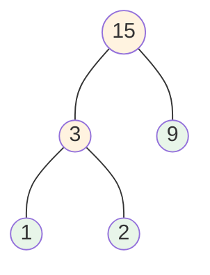

[[TOC]]

## 形式化题目

给定 $n$ 个正整数 $a_1, a_2, \dots, a_n$。每次可以选出其中两个数 $x, y$，把它们删去并放入一个新数 $x+y$，本次操作的代价为 $x+y$。经过恰好 $n-1$ 次操作后只剩一个数，求总代价的最小值。

以样例 $a = \{1, 2, 9\}$ 为例：先合并 $1+2$，代价 $3$；再合并 $3+9$，代价 $12$；总代价 $3+12=15$，是最小值。

## 正解

### 思路

**朴素做法**：任意一种合并次序的代价都不同，若不加思考地搜索所有合并次序，共约 $n! \cdot (n-1)!$ 种，$n$ 稍大就完全不可行。这提示代价的结构里一定藏着某种"每次做当前最优选择"的贪心规律。

**第一步观察：合并过程是一棵三叉度数的二叉树。** 每堆果子从诞生到被合并，每次参与合并它的重量都被累加一次。把每堆果子看作一个叶子（权值 $a_i$），每次合并把两堆合并成新堆，就相当于新建一个父亲节点，其权值等于两个儿子之和。最终形态是一棵二叉树，总代价为：

$$\text{总代价} = \sum_{i=1}^{n} a_i \times \text{dep}_i$$

其中 $\text{dep}_i$ 是第 $i$ 个叶子在合并树中的深度（叶子到根的边数）——每个叶子每往上走一层，它的重量就被计入一次代价。于是问题转化为：**构造一棵 $n$ 个叶子的二叉树（所有内部节点都有两个孩子），使 $\sum a_i \times \text{dep}_i$ 最小**。这正是经典的 **Huffman 树**问题。

以样例画出合并树：小堆 $1,2$ 被合并了两次（深度为 $2$），大堆 $9$ 只被合并一次（深度为 $1$），代价 $1\times2+2\times2+9\times1=15$。

圆圈中的数字是堆的重量，绿色是原始果子堆（叶子），橙色是合并出的新堆（内部节点）。

**第二步：贪心策略——权值越小的叶子应该越深。** 直觉上，重量小的堆"不值钱"，应该多被合并几次；重量大的堆应该尽量晚合并、少被计入。交换论证可以严格证明这一点：

在最优合并树中，取深度最大的两个叶子 $u, v$，它们必为兄弟（否则把它们的兄弟换成深度最大的另一个叶子，总代价不增）。设它们的权值是 $a_u \le a_v$。再取全树中权值最小的两个数 $a_x \le a_y$。若 $\{u, v\} \ne \{x, y\}$，把 $x, y$ 与 $u, v$ 的位置交换，交换后 $x, y$ 的深度变大、$u, v$ 的深度变小，由于 $a_x, a_y$ 是最小的权值，总代价不会增加：

$$a_x \cdot \text{dep}_u + a_y \cdot \text{dep}_v \le a_u \cdot \text{dep}_u + a_v \cdot \text{dep}_v$$

（利用了 $a_x \le a_u$、$a_y \le a_v$ 且 $\text{dep}_u = \text{dep}_v$ 是最大深度。）因此存在一棵最优树，其中**最小的两个权值是兄弟**。

**第三步：把贪心变成算法。** 既然最小的两堆在最优方案中一定先合并，就把它们合并成一个权值为 $a_x + a_y$ 的新堆——这相当于把这两个叶子换成一个新的"超级叶子"，问题规模从 $n$ 降到 $n-1$，且是同一形式的问题。对剩下的堆递归做同样的事：**每次取出当前最小的两堆合并，代价 $a_x + a_y$ 累加进答案，把新堆放回去**，直到只剩一堆。

维护"当前最小的两堆"最自然的数据结构就是**小根堆**：每次弹出堆顶两次，合并后压回，共进行 $n-1$ 轮。

### 代码

@include-code(./main.py, python)

### 复杂度

每轮合并做两次弹出、一次压入，各为 $O(\log n)$，共 $n-1$ 轮，总时间复杂度 $O(n \log n)$，与正解同阶。堆中始终至多 $n$ 个元素，空间复杂度 $O(n)$。$n \le 10^4$、$a_i \le 2 \times 10^4$ 时总代价不超过 $2 \times 10^{31}$ 量级内（题目保证小于 $2^{31}$），Python 整数天然无溢出问题。

## 总结

- 把合并过程看成二叉树后，总代价 $= \sum a_i \times \text{dep}_i$，问题即构造权值和最小的合并树。
- 交换论证得到核心结论：最小的两个权值在最优解中互为兄弟，先合并它们不会更差。
- 于是每次贪心地合并当前最小的两堆，用小根堆维护，总复杂度 $O(n \log n)$。这正是构造 **Huffman 树**的标准过程，也是"每次取当前最小"的贪心与二叉堆结合的经典范例。
