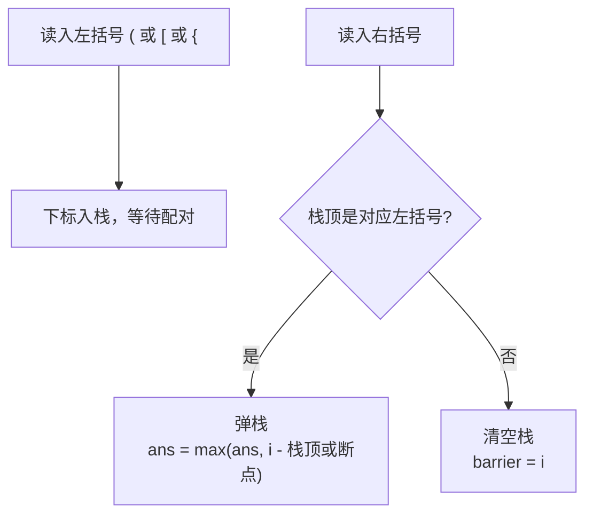

[[TOC]]

## 形式化题目

给定一个长度为 $N$（$N \leqslant 10^5$）的括号字符串 $S$，字符只可能是 `( ) [ ] { }`。定义合法（美观）括号序列：

1. 空串合法；
2. 若 $A$ 合法，则 `(A)`、`[A]`、`{A}` 合法；
3. 若 $A$、$B$ 合法，则 $AB$ 合法。

求 $S$ 的一个**连续子段** $S[l..r]$，使其合法且长度 $r - l + 1$ 最大，输出这个最大长度。

**样例解释**：输入 `({({(({()}})}{())})})[){{{([)()((()]]}])[{)]}{[}{)` 中，位置 6--9 的子段 `{()}` 是最长合法子段（`(`、`{`、`}`、`)` 三层嵌套），故输出 $4$。

## 正解

### 思路

**朴素做法**：枚举子段左端点 $l$ 和右端点 $r$，每段再用栈（或计数器）判断合法性，复杂度 $O(N^2)$ 甚至 $O(N^3)$。$N = 10^5$ 时彻底超时。

**关键观察**：朴素做法对每个左端点都从零重新匹配，但从左往右扫一遍字符串时，"到每个位置为止的匹配状态"其实可以由一个栈完整刻画——这就是经典的括号匹配栈，只是本题需要在栈里多存一个信息：**每个未配对左括号的下标**。

具体地，从左往右扫描，维护：

- 一个栈，存放**尚未配对的左括号的下标**；
- 一个"断点" `barrier`，表示最近一个**无法配对**的右括号的下标。

对每个位置 $i$ 分类处理：

- **左括号**：下标 $i$ 入栈，等待将来的右括号。
- **右括号，且栈顶正是它对应的左括号**：弹出栈顶，此时以 $i$ 结尾的合法子段，左端点恰好是"栈配对后新的栈顶下标的后一位"，也就是"栈内更靠下的未配对左括号"或"断点"——栈里剩的左括号不可能属于这段子段（括号不能交叉匹配），断点本身不能包含，所以合法子段是开区间 `(栈顶, i]`，长度为 $i - \text{栈顶}$；栈空时左端点是断点，长度为 $i - \text{barrier}$。
- **右括号，栈顶不是对应左括号（或栈空）**：任何包含这个右括号的子段都不可能合法，它是新的断点；同时它之前所有未配对的左括号都无法再被它右边的右括号配上（配对不能交叉），所以栈要**清空**。

整个过程中"以每个右括号结尾的合法子段长度"取最大值即可。合法子段的结尾一定是右括号（空串除外），所以只在这些时刻更新答案不会漏解。

下面用样例 `([)]{}{` 演示三种事件的走向：

**为什么清空栈是对的**：设失配右括号在下标 $i$，栈里有未配对左括号 $j < i$。若某个更右的右括号 $k > i$ 与 $j$ 配对，则子段 $[j..k]$ 内部包含位置 $i$ 的右括号，而它无法在段内配对，与 $[j..k]$ 合法矛盾——即配对不能交叉，$j$ 彻底作废。

以 `barrier` 或"新的栈顶"作为左端点参考，是因为合法序列删去首尾一对配对括号后仍是合法序列：配对成功时，`(栈顶, i]` 这一段恰好是一段合法序列的结尾部分，它再往左延伸到的第一个"障碍"就是栈顶的未配对左括号或断点。

### 代码

@include-code(./main.py, python)

### 复杂度

- 时间复杂度 $O(N)$：每个下标至多入栈、出栈各一次。
- 空间复杂度 $O(N)$：栈最坏存 $N/2$ 个下标（如 `((((`）。

## 总结

- 把"括号匹配栈"的栈元素从字符升级为**下标**，就能在匹配成功的一瞬间算出以当前右括号结尾的最长合法子段。
- 失配的右括号是"断点"：任何合法子段都不能跨过它，且它作废之前所有未配对的左括号（配对不能交叉），所以栈要清空。
- 每个下标至多入栈出栈一次，时间 $O(N)$、空间 $O(N)$，是本题 $N \leqslant 10^5$ 下唯一可行的复杂度阶。

## 图示解析

### 逐字符扫描演示

以 `()[{(`（长度 5）为例，展示栈、断点和答案如何随扫描变化：

| 位置 | 字符 | 事件 | 栈内容（下标） | barrier | 本步 ans | 全局 ans |
| --- | --- | --- | --- | --- | --- | --- |
| 0 | `(` | 左括号入栈 | `[0]` | -1 | — | 0 |
| 1 | `)` | 与栈顶 `( ` 配对 | `[]` | -1 | $1-(-1)=2$ | 2 |
| 2 | `[` | 左括号入栈 | `[2]` | -1 | — | 2 |
| 3 | `]` | 与栈顶 `[ ` 配对 | `[]` | -1 | $3-(-1)=4$ | 4 |
| 4 | `(` | 左括号入栈 | `[4]` | -1 | — | 4 |

观察重点：位置 1 和 3 配对成功时栈都变空，此时左端参考取 `barrier = -1`，所以长度分别是 $1-(-1)$ 和 $3-(-1)$——`barrier` 把"序列开头"也当成了天然断点。最后剩下的下标 4 的 `(` 永远等不到配对，不影响答案。

再看一个出现**断点**的例子 `()()(]([)`：

| 位置 | 字符 | 事件 | 栈内容（下标） | barrier | 本步 ans | 全局 ans |
| --- | --- | --- | --- | --- | --- | --- |
| 0--3 | `()()` | 连续两次配对 | `[]` | -1 | 2, 4 | 4 |
| 4 | `(` | 左括号入栈 | `[4]` | -1 | — | 4 |
| 5 | `)` | 与栈顶 `( ` 配对 | `[]` | -1 | $5-(-1)=6$ | 6 |
| 6 | `]` | 栈空，失配 | `[]` | **6** | — | 6 |
| 7 | `(` | 左括号入栈 | `[7]` | 6 | — | 6 |
| 8 | `)` | 与栈顶 `( ` 配对 | `[]` | 6 | $8-6=2$ | 6 |

观察重点：位置 6 的 `]` 失配成为新断点，它把序列切成两半；位置 8 配对成功时栈空，左端参考取 `barrier = 6`，所以长度只有 $8-6=2$，而不会错误地跨越断点算出 $8-(-1)$。这正是"合法子段不能跨过失配右括号"在实现上的体现。
