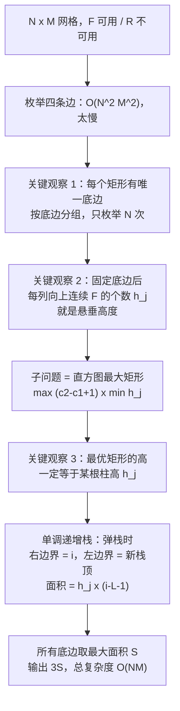

[[TOC]]

## 形式化题目

给定一个 $N \times M$ 的字符网格，每格是 `F` 或 `R`。要求选出一个**轴对齐的连续子矩形**（行的连续区间 $\times$ 列的连续区间），使矩形内每一格都是 `F`，并最大化它的格数（面积）。设最大面积为 $S$，输出 $3S$。

用 $[\,\cdot\,]$ 表示条件成立取 $1$、否则取 $0$，则要求

$$
S = \max_{\substack{1 \leqslant r_1 \leqslant r_2 \leqslant N \\ 1 \leqslant c_1 \leqslant c_2 \leqslant M}}
(r_2 - r_1 + 1)(c_2 - c_1 + 1)\cdot\bigl[\text{子矩形 } [r_1, r_2] \times [c_1, c_2] \text{ 全为 } F\bigr]
$$

约束：$1 \leqslant N, M \leqslant 1000$，即最多 $10^6$ 个格子。

题面样例的网格与它的唯一最大矩形（第 1--5 行、第 4--6 列，$5 \times 3 = 15$ 格）如下：

| 行\列 | 1 | 2 | 3 | 4 | 5 | 6 |
| :---: | :---: | :---: | :---: | :---: | :---: | :---: |
| 1 | R | F | F | **F** | **F** | **F** |
| 2 | F | F | F | **F** | **F** | **F** |
| 3 | R | R | R | **F** | **F** | **F** |
| 4 | F | F | F | **F** | **F** | **F** |
| 5 | F | F | F | **F** | **F** | **F** |

观察重点：网格里所有的 `R` 都落在前 3 列，所以第 4--6 列从第 1 行到第 5 行一路畅通，可以竖着铺满 5 层。面积 $5 \times 3 = 15$，输出 $3 \times 15 = 45$。这个最大矩形同时贴着上、下、右三条边，肉眼还算好找；但 $N, M$ 到 $1000$ 时必须靠算法而不是肉眼。

## 正解

### 思路

**朴素做法与瓶颈。** 直接枚举矩形的四条边 $(r_1, r_2, c_1, c_2)$，再用二维前缀和 $O(1)$ 判断是否全 `F`。枚举量是 $\binom{N+1}{2}\binom{M+1}{2} = O(N^2M^2)$，$N = M = 1000$ 时约 $10^{12}$，远超 1000 ms 的预算。瓶颈在于**把矩形的上下两条边都当成自由变量**。

**第一步：按底边分组。** 任何非空矩形都有唯一的底边行 $r$，所以

$$
S = \max_{1 \leqslant r \leqslant N}\ \text{底边在第 } r \text{ 行的最大全 } F \text{ 矩形面积}
$$

行区间的枚举从 $O(N^2)$ 降到 $O(N)$ 个互不干扰的子问题。

**第二步：把子问题翻译成直方图。** 固定底边 $r$，记

$$
h_j = \text{第 } j \text{ 列从第 } r \text{ 行向上数，连续的 } F \text{ 个数}
$$

一个底边为 $r$、覆盖列区间 $[c_1, c_2]$、高为 $H$ 的矩形全 `F`，当且仅当 $H \leqslant \min_{j \in [c_1, c_2]} h_j$：每一列向上至少 $H$ 格是 `F`，矩形才落得进去。取最高的合法 $H$ 就是区间最小值，于是

$$
\text{底边在第 } r \text{ 行的最大面积} = \max_{c_1 \leqslant c_2}\ (c_2 - c_1 + 1)\min_{j \in [c_1, c_2]} h_j
$$

这正是经典的**直方图最大矩形**问题。

**第三步：高度逐行递推。** 底边从第 $r-1$ 行下移到第 $r$ 行时

$$
h_j \leftarrow \begin{cases} h_j + 1, & (r, j) \text{ 是 } F \\[2pt] 0, & (r, j) \text{ 是 } R \end{cases}
$$

一趟 $O(M)$ 就能把上一行的高度数组改成当前行的，不需要重新扫描上方所有格子。

下面用样例演示这个递推过程，以及每行作为一个直方图时的最大矩形：

| 底边行 | 本行内容 | 悬垂高度 $h_1 \sim h_6$ | 本行直方图最大矩形 |
| :---: | :--- | :--- | :---: |
| 1 | `R F F F F F` | `[0, 1, 1, 1, 1, 1]` | $1 \times 5 = 5$ |
| 2 | `F F F F F F` | `[1, 2, 2, 2, 2, 2]` | $2 \times 5 = 10$ |
| 3 | `R R R F F F` | `[0, 0, 0, 3, 3, 3]` | $3 \times 3 = 9$ |
| 4 | `F F F F F F` | `[1, 1, 1, 4, 4, 4]` | $4 \times 3 = 12$ |
| 5 | `F F F F F F` | `[2, 2, 2, 5, 5, 5]` | $5 \times 3 = \mathbf{15}$ |

观察重点：第 3 行前 3 列是 `R`，对应高度立刻清零，而第 4--6 列"踩着上一行继续长高"，从 1 一路长到 5。所以答案取所有行直方图矩形的最大值即可——最大矩形虽然跨了 5 行，但它等价于"底边在第 5 行的那一次直方图计算"，不需要显式枚举行区间。

**第四步：单调栈求直方图最大矩形。** 这一步的关键性质是：最优矩形的高**一定等于某根柱子的高度**。若高 $H$ 严格小于区间最小值，把 $H$ 抬到该最小值仍然合法且面积更大——矛盾。于是只需对每根柱子 $j$ 问："以 $h_j$ 为高，最宽能铺到哪？" 答案是左右两侧第一个更矮的柱子之间：

$$
L_j = \text{左边第一个 } h_k < h_j \text{ 的位置}, \qquad R_j = \text{右边第一个 } h_k < h_j \text{ 的位置}
$$

$$
\text{直方图答案} = \max_j\ h_j \cdot (R_j - L_j - 1)
$$
剩下的问题是：怎么一遍扫描同时求出所有 $L_j, R_j$。维护一个存下标的栈，并保持**栈内高度严格递增**：

- 扫描到 $i$ 时，若 $h_i \leqslant h_{\text{top}}$，说明栈顶 `top` 往右走不动了，**$i$ 就是它的 $R_{\text{top}}$**；
- 把 `top` 弹出后露出的新栈顶，正是**它左边第一个更矮的位置** $L_{\text{top}}$（空栈则取 $-1$）；
- 于是一次弹栈就凑齐了左右边界，立刻结算 $h_{\text{top}} \cdot (i - L_{\text{top}} - 1)$。

每个下标至多入栈一次、出栈一次，均摊 $O(M)$。

最后一行 `[2, 2, 2, 5, 5, 5]` 的完整扫描过程（下标从 0 起，末尾补哨兵 $0$）：

| 扫描到 $i$ | $h_i$ | 弹出并结算 | 结算后栈（下标:高度） |
| :---: | :---: | :--- | :--- |
| 0 | 2 | — | `0:2` |
| 1 | 2 | 高 2 宽 1 = 2 | `1:2` |
| 2 | 2 | 高 2 宽 2 = 4 | `2:2` |
| 3 | 5 | — | `2:2  3:5` |
| 4 | 5 | 高 5 宽 1 = 5 | `2:2  4:5` |
| 5 | 5 | 高 5 宽 2 = 10 | `2:2  5:5` |
| 哨兵 6 | 0 | 高 5 宽 3 = **15**；高 2 宽 6 = 12 | 空 |

观察重点：等高的柱子不会互相阻塞——靠左的先被弹出，宽度偏小；最靠右的那根（下标 5）一直留到哨兵处，此时右边界是 6、新栈顶是下标 2（高度 2），宽度 $6 - 2 - 1 = 3$，正好把三根同高的柱子合并算成高 5、宽 3 的矩形。末尾那根**高度 0 的哨兵**不是真格子，它的作用是让扫描结束时栈里所有非零柱子都被弹出来结算，省掉循环外的一段清栈代码。

**为什么弹出条件带等号、为什么哨兵必需。** 带等号时，等高柱子中靠左的先弹出（其宽度是到当前 $i$ 为止的部分宽度），而最靠右的那根一直留到遇到更矮者，一次性拿到完整宽度，两者乘积相同，最大面积不受影响。若改成严格小于，等高柱子会留在栈里等更矮者，宽度可能更大，但那个矩形同样合法、且被“最右等高柱”的完整宽度覆盖，最大值仍然不变。所以两种写法都正确；带等号的好处是等高者立即结算，栈深不会被同类元素推高，语义也更统一。哨兵则保证“右边没有更矮者”（$R_j = M$）的柱子也有机会结算。

### 代码

Python 版：

@include-code(./main.py, python)

C++ 版（同一算法）：

@include-code(./main.cpp, cpp)

### 复杂度

- 时间复杂度：$O(NM)$。其中读入 $O(NM)$、$N$ 行高度递推共 $O(NM)$、$N$ 次单调栈共均摊 $O(NM)$（每根柱子入栈出栈各一次）。相比朴素解法的 $O(N^2M^2)$，$N = M = 1000$ 时从 $10^{12}$ 量级降到 $10^6$ 量级，降了六个数量级。
- 空间复杂度：$O(NM)$ 用于存放输入 token 表，算法自身状态只需 $O(M)$（`heights` 数组 + 栈）。$N = M = 1000$ 时峰值内存约 35 MB，低于 128 MB 限制。

## 总结

- **按底边分组**是本题的第一个突破口：任何矩形都有唯一底边，于是 $O(N^2)$ 的行区间枚举被压成 $O(N)$ 个独立子问题。
- **悬垂高度**把"二维里找全 `F` 矩形"变成"一维直方图最大矩形"：底边下移一行，只需让能长高的列加一、被 `R` 挡住的列清零。
- **单调递增栈**在弹栈的瞬间同时拿到"右边界 = 当前下标"和"左边界 = 新栈顶"，均摊 $O(1)$ 结算一根柱子，把 $O(M^2)$ 的列区间枚举降到 $O(M)$。
- 两个必须记住的实现细节：弹出条件带等号（让等高柱子立即结算，栈深不被同类元素推高），以及末尾补一根高度 $0$ 的哨兵（保证栈内剩余柱子全部结算）。
- 三层优化合起来把 $O(N^2M^2)$ 降到 $O(NM)$。输出前别忘了乘 3。

## 图示解析

这张图串起本题从网格到答案的主线：

先看每个节点解决了哪一层的瓶颈：第一层把 $O(N^2M^2)$ 的枚举对象砍成 $O(N)$ 个底边，第二层让每个子问题的输入能以 $O(M)$ 增量维护，第三层把子问题内部从 $O(M^2)$ 降到均摊 $O(M)$。顺着箭头往下读，每一步都只依赖上一层已经证明过的结论，没有跳步。
