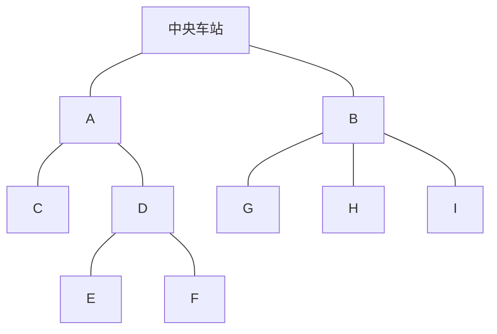

[[TOC]]

## 形式化题目

设 $T$ 是一棵以中央车站为根的无标号有根树。一条**探索路线**是从根出发、每条边恰好走两次（下行一次、上行一次）的遍历，编码成长度为 $2 \times$ 边数的 `0/1` 串：

- `0`：沿一条边走到离根**更远**的一站（第一次进入某个结点）；
- `1`：沿一条边退回离根**更近**的一站（回到父亲）。

给定两条长度相等的探索路线串，判断是否存在同一棵树，使两条串都是它的探索路线（即两串描述的无标号有根树同构）。同构输出 `same`，否则 `different`。

数据范围：串长最多 $3000$（即结点数 $\leqslant 1500$），多组询问。

样例第一组的两条串对应同一棵树（根的两个子树分别是：一棵挂“叶子 + 二元结点”的子树、一棵挂三片叶子的子树）：



同一条路线在"每个结点先走哪个儿子"上有自由度，所以同一棵树可以产生很多不同的路线串——这正是本题要消除的信息。

## 正解

### 思路

**朴素做法。** 最直接的想法是按括号匹配把两条路线串各自还原成一棵显式树，再对两棵树做有根树同构判定（AHU：一个结点等价于"排序后的儿子子树"）。但路线串本身就是"进入/离开"型的括号序列，建树只是把括号信息翻译一遍再读出来，绕了一圈。

**关键观察：子树 ↔ 括号区间。** 把 `0` 看成左括号、`1` 看成右括号，路线串是一个合法括号序列。每个结点对应其中一段区间（从第一次进入它到离开它），父子区间嵌套。同一棵树的两种路线，差别**只在每一层儿子被访问的先后顺序**——只要给每个子树一个与儿子顺序无关的"指纹"，两条串等价当且仅当根的指纹相同。

**规范形（树的最小表示）。** 递归定义结点 $u$ 的规范串：

$$\mathrm{canon}(u) = \texttt{0}\,\, s_1 s_2 \cdots s_k \,\,\texttt{1}, \qquad s_i = \mathrm{canon}(\text{儿子}_i) \text{ 升序排序后拼接}$$

- 前导 `0` 和尾 `1` 对应"进入/离开 $u$"这两步路线动作，中间是各儿子子树的动作；
- 对儿子规范串**排序**，正好抹掉"先走哪个儿子"这一同构不计的自由度；
- 叶子的规范串是 `01`。

整条路线串 $S$ 恰好等于"根的各个儿子的规范串按实际访问顺序拼接"。根没有自己的前导 `0`/尾 `1`，于是定义

$$\mathrm{canon}(S) = \text{根儿子的规范串排序后拼接}$$

对子树规模归纳可得：两条串来自同一棵树 $\Leftrightarrow \mathrm{canon}(S_1) = \mathrm{canon}(S_2)$。这就是经典的 AHU 树同构（有根版）。

**在栈上直接折叠，跳过建树。** 还原树时栈里保存的就是当前路径上的结点；而 AHU 自底向上合并时，每个结点只需要"收齐儿子的规范串"。于是让栈的每一层不存结点，直接存**该结点已收集的儿子规范串列表**：

- 读到 `0`（进入新结点）：压入一个空列表；
- 读到 `1`（退回父亲）：弹出栈顶列表 $K$，把 $\texttt{0} + \mathrm{sort}(K) \text{ 拼接} + \texttt{1}$ 追加进新栈顶——这个结点"封口"；
- 串结束：弹出根的儿子规范串列表，排序拼接即规范形。

用样例二第一组演示（两个串描述的树不同构，规范形应当不同）：

| 串 | 还原出的树（部分） | 根儿子规范串排序拼接 |
| --- | --- | --- |
| `0100101100100111` | 根有两个儿子：一棵叶子，和一棵二元内结点（挂两棵叶子） | `0001101100101101` |
| `0011000111010101` | 根有四个儿子：二元结点、二元结点、叶子链结点、叶子（各挂若干叶子） | `0001110011010101` |

两个规范形不相等，输出 `different`。观察要点：排序把"访问顺序"这一自由度彻底消掉，剩下的差异全部来自树的真实形状。

**实现细节与两个坑。**

1. **根层没有前导 `0`/尾 `1`**：循环结束时栈里只剩根的儿子列表，直接 `sort + join`，不能再套"封口"（多出一对括号会让两条串的约定不一致）。只要两条串用同一套约定比较，结果就正确。
2. **求值顺序坑**：不能写 `stack[-1].append(wrap(stack.pop()))`——Python 先求值 `stack[-1]`（此刻栈顶还是即将弹出的那层），`pop()` 之后再追加，结果被追加进已弹出的列表里直接丢失。必须先 `kids = stack.pop()` 再 `stack[-1].append(wrap(kids))`。
3. **递归深度**：串长 3000 时链形树（`000…111…`）的递归深度可达 1500，超出 CPython 默认递归限制，所以用显式栈迭代，不用递归 + `setrecursionlimit`。

### 代码

@include-code(./main.py, python)

### 复杂度

设串长 $n \leqslant 3000$。每个字符进出栈一次；每次封口对儿子规范串做一次排序，最坏情况下排序比较的字符总量为 $O(n^2)$（如"链上每个结点挂一串叶子"），实际数据下远小于该上界，1s 时限内轻松通过。空间上所有栈层串长之和不超过 $O(n)$。

## 总结

- 路线串是括号序列：`0` = 进入、`1` = 离开，每个结点对应一个嵌套区间。
- 树同构 ⟺ 消除儿子访问顺序后的指纹相同：规范形 = `0` + 儿子规范串排序拼接 + `1`。
- 不必显式建树：栈的每层直接收集儿子规范串，`1` 触发封口，最后对根层排序拼接比较。
- 两个实现坑：根层不封口；`stack[-1].append(wrap(stack.pop()))` 的求值顺序陷阱。

## 图示解析

### 规范形的折叠过程

以样例一第一组的 `0010011101001011` 为例（位置从 1 数起），列出每个 `1` 触发的封口动作：

```text
串：    0  0  1  0  0  1  1  1  0  1  0  0  1  0  1  1
位置：  1  2  3  4  5  6  7  8  9 10 11 12 13 14 15 16
封口：      01    01 0011  00011011  01       01    001011
                  └2棵叶┘
```

- 位置 3、6 的 `1`：两棵叶子封口成 `01`；位置 7 的 `1` 让含这两棵叶子的二元结点封口成 `0011`（它本身有两个儿子 `01` + `01`）；
- 位置 8 的 `1`：左子树的父结点封口成 `00011011`（儿子是 `0011` 和 `01`）；
- 位置 10、13、15 的 `1`：右子树里三棵叶子封口；位置 16 的 `1` 让右子树的父结点封口成 `001011`（三个儿子都是 `01`）；
- 根层把两个儿子规范串 `00011011`、`001011` 排序拼接，得到 `0001101100101101`。

第二条路线 `0100011011001011` 访问儿子的顺序不同，中间封口位置也不同（第一个封口在位置 2），但根层拿到的儿子规范串集合完全相同，排序拼接后同样是 `0001101100101101`，故输出 `same`。可以看到：排序前两条路线的中间产物不同，排序后收敛到同一个不动点——"同构的不动点"正是这个算法的全部思想。
