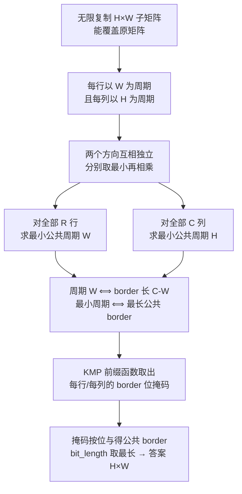

[[TOC]]

## 形式化题目

给定 $R \times C$ 的字符矩阵 $G$（元素为大写字母）。若把 $H \times W$ 的子矩阵 $T$ 不断向右、向下复制铺满平面，得到
$G'[i][j] = T[i \bmod H][j \bmod W]$，且 $G'$ 在左上角 $R \times C$ 的窗口内与 $G$ 完全重合，则称 $T$ 是 $G$ 的**覆盖子矩阵**。求覆盖子矩阵的最小面积 $H \cdot W$。

## 正解

### 思路

**朴素做法。** 直接按定义枚举 $W = 1 \ldots C$ 与 $H = 1 \ldots R$，逐格检查
$G[i][j] = G[i \bmod H][j \bmod W]$ 是否处处成立，取最小的 $H \cdot W$。
单次检查 $O(RC)$，总复杂度 $O(R^2C^2)$，在 $R \leqslant 10^4$ 时完全不可行。

**瓶颈在哪。** 两处浪费：一是把二维条件当成一个整体去验证，二是对固定方向逐个候选周期重扫字符串。下面分别消掉。

#### 第一步：行与列两个方向可以拆开

固定行号 $i$，把 $j$ 换成 $j + W$（仍要求 $j + W < C$）：覆盖定义右端的
$T[i \bmod H][(j + W) \bmod W] = T[i \bmod H][j \bmod W]$ 完全没变，所以必然有
$G[i][j + W] = G[i][j]$——**每一行都以 $W$ 为周期**。同理把 $i$ 换成 $i + H$ 可得**每一列都以 $H$ 为周期**。

反过来，若每行以 $W$ 为周期、每列以 $H$ 为周期，就可以沿行方向反复减 $W$、沿列方向反复减 $H$，
把任意 $(i, j)$ 归约到 $(i \bmod H, j \bmod W)$，每一步的值都不变，于是
$T[i \bmod H][j \bmod W] = G[i][j]$，覆盖成立。

> **一句话**：$H \times W$ 是覆盖子矩阵 $\iff$ 每行以 $W$ 为周期且每列以 $H$ 为周期。

$H$ 与 $W$ 的约束互不耦合，所以答案就是两个独立一维问题的最小值之积：

$$W^* = \text{所有行的最小公共周期}, \qquad H^* = \text{所有列的最小公共周期}, \qquad \text{ans} = H^* \cdot W^*.$$

以样例为例，两行都是 `ABABA`：

| 行\列 | 0 | 1 | 2 | 3 | 4 |
| --- | --- | --- | --- | --- | --- |
| **0** | `A` | `B` | `A` | `B` | `A` |
| **1** | `A` | `B` | `A` | `B` | `A` |

行方向：每行的最小周期都是 2，公共周期取最小得 $W^* = 2$（覆盖块 `AB`）。
列方向：转置后 5 列依次是 `AA`、`BB`、`AA`、`BB`、`AA`，每列的最小周期都是 1，$H^* = 1$。
面积 $= 1 \times 2 = 2$，与样例输出一致。

#### 第二步：把"周期"换成"border"

设串 $s$ 长度 $n$。$s[i] = s[i+p]$ 对所有 $0 \leqslant i < n-p$ 成立，等价于说
「前缀 $s[0..n-p)$ 等于后缀 $s[p..n)$」，也就是 $s$ 有一条长度 $n-p$ 的 **border**。于是

$$\text{最小周期} \iff \text{最长 border}, \qquad \text{最小公共周期} = n - \text{最长公共 border}.$$

样例中 `ABABA` 的 border 有 `A`（长 1）和 `ABA`（长 3），最长是 3，所以最小周期 $5-3=2$。

#### 第三步：KMP 一次扫描取出全部 border

KMP 的前缀函数 `nxt[i]` 记录前缀 `s[:i]` 的最长 border 长度。而 $s$ 的**全部** border 长度恰好是
`nxt[n], nxt[nxt[n]], …` 直到 0——因为 border 的 border 仍是 border，沿链回溯既不遗漏也不会重复。
这条链的长度是 $O(n)$，所以一次 $O(n)$ 扫描就能枚举完所有候选周期，不必对每个 $p$ 重扫一遍。

`ABABA` 的前缀函数与 border 链：

| `nxt` 按位 | 0 | 0 | 0 | 1 | 2 | 3 |
| --- | --- | --- | --- | --- | --- | --- |
| border 长度 $b$ | 3 | 1 | 0 |
| 对应周期 $n-b$ | 2 | 4 | 5 |

#### 第四步：多个串求"公共"border

把每个串的 border 长度集合压成一个位掩码：第 $b$ 位为 1 表示存在长度 $b$ 的 border。
所有串的掩码**按位与**，留下的就是公共 border 集合，`bit_length() - 1` 即最长公共 border。

掩码里额外置上第 0 位（长度 0 的 border 恒存在），这样按位与的结果永远非零：
即使没有任何非平凡公共 border，`bit_length() - 1 = 0`，得到 $W^* = n$——整段长度本身永远是周期，
与直觉一致，也省掉了"无解"分支。

列方向完全对称：把所有列当成等长的长字符串，做同一件事得到 $H^*$。

> **常见误区**：不要用"每行最小周期的最小公倍数"。例如用例 `ABCDEFAB`（最小周期 6）与
> `AAAABAAA`（最小周期 5）同行时，它们的公共 border 长度集合交集含 `AB`（长 2），
> 正确宽度是 $8-2=6$；而 lcm 会给出 30 并截断成 8，答案就错了。

整个流程：



### 代码

@include-code(./main.py, python)

### 复杂度

设串长为 $n$。`border_mask` 中 KMP 主体扫描 $O(n)$，沿 `nxt` 链回溯时每轮 `b` 至少减 1、链长不超过 $n$，也是 $O(n)$。对 $R$ 行、$C$ 列各做一遍，总时间 $O(RC)$，空间 $O(RC)$（列字符串与 `nxt` 数组）。相比朴素做法的 $O(R^2C^2)$，省去了"枚举候选周期"与"逐周期重扫"两重开销；最坏规模 $10^4 \times 75$ 实测约 0.2 秒。

## 总结

- 覆盖的定义可以逐方向展开：固定一个下标就能证明「覆盖 $\iff$ 行周期 $W$ 且列周期 $H$」，于是二维问题降成两个互不影响的一维问题，答案是两者最小值的乘积。
- 「周期 $\iff$ border」把求最小周期变成求最长 border；KMP 前缀函数沿 `nxt` 链回溯一次即可列举串的全部 border，把 $O(n^2)$ 的枚举降到 $O(n)$。
- 多个串的"公共"语义用位掩码按位与表达：`common.bit_length() - 1` 直接给出最长公共 border，$n$ 减去它就是最小公共周期。
- 关键陷阱是不要用各行最小周期的最小公倍数；公共 border 的交集才是正确的"公共周期"语义。

## 图示解析

```text
R×C 字符矩阵
`- 覆盖 ⟺ 每行周期 W 且每列周期 H          （固定下标 j→j+W / i→i+H 即可证明）
   `- 两方向独立 → ans = W* × H*
      `- 一维问题：求一组串的最小公共周期
         `- 周期 p ⟺ border 长 n-p，故求最长公共 border
            `- KMP 前缀函数沿 nxt 链取出全部 border → 位掩码
               `- 全部掩码按位与 → bit_length()-1 = 最长公共 border
                  `- W* = C - b ；H* = R - b' ；输出乘积
```

图中只保留正文已经证明过的关键关系：先有"方向可分离"，才有"两个一维问题"；
先有"周期 ⟺ border"，才能用 KMP 的 `nxt` 链代替枚举；最后的按位与把"公共"落到一次位运算上。
