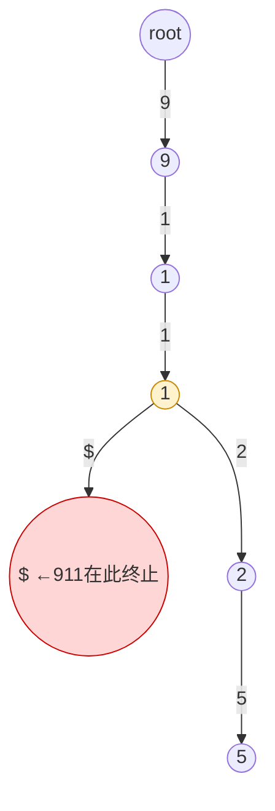

[[TOC]]

## 形式化题目

给定 $t$ 组数据。每组数据给出 $n$ 个仅由数字组成的字符串（每个长度不超过 $10$）。判断这 $n$ 个字符串中是否存在某一个是另一个的**前缀**：存在则输出 `NO`（不兼容），不存在则输出 `YES`（兼容）。注意一个字符串本身也算自己的前缀，但本题只关心**不同号码之间**的关系。

## 正解

### 思路

先想朴素做法：对每一对号码 $(a, b)$ 检查 $b$ 是否以 $a$ 开头，$n \leqslant 10000$、$t \leqslant 40$ 时最多要比较约 $40 \times \frac{10^4 \times 10^4}{2}$ 对，明显不可接受。瓶颈在于：**两两比较浪费了大量重复的前缀扫描**——很多号码共享相同开头，每次却都从头比一遍。

这正是字典树（Trie）擅长的事：把所有号码放进一棵以「数字 → 子节点」为边的树里，**公共前缀只走一遍**。判断前缀关系只需在插入时捕获两类冲突事件：

1. **更早的号码是当前号码的前缀**：插入当前号码途中，走到某一层时发现这里早就有一个号码终止了（即别人恰好到此为止，而当前号码还要继续往下走）。反过来说，这一层应该"只有到这为止的人"。
2. **当前号码是更早号码的前缀**：当前号码走完了，但它结尾那个节点还挂着别的子节点，说明更早的某个号码从这里继续延伸了下去。

为了把「某号码在此终止」也统一成树上的一个节点，实现里给每个号码末尾拼一个哨兵字符 `$`（数字里不可能出现的字符）：号码 `911` 变成 `911$`，`$` 那条边就是它的终点。于是两类冲突都变成对"节点是否非空"的检查，逻辑对称、代码最短。

以样例一中 `911` 与 `91125426` 为例：

插入 `911$` 之后，`$` 子节点挂在第 3 层的 `1` 号节点上；再插入 `91125426$`，走到第 3 层继续沿数字 `2` 下走时，发现它的兄弟里已经有 `$`——事件 1 发生，说明 `911` 是 `91125426` 的前缀，立即输出 `NO`。

而样例二中没有任何号码提前终止在别人的路径上，五个号码插入完毕都无冲突，输出 `YES`。注意顺序不影响结论：`12345` 比 `12340` 先插还是后插，两类事件总有一个会在插入时触发，所以一趟插入即可判定，无需二次遍历。

### 代码

@include-code(./main.py, python)

### 复杂度

设一组数据的号码总字符数为 $L$（$L \leqslant n \times 10$）。每个字符只被插入一次，每次沿边走一步、做一个字典操作，时间复杂度 $O(t \cdot L)$；Trie 节点数也不超过总字符数，空间复杂度 $O(L)$。对 $t = 40$、$n = 10^4$、号码长 $10$，总量约 $4 \times 10^6$ 步，远优于朴素做法的 $O(t \cdot n^2 \cdot 10)$。

## 总结

- 前缀冲突在 Trie 上表现为两个对称事件：**新路径穿过更早号码的终点**、**新号码的终点仍有后继**；用末尾哨兵字符把"终止"统一成一条边，两类检查都化归为"子节点表里有没有谁"。
- 一趟插入 $O(L)$ 判定，且与插入顺序无关；相比两两 `startswith` 的 $O(n^2 L)$ 朴素做法，把重复的公共前缀扫描合并成了共享的树路径。
