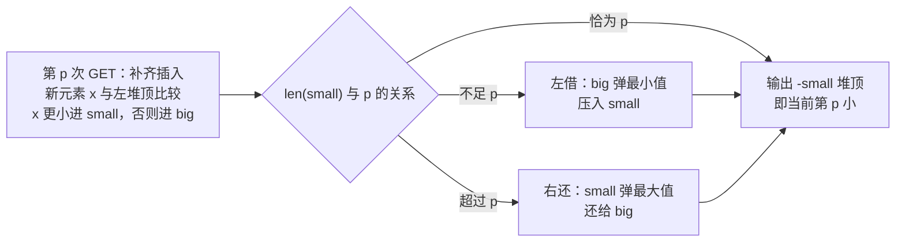

[[TOC]]

## 形式化题目

给定长度为 $M$ 的序列 $A(1), A(2), \dots, A(M)$ 和长度为 $N$ 的序列 $u(1), u(2), \dots, u(N)$，满足 $1 \le N \le M \le 30000$、$|A(i)| \le 2 \times 10^9$，且对所有 $p$ 有 $p \le u(p) \le M$。

维护一个初始为空的整数多重集合和计数器 $i = 0$。序列 $A$ 依次给出所有 `ADD(x)` 操作的参数；第 $p$ 次 `GET` 操作发生在第 $u(p)$ 个元素加入之后，它使 $i$ 增加 $1$ 并输出当前集合升序后的第 $i$ 小。由于第 $p$ 次 GET 时盒内至少要有 $p$ 个数，$u$ 是单调不减的。

对每个 $p = 1, 2, \dots, N$，即求

$$\text{ans}(p) = \{A(1), \dots, A(u(p))\}\ \text{的第}\ p\ \text{小}.$$

### 样例推演

以 $A = (3, 1, -4, 2, 8, -1000, 2)$、$u = (1, 2, 6, 6)$ 为例，下表用正解的两个堆
（`small` 为存"当前最小的若干个数"的大根堆，加粗其堆顶；`big` 为其余数的小根堆）
展示每次 GET 前后的变化，具体机制见下文正解：

| GET 序号 $p$ | 补齐插入的元素 | 平衡前 `small`（个数） | 借/还动作 | GET 后 `small` | `big` | 输出（第 $p$ 小） |
| --- | --- | --- | --- | --- | --- | --- |
| 1 | 3 | {3} (1) | 无 | {**3**} | {} | 3 |
| 2 | 1 | {1, 3} (2) | 无 | {**3**, 1} | {} | 3 |
| 3 | -4, 2, 8, -1000 | {-1000, -4, 1, 2, 3, 8} (6) | 还回 3、2 | {-1000, -4, **1**} | {2, 3, 8} | 1 |
| 4 | （无） | {-1000, -4, 1} (3) | 借入 2 | {-1000, -4, 1, **2**} | {3, 8} | 2 |

第 3 行最有代表性：一次 GET 前插入了 4 个元素，左侧攒到 6 个、超出 $p = 3$，
于是把左侧最大的 3 和 2 依次"还"给右侧；第 4 行 $p$ 变成 4 却没有新元素，
只需从右侧借一个最小值 2。答案始终是左侧的堆顶。

## 暴力解法

### 思路

按 $u$ 还原操作序列：从左到右扫描 $p = 1 \dots N$，先把 $A\big(u(p-1)+1 \dots u(p)\big)$
依次加入集合，再对当前集合整体排序（或线性选择）取出第 $p$ 小输出。

这个做法正确且直观，但每次 GET 都对"几乎没变"的集合从头重算一次顺序统计量。

### 代码

暴力层省略代码：按本篇要求不单独提供暴力实现（无 brute 文件），朴素做法仅用于暴露瓶颈，思路见上文；正式解法见下方正解的代码。

### 复杂度

第 $p$ 次 GET 花费 $O\big(u(p)\log u(p)\big)$，总计 $O(NM \log M)$；即使用线性选择
也是 $O(NM)$。$M = 3 \times 10^4$ 时分别约为 $10^{10}$ 与 $9 \times 10^8$，都远超时限。

### 瓶颈

瓶颈在于**每次询问都从头重算**：相邻两次 GET 之间集合只新增了
$u(p) - u(p-1)$ 个元素，要输出的排名也只从 $p-1$ 走到 $p$——旧的第 $p-1$ 小
信息几乎可以全部复用，却被排序扔掉了。

## 正解

### 关键观察

1. **要维护的排名恰好是 $1, 2, 3, \dots$ 递增**：第 $p$ 次 GET 要第 $p$ 小，
   不是任意排名。因此"最小的一些数"这个前缀每轮只会多要一个，维护它的代价
   可以摊还很小的常数。
2. **集合只增不减**：插入后第 $p$ 小只可能不变或变大，所以围绕
   "当前最小的 $p$ 个数" 做增量维护是安全的。

把集合沿全局排序切成两段，用一个数据结构各管一段，让左段的**大小恒等于 $p$**，
答案就是左段的最大值。

### 思路

维护**对顶堆**：

- 大根堆 `small`：始终保持"恰好是当前集合中最小的 `len(small)` 个数"，
  堆顶即当前第 `len(small)` 小；
- 小根堆 `big`：装剩下的所有数。两堆合起来是全集。

处理第 $p$ 次 GET 分三步：

1. **补齐插入**：把 $A\big(u(p-1)+1 \dots u(p)\big)$ 依次插入。每个新元素 $x$
   与左侧堆顶比较：$x$ 比左侧最大值还小就进 `small`，否则进 `big`。
   这个贪心保证 `small` 始终装着"最小的一段数"。
2. **左借**：若 `len(small) < p`，从 `big` 弹出最小值压入 `small`。
3. **右还**：若 `len(small) > p`，把 `small` 的堆顶（左侧最大）弹回 `big`。

平衡后 `len(small) == p`，堆顶就是第 $p$ 小。注意插入和平衡的先后次序：
先全部插入、再借/还，借还只沿"全局排序的左右边界"滑动元素，不破坏
"`small` 是最小的一段"这一性质。

实现上，Python 的 `heapq` 只有最小堆，所以 `small` 用**相反数**存储：
比较写 `x < -small[0]`，输出时再取负号翻回来。

### 代码

Python 版：

@include-code(./main.py, python)

C++ 版（同一算法）：

@include-code(./main.cpp, cpp)

### 复杂度

- **时间** $O(M \log M)$：每个元素最多进出 `small` 常数次（`len(small)` 随 $p$
  单调加 1、超过时还回，摊还每个元素进出左堆的次数是常数），每次堆操作
  $O(\log M)$。$M = 3 \times 10^4$ 时约 $4.5 \times 10^5$ 次堆操作，远优于暴力。
- **空间** $O(M)$：两堆合计存放全部元素。

## 总结

- 本题的关键是把"每次询问重算第 $p$ 小"改成**把答案物化成数据结构的状态**：
  对顶堆的左堆大小恒等于当前询问的排名，堆顶即答案。
- 排名恰好 $1, 2, \dots$ 递增 + 集合只增不减，是左堆只需"借/还"平衡、
  每轮摊还 $O(1)$ 次移动的前提；如果询问的是任意排名，就要换成权值
  树状数组或平衡树。
- 对顶堆是"动态第 $k$ 小（$k$ 单调变化）"这一类问题的标准套路，也常见于
  "数据流的中位数"等变体。
