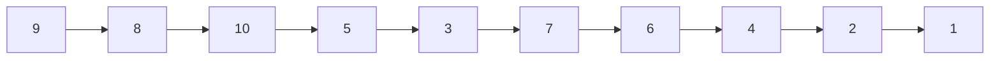

[[TOC]]

## 形式化题目

给定一张有向无环图 $G=(V,E)$，$|V|=N$、$|E|=M$，边可以重复给出。对每个点 $v$，求它能到达的点数

$$|R(v)|,\quad R(v)=\{u \mid \text{存在从 } v \text{ 到 } u \text{ 的有向路径}\}$$

其中规定 $v$ 到自身可达，即 $v \in R(v)$，所以 $|R(v)| \geqslant 1$；重复的边不影响可达性。

## 正解

### 思路

本题 $1 \leqslant N,M \leqslant 30000$，时限 1000ms，内存 128MB。

**第一步：把「搜索」看成「集合合并」。**

最容易想到的做法是：对每个点单独做一次 DFS，把能走到的点全部标记，数标记个数。它是对的，因为 DFS 走遍的正是所有路径终点。但它的工作量是 $O(N^2)$：每个点都要重走一遍自己后方的整张子图，而不同起点的子图高度重叠。真实数据里这种重叠非常严重——第 5 组 $N=M=30000$、却只有一个点出度为 $0$，说明绝大多数点最终都汇入同一个汇点，同一份信息被重算了上万遍。

重复的根源是：DFS 每次都在**重新发现** $w$ 能到哪些点，而不是**复用**已经知道的答案。于是把搜索改写成递推：

$$R(v)=\{v\}\cup\bigcup_{(v,w)\in E}R(w)$$

只要每个后继 $w$ 的 $R(w)$ 已经算好，$R(v)$ 就只是几个已知集合的并集。

**第二步：用拓扑逆序让递推成立。**

上面的式子依赖后继，所以要从汇点往源点算。DAG 的拓扑序保证了：把拓扑序倒过来扫，轮到 $v$ 时它的所有后继都已经算完。样例第 1 组的拓扑序是 $1,2,4,6,7,3,5,10,8,9$，倒过来扫的处理次序如下：

图中每个节点是样例里的一个点，箭头方向是**计算顺序**，不是原图的边：从没有出边的汇点 $9,8,10$ 出发一路向左，最后才算到源点 $1,2$。观察重点是箭头只保证「后继排在前面」——例如 $2 \to 3$ 这条原图的边，在图上体现为 $3$ 出现在 $2$ 的左边，所以算 $2$ 的时候 $3$ 的掩码已经就位。原图真正的边见下面那张掩码表。

**第三步：把一个集合压成一个整数。**

即使改成递推，如果真用 Python 的 `set` 去合并，每个后继集合仍要逐个元素搬进来，$\sum_v |R(v)|$ 依然可以达到 $O(N^2)$：第 5 组数据的答案总和就是 $4.5\times10^8$，没有实质变快。

真正的转折在于：题目只问「某个点在不在 $R(v)$ 里」，从不问「$R(v)$ 里具体有哪些数」。既然一个集合只被用来回答「在不在」，那就把它编码成 $N$ 位二进制数 `reach[v]`，**第 $u$ 位为 $1$ 表示 $u$ 可达**。三种集合运算于是各对应一条位运算：

| 集合运算 | 位运算 | 代码 |
| --- | --- | --- |
| $R(v) \cup R(w)$ | 按位或 | `mask \|= reach[w]` |
| $\{v\}$，即 $v \in R(v)$ | 单独置第 $v$ 位 | `mask = 1 << v` |
| $\lvert R(v)\rvert$ | 数二进制里 1 的个数 | `mask.bit_count()` |

一次按位或只花 $O(N/64)$ 个机器字，并且由 Python 的 C 层执行，常数远小于在 Python 层逐个元素循环。

下面按处理次序列出样例第 1 组的全过程。去重后剩 8 条边：$2\to3,2\to5,2\to10,3\to8,3\to9,4\to8,4\to9,5\to9$。

| 处理次序 | $v$ | 后继 | `reach[v]` 的二进制（下标 $10 \to 1$） | 可达集合 | $\lvert R(v)\rvert$ |
| --- | --- | --- | --- | --- | --- |
| 1 | 9 | — | `0100000000` | {9} | 1 |
| 2 | 8 | — | `0010000000` | {8} | 1 |
| 3 | 10 | — | `1000000000` | {10} | 1 |
| 4 | 5 | 9 | `0100010000` | {5, 9} | 2 |
| 5 | 3 | 8, 9 | `0110000100` | {3, 8, 9} | 3 |
| 6 | 7 | — | `0001000000` | {7} | 1 |
| 7 | 6 | — | `0000100000` | {6} | 1 |
| 8 | 4 | 8, 9 | `0110001000` | {4, 8, 9} | 3 |
| 9 | 2 | 3, 5, 10 | `1110010110` | {2, 3, 5, 8, 9, 10} | 6 |
| 10 | 1 | — | `0000000001` | {1} | 1 |

表的每一行是一次循环：位掩码最左边是第 $10$ 位、最右边是第 $1$ 位（第 $0$ 位空着不用，于是点编号和位下标一一对应，读写时不需要做偏移换算）。看第 9 行 $v=2$：它先置上自己的第 $2$ 位，再或上进过 3、5、10 三行的掩码，得到 $6$ 个 $1$，正好对应样例输出的第 2 行 `6`；第 4 行 $v=5$ 只有 $5$ 和 $9$ 两个 $1$，对应输出 `2`。出度为 $0$ 的点 $1,6,7,8,9,10$ 在表里都只有一个 $1$，对应样例输出的 `1`。这里 $8$ 和 $9$ 并不是孤立点，只是没有出边——它们的掩码仍是别的点合并的对象。

**第四步：及时释放掩码。**

用大整数存集合的代价是：每个 `reach[v]` 都占 $N$ 位，$N$ 个同时驻留就是 $O(N^2)$ 位。做法是给每个点记一个「还有几个前驱要读它」的计数，读完就把它置 $0$ 释放。把释放那一行删掉再跑第 5 组数据，峰值内存从 31MB 涨到 149MB，直接超过 128MB 限制——这一步不是锦上添花，而是本题 Python 实现能不能过内存限制的关键。

代码里还有一个容易忽略的正确性要求：**输入边要去重**。题面没有声明边不重复，而样例第 1 组的 `2 3` 和 `5 9` 各出现了两次，真实数据前四组分别含 2、80、103、431 条重边。不去重的话入度会虚高，Kahn 算法里这些点的入度永远减不到 $0$，整片子图都会被漏掉。

### 代码

@include-code(./main.py, python)

### 复杂度

- 时间复杂度：$O\big((N+M)\cdot N/64\big)$。每条边做一次 $O(N/64)$ 的按位或，每个点做一次 $O(N/64)$ 的 `bit_count()`，前面还有 $O(N+M)$ 的读入、去重和拓扑排序。
- 空间复杂度：$O(N+M)$ 存图和顺序数组，另加同时驻留的掩码，最坏 $O(N^2/64)$ 个机器字；配合引用计数释放后，第 5 组数据实测峰值 31MB。

## 总结

- 看到「从每个点出发能到达多少点」，先写成集合递推 $R(v)=\{v\}\cup\bigcup R(w)$，把重复搜索变成合并已有答案。
- DAG 加上依赖后继，就说明该按拓扑逆序自底向上填，每个答案只算一次。
- 只问「在不在」的集合用位掩码：合并是按位或，大小是 `bit_count()`。Python 的任意精度整数天然就是一个位集合，不必手写 `bitset`。
- 输入边可能重复，去重是正确性要求而不只是优化：重边会让入度虚高，拓扑排序会漏点。
- 掩码很占空间，读完就按引用计数释放，是本题通过内存限制的必要处理。
