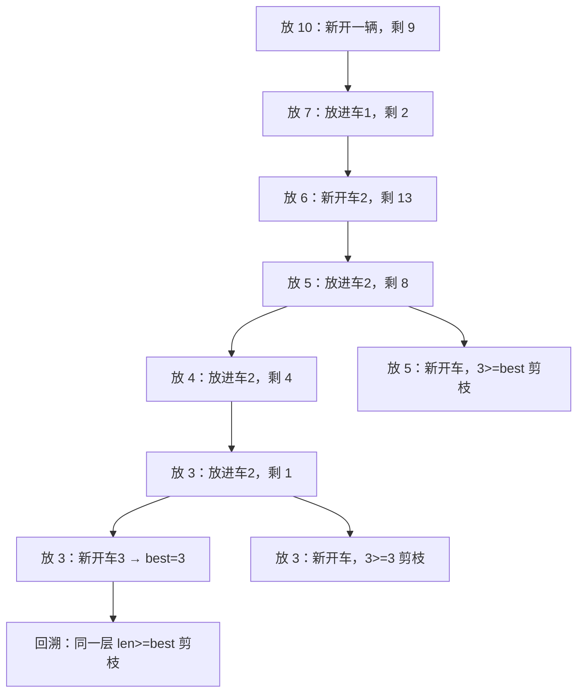

[[TOC]]

## 形式化题目

给定 $N$ 个重量 $C_1, C_2, \ldots, C_N$ 与容量 $W$（保证每个 $C_i \leqslant W$），把它们划分成若干个互不相交的子集，使每个子集内的元素之和不超过 $W$。求所需子集个数的最小值。

以样例为例子集划分的一种最优方案：

| 车 | 装的小猫 | 总重量 | 是否超限 |
| --- | --- | --- | --- |
| 第 1 辆 | $1994 + 2$ | $1996$ | 恰好装满 |
| 第 2 辆 | $29 + 12 + 1$ | $42$ | 未超限 |

两只猫不能合用一车之外的其他可能都被排除后，$2$ 辆就是答案。要特别注意：$N \leqslant 18$ 很小，但 $W$ 可以到 $10^8$，所以**不能**对重量做任何与 $W$ 成正比的预处理。

## 正解

### 思路

这是经典的**装箱问题（bin packing）**：把 $N$ 件物品装进最少数量的容量 $W$ 的箱子。装箱问题是 NP 困难的，没有任何已知的多项式解法；但这里 $N \leqslant 18$，规模极小，所以正解是**带剪枝的深度优先搜索**。

**第一步：把"装箱"翻译成"逐只做决定"。**

不要去想"最后分成哪几堆"，而是一个一个地安排小猫：按某个顺序依次处理第 $i$ 只猫，这是**搜索的阶段**；对每只猫尝试两种动作——塞进某辆**已经租好的车**（前提是剩余空间装得下），或者**新租一辆车**。当第 $N$ 只猫也安置好，就得到一个可行方案，车数就是它的花费。

这样搜索的叶子节点集合与"所有合法划分"一一对应，只要枚举完，取最小的叶子深度就是答案。$N=18$ 时最坏情况下每层分支数最多 $N$，节点数是 $O(N!)$ 级别，必须剪枝。

**第二步：讨论顺序——从重到轻。**

把猫按重量**降序**排序后再搜索。理由有两个：重的猫能落脚的候选车最少（剩余空间要 $\geqslant C_i$），分支最窄；而且重的猫排在前面，能更早把 `best`（当前搜到的最优车数）压小，后面的宽分支就都被剪掉。这一步不改变正确性，只是让同一棵搜索树变得更容易被剪。

**第三步：能不能直接贪心？**

很自然的想法是：按重量降序，每只猫塞进"还装得下它、且剩余空间最小"的那辆车（首次适应递减，FFD）。贪心很快，但它**不保证最优**。例如 $W = 19$、猫的重量是 $10, 7, 6, 5, 4, 3, 3$：

| 步骤 | 当前猫 | 已租车剩余空间 | 贪心的选择 |
| --- | --- | --- | --- |
| 1 | $10$ | 空 | 新开车，剩 $9$ |
| 2 | $7$ | $9$ | 放进第 1 辆，剩 $2$ |
| 3 | $6$ | $2$ | 新开车，剩 $13$ |
| 4 | $5$ | $2, 13$ | 放进第 2 辆，剩 $8$ |
| 5 | $4$ | $2, 8$ | 放进第 2 辆，剩 $4$ |
| 6 | $3$ | $2, 4$ | 放进第 2 辆，剩 $1$ |
| 7 | $3$ | $2, 1$ | 两辆都装不下，新开车，共 $3$ 辆 |

贪心得到 $3$ 辆；但最优是 $10+6+3 = 19$ 与 $7+5+4+3 = 19$ 两辆。所以贪心只能当作剪枝用的**可行上界**，不能当答案。

**第四步：三条剪枝。**

记 `best` 为目前搜到的最小车数（初始值取贪心结果），`space_left` 为各已租车的剩余空间，`free` 为它们的总和。

1. **车数剪枝**：若已租车数 `len(space_left) >= best`，这个分支再往下走也不可能更优，立即返回。
2. **剩余量下界剪枝**：设 `suffix[i]` 为第 $i$ 只及以后（已按降序排好，也就是最重的那些）的重量和。现有空位一共只能再塞 `free`，剩下 `suffix[i] - free` 的重量必须靠新车，每辆车最多贡献 `capacity`，所以还要
   $$\left\lceil \frac{\texttt{suffix[i]} - \texttt{free}}{\texttt{capacity}} \right\rceil$$
   辆车。若 `len(space_left)` 加上它已经 $\geqslant$ `best`，同样剪掉。
3. **"最重的几只"下界剪枝**：这是最强的一条。固定起点 $i$，考虑第 $i$ 只及以后这 $n-i$ 只猫。对每个 $k$，取它们中最轻的 $k$ 只（即第 $i$ 到第 $i+k-1$ 只里第 $i+k-1$ 只最轻，重量为 $c = C_{i+k-1}$）。任何一辆车装的猫都 $\geqslant c$，所以一辆车最多装 $\lfloor W / c \rfloor$ 只，装完这 $k$ 只至少要
   $$\left\lceil \frac{k}{\lfloor W / c \rfloor} \right\rceil$$
   辆车。对所有 $k$ 取最大值，就得到"第 $i$ 只及以后至少要几辆车"的下界 `least[i]`，与当前怎么装无关。若 `least[i] >= best`，这个子树不可能更优。

**第五步：对称性去重。**

不同的车如果剩余空间相同，它们在结构上完全等价：把猫放进其中任何一辆，得到的后续状态（剩余空间的多重集）一模一样。用一个 `tried` 集合记住本次已经试过哪些剩余空间，同一个值只试一辆，直接砍掉大部分重复分支。这一步也用到了 `cats` 已降序：同一只猫放进剩余空间大的车，剩下的小车就更装不下后面较小的猫，剪枝效果更好。

把这几步合起来，就能在 $N=18$ 时快速搜完。下图的搜索树片段取自第二步里的贪心反例（$W=19$，猫为 $10, 7, 6, 5, 4, 3, 3$），可以看清剪枝发生在哪里。

图中第一段路径找到的是 $3$ 辆的可行方案（对应贪心结果），随后回溯发现第二辆车还剩 $9$ 时先放 $6$ 而不是 $5$，能让第 6、7 只 $3$ 也塞进同一辆车，于是 $best$ 降到 $2$；此后所有已用 $3$ 辆车的分支都在进门那一行被 `len(space_left) >= best` 挡掉。

对应的代码如下。

### 代码

Python 版：

@include-code(./main.py, python)

C++ 版（同一算法）：

@include-code(./main.cpp, cpp)

### 复杂度

- 时间复杂度：最坏 $O(N!)$（每层最多 $N$ 种落点），也就是枚举全部划分的规模；降序 + 三条下界剪枝 + 对称去重后，$N \leqslant 18$ 的实际搜索量远小于上界，真实数据均在毫秒级。
- 空间复杂度：$O(N)$，递归深度与 `space_left`、`suffix`、`least` 都只有 $N$ 项。

### 正确性要点

- **不漏解**：每一只猫只有"进已有车"和"开新车"两类落点，任何合法划分（把每辆车按其中第一只猫被处理的时刻视为"开新车"）都能在搜索树上找到唯一路径，因此最优解一定被枚举到。
- **剪枝不误杀**：三条下界（已用车数、剩余重量、最重几只的每车件数）都只用于"这个子树不可能比 `best` 更好"的判定，只会跳过不优的分支；`best` 初值来自一个可行方案，故答案始终可行。
- **边界**：$N = 1$ 时贪心直接返回 $1$；所有 $C_i = W$ 时每只猫各占一车，贪心给出 $N$，剪枝立刻终止；题面保证 $C_i \leqslant W$，代码不必处理装不下的猫。

## 总结

- 装箱问题是 NP 困难的，但 $N \leqslant 18$ 允许**搜索 + 剪枝**：把"划分"改写成一维的"逐只猫做决定"。
- 降序排序是这类搜索的固定套路：重物分支窄、能更早压紧上界。
- 贪心（首次适应递减）拿不到最优解，但可以提供一个便宜又紧的上界，让剪枝从第一步就生效。
- 三条剪枝互补：车数下界管"已经开太多车"，剩余重量下界管"后面还得再开几辆"，每车件数下界管"最重的这几只无论如何都装不完"。
- 剩余空间相同的车互为对称，同一层只试一次即可，这是本题最简单也最有效的一刀。
