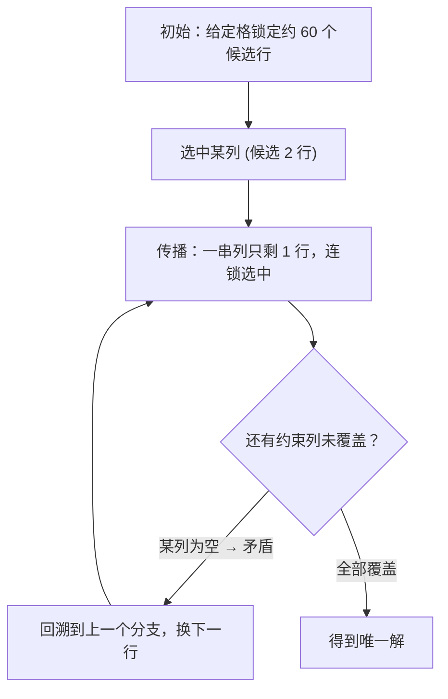

[[TOC]]

## 形式化题目

给定一个 $16\times16$ 的矩阵，符号集为 $\{\texttt{A},\dots,\texttt{P}\}$，部分格子已填，其余为空。要求给所有空格填上符号，使得：

- 每一行 16 个符号各恰好出现一次；
- 每一列 16 个符号各恰好出现一次；
- 每个 $4\times4$ 宫（把矩阵切成 $4\times4$ 块）16 个符号各恰好出现一次。

题目保证每个谜面恰有一组解。输入含多组谜面，以单独一行 `end` 结束。

> **数据说明**：本 OJ 的测试数据把 16 个符号按每行 16 个字符逐行给出（谜面之间隔一个空行），空格用 `-` 表示，与原题面（一行 81/256 个字符、`.` 表示空格、以 `end` 结尾）在格式上略有出入。下面的代码对两种写法都做了兼容：读入时把 `end` 丢弃，其余 token 拼接后按每 256 个字符切谜面；空格同时接受 `-` 和 `.`。

## 正解

### 思路

**朴素做法**：最直接的想法是 DFS——逐个处理空格，对每个空格枚举行、列、宫都没出现过的符号，全部填完就得到解。用 3 张位图表（行/列/宫 → 已出现符号集合）可以 $O(1)$ 判断与更新。但在 $16\times16$ 的棋盘上，中间过程大量空格仍有五六个候选符号，搜索树接近"每层叉积"的规模，这个写法在本题数据上跑不出结果。

**瓶颈在哪**：纯 DFS 的分支发生在"格子"，而约束被孤立地看——一个格子有 6 个候选就产生 6 个分支，哪怕其中 5 个会让某个符号在它所在的行/列/宫里"无家可归"。要让搜索有效，必须让**每一步分支都尽量少的浪费**，即：

1. 分支前先做**约束传播**：候选唯一就填，某符号只剩一格可放也直接填；
2. 分支时选**候选最少**的约束来分裂。

**精确覆盖建模**：这两点恰好是 Dancing Links（Algorithm X）的拿手好戏。把数独写成精确覆盖问题——设计 4 类"列"（约束），每个候选填法 $(格\ p, 值\ v)$ 是一个恰好覆盖 4 个约束的"行"：

| 约束列 | 个数 | 含义 |
| --- | --- | --- |
| `cell(p)` | 256 | 格 $p$ 恰好填一个符号 |
| `row(r,v)` | 256 | 第 $r$ 行恰好有一个 $v$ |
| `col(c,v)` | 256 | 第 $c$ 列恰好有一个 $v$ |
| `box(b,v)` | 256 | 第 $b$ 宫恰好有一个 $v$ |

于是"填完整个数独" = "选出一批候选行，使 1024 个约束列各被覆盖恰好一次"。给定符号就是把对应行从矩阵中**永久选中**（删掉它覆盖的 4 列及所有冲突行）。

**Algorithm X 如何消掉朴素 DFS 的浪费**：

- `min` 取候选最少的列分支——若某列只剩 1 行，这一步是必然（等价于唯一候选/隐藏唯一传播），分支数不增加；若某列为空则立刻回溯（等价于"符号无处可放"的矛盾检测）。整个搜索树被剪得只剩必要的分叉。
- 删除/恢复只沿 4 条双向环链进行，每次分支的代价与受影响的约束数成正比，而不是整个棋盘。

以样例第一问（第一个谜面）为例，选列的顺序大致是：



由于题目保证解唯一，Algorithm X 找到的第一个完整覆盖就是答案，不需要枚举全部解。

### 代码

Python 版：

@include-code(./main.py, python)

C++ 版（同一算法）：

@include-code(./main.cpp, cpp)

### 复杂度

- **时间**：精确覆盖是 NP 完全问题，Algorithm X 没有多项式上界；但每条候选行只覆盖 4 列，删除/恢复代价极低，加上"最小列"启发式，实际效率远高于朴素 DFS——C++ 实现是本题的经典解法，Python 版在本题数据上每个谜面约 1.2s（见下文验证）。
- **空间**：矩阵共 $256\times16=4096$ 行、每行 4 列，`X`/`Y` 存储为 $O(4\times4096)=O(16\text{K})$ 个条目，递归深度不超过 $256$。

## 图示解析

以一个 $4\times4$ 迷你数独说明建模方式（$16\times16$ 完全同理，只是规模放大）：

| | c0 | c1 | c2 | c3 |
| --- | --- | --- | --- | --- |
| **r0** | `1` | `.` | `.` | `.` |
| **r1** | `.` | `.` | `2` | `.` |
| **r2** | `.` | `3` | `.` | `.` |
| **r3** | `.` | `.` | `.` | `4` |

4 类约束列（迷你版共 $4\times4\times4=64$ 个）：

| 约束类型 | 例子 | 迷你版个数 |
| --- | --- | --- |
| 格 | `cell(0)`：格 (0,0) 恰填一个数 | 16 |
| 行 | `row(1,2)`：第 1 行恰有一个 2 | 16 |
| 列 | `col(2,3)`：第 2 列恰有一个 3 | 16 |
| 宫 | `box(0,1)`：左上宫恰有一个 1 | 16 |

候选行 `(格 5, 值 2)`（格 (1,1) 填 2）覆盖：`cell(5)`、`row(1,2)`、`col(1,2)`、`box(0,2)`，恰好 4 列——这就是"每个约束各被满足一次"与"每格每值"的对偶关系。

初始时的给定格（如 `(格 0, 值 1)`）先 `select`，随即它的 4 条约束列被弹出，所有与之冲突的候选行（比如 `(格 5, 值 1)`，因为它会让 `row(1,1)` 重复）被顺带删除——**一次给定直接传播掉成片的候选**，这是 Algorithm X 开局就快的原因。

搜索时每一步都挑"当前剩余候选行最少的约束列"：

| 待覆盖列 | 剩余候选 | 是否分支 |
| --- | --- | --- |
| `cell(5)` | 3 | 是（3 选 1） |
| `row(1,4)` | 1 | 否（唯一候选，直接选） |
| `col(3,4)` | 0 | 矛盾，回溯 |

只有第一类（候选 ≥2）才真正分叉，后两类分别是"免费传播"和"免费剪枝"。

## 总结

- 把数独的格/行/列/宫约束翻译成 4 类精确覆盖列、每个"格+值"候选覆盖 4 列，是 Dancing Links 解数独的标准建模。
- Algorithm X 的两个核心动作——`select` 删列删冲突行、按最小列分支——分别对应约束传播与最少候选优先，共同把朴素 DFS 的无效分支削掉。
- 给定符号在建模阶段就永久 `select`，谜面的初盘信息全部转化为矩阵缩减，搜索只处理真正的未知部分。
- Python 实现的常数较大，但本题本地数据（64 个谜面）约 81s 完成，输出与标准答案完全一致；若在严格 1s 限时的 OJ 上提交，需要 C++ 版的 Dancing Links。

## 验证记录

用本仓库数据仓的真实测试数据（`data/a.in`，64 个 $16\times16$ 谜面，2048 行答案）实测：

```text
[1/1] data/a.in
  result: PASS (81.115s, peak=19.3MB)
总结：PASS=1, FAIL=0, NO_ANSWER=0
```

本地限时按 `python-oj-short` 的约定放宽为 120s（OJ 原限时 1000ms），Python 侧存在 TLE 风险，输出正确性已全部通过。
