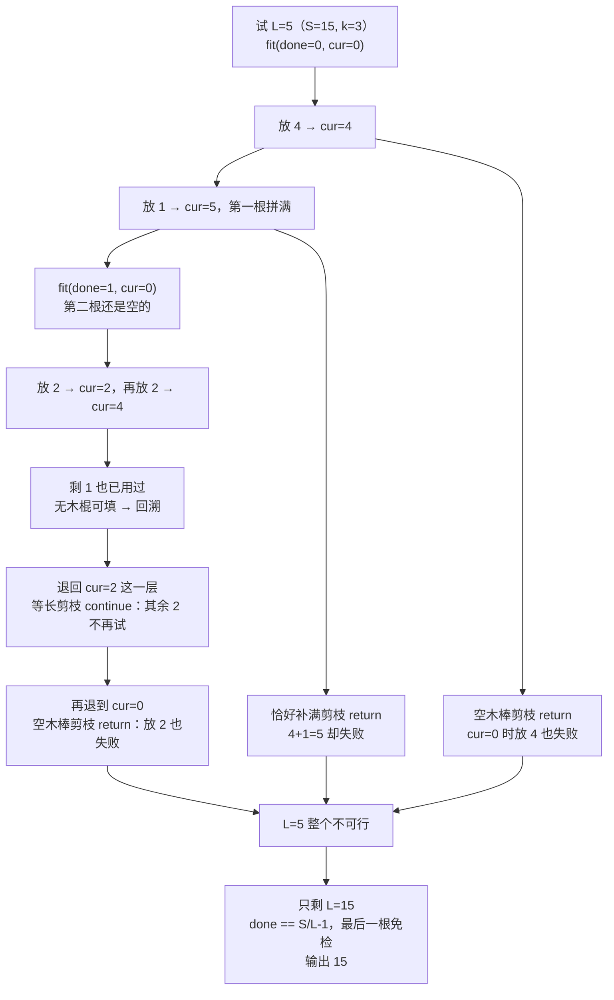

[[TOC]]

## 形式化题目

给定一个正整数多重集 $A = \{a_1, a_2, \dots, a_n\}$，$n \leqslant 64$，每个 $a_i \leqslant 50$。
把它划分成若干个部分（每个元素恰好属于一个部分），使得**每个部分的元素和都相等**，
记这个公共和为 $L$。求 $L$ 的最小可能值。

设 $S = \sum_{i=1}^{n} a_i$，则答案 $L$ 必须满足

$$
L \mid S, \qquad L \geqslant \max_{1 \leqslant i \leqslant n} a_i
$$

反过来，只要 $A$ 能划分成 $S/L$ 个元素和恰为 $L$ 的部分，$L$ 就是合法答案。

::: warning
**数据里的非法节**：题面声明"每一节木棍的长度均不大于 50"，但本题实际使用的数据（沿用 POJ 1011 / 洛谷 P1120 加强版）
里混进了长度大于 50 的节，本数据集最大到 64。这些节与题面前提矛盾，**处理时必须忽略**。

证据：不过滤时，258 组数据中有 116 组连 $L \mid S$、$L \geqslant \max a_i$ 都不成立，
即根本无解；过滤掉 $>50$ 的节后，全部 258 组的输出与标准答案完全一致
（其中小规模部分另用独立的位掩码精确算法逐组复核）。这也是该题在各 OJ 上的通行处理。
:::

## 正解

### 思路

#### 朴素做法与瓶颈

最直接的做法是枚举答案 $L$，再判断"能否把 $A$ 恰好拼成若干根长为 $L$ 的木棒"。判断本身用回溯：
每根木棒递归地尝试所有能凑出 $L$ 的子集，凑满一根就从集合里删掉，继续处理剩下的。

麻烦在于判断的状态是"还剩哪些木棍可用"，也就是一个 $2^n$ 的掩码空间。$n = 64$ 时
$2^{64} \approx 1.8 \times 10^{19}$，完全不可行。即使换写成"逐根装填、每层试 $O(n)$ 个候选"，
搜索树依然是深度 $n$、每层分枝 $O(n)$ 的巨物，而且其中绝大多数分支是**同构的重复**：

| 浪费来源 | 具体表现 |
| --- | --- |
| 候选 $L$ 太多 | 从 $\max a_i$ 到 $S$ 逐个试，最多 $64 \times 50 = 3200$ 个长度，其中大多数不整除 $S$ |
| 组内顺序重复 | 同一根木棒里 $\{5, 2, 1\}$、$\{2, 5, 1\}$、$\{1, 5, 2\}$ 是同一个解，却各搜一遍 |
| 等长木棍互换 | 一节长 5 的木棍失败后，其余等长的还要逐个再试 |
| 注定失败仍展开 | 空木棒里放不下某节、或某节恰好补满仍失败，都要搜完整棵子树才回退 |
| 最后一根白搜 | 拼好 $k-1$ 根后，剩余木棍总长必然是 $L$，却还要再搜一遍才确认 |

所以本题的关键不在"换算法"，而在**把搜索树上这些多余的分支提前砍掉**。要砍得准，先要知道
答案 $L$ 本身受哪些硬约束。

#### 关键观察：候选 $L$ 只有 $S$ 的因数

因为所有木棒等长，$S$ 被均分成 $S/L$ 根，所以：

- $L \mid S$，否则不可能均分；
- $L \geqslant \max a_i$，因为每一节都来自某根木棒，不可能比原来的木棒还长。

这两条把候选从约 $S$ 个降到只剩 $S$ 的因数：在 $S \leqslant 3200$ 的范围内最多 48 个
（$S = 2520$ 取到），而不是 3200 个。更妙的是，若改用

$$
k = \frac{S}{L} \quad (\text{木棒根数})
$$

来枚举，则 $k$ 越小 $L$ 越大，所以**把 $k$ 从大到小枚举，等价于把 $L$ 从小到大枚举**。
于是第一个通过判定的 $L$ 就是最小答案，可以直接返回，连排序都不用。

#### 剪枝一：降序排序

先把木棍按长度**从大到小**排序。理由不在正确性上，而在搜索顺序上：
长木棍能落脚的位置少、约束强，先把它定下来，后面的短木棍才有较大自由度，
能更早搜到解或更早发现无解。另外降序后等长的木棍彼此相邻，也是剪枝二的基础。

需要强调的是：后面的四条剪枝在正确性上**并不依赖降序**，它们依赖的是
"未使用的木棍集合"这一状态本身。降序只是让搜索更快撞到解或更快撞到死路。

#### 剪枝二：同层等长跳过

在同一层搜索里，如果刚刚试过长度为 $v$ 的木棍并失败了，那么本层其余长度同为 $v$ 的木棍
**不必再试**：它们在"是否已使用"和"当前木棒剩余空间"这两个维度上完全对称，互换后局面同构。

代码里用一个变量记住本层刚失败的长度：

```text
failed = 0
for i in start..n-1:
    if a[i] == failed: continue   # 等长剪枝
    ...
    failed = a[i]                 # 必须在回溯之后才更新
```

注意 `failed` 要在**撤销标记之后**再赋值，否则成功路径上也会被污染。
实际上由于数组已降序，等长的木棍本来就相邻，所以用"记住上一个失败长度"就足够；
另一种等价写法是 `if not used[i-1] and a[i] == a[i-1]: continue`。

#### 剪枝三（致命）：空木棒失败 ⇒ 整个 $L$ 无解

设当前正在拼的这根木棒**还是空的**（`current == 0`），我们把 $a_i$ 放进去，结果搜下去失败了。
那么 $L$ **一定不可行**，可以直接返回，而不是只跳过 $a_i$。

> **理由**：先注意一个事实：此刻 `current == 0`，说明除了当前这根空木棒，
> 其它已动过的木棒都已拼满。于是含有 $a_i$ 的那根木棒 $R$ **一定还没开始拼**。
>
> 反设 $L$ 可行，取一份可行解。它里面包含 $a_i$ 的那根是 $R = \{a_i\} \cup U$，
> 且当前这根空木棒对应解里的某组 $T$，两者元素和都是 $L$。
>
> 把这两根木棒的内容交换：当前这根改成 $R$，原来 $R$ 的位置改成 $T$。
> 两者元素和都是 $L$，剩下的木棒不动，所以仍是一份可行解——
> 而且在这份解里，$a_i$ 恰好就是当前这根空木棒的第一节。
>
> 搜索确实枚举了"把 $a_i$ 放进空木棒"这一步，并会穷尽之后所有可能的拆法。
> 既然上述可行解存在，这一步就必然能搜出解——与"这一步搜下去失败"矛盾。
> 故 $L$ 无解。（这里只用到了"$R$ 还没开始拼"，与降序无关。）

这条剪枝的威力在于：它把"一棵子树搜完"变成"一步判死"，并且直接终止整个 $L$ 的判定。

#### 剪枝四（致命）：恰好补满却失败 ⇒ 整个 $L$ 无解

设 $a_i$ **恰好填满**当前木棒的最后一点空缺（`current + a[i] == L`），结果失败。
同样可以判定 $L$ 不可行。

> **理由**：把当前这根木棒已拼好的前缀记为 $P$（$\operatorname{sum}(P) = current$）。
> 反设 $L$ 可行，并取一份与当前局面一致的可行解。
>
> 在这份解里，包含 $P$ 的那根木棒由 $P \cup T$ 组成，其中 $T$ 是一组未使用的木棍，
> 满足 $\sum_{t \in T} t = L - current = a_i$。又因为 $a_i$ 还没被使用，
> 它属于某根还没动过的木棒 $R = \{a_i\} \cup U$，满足 $\sum_{u \in U} u = L - a_i$。
>
> **若 $a_i \in T$**：由 $\sum_{t \in T} t = a_i$ 得 $T = \{a_i\}$，即这份解里就是"$a_i$ 恰好补满
> 当前这根木棒"——可这正是刚刚搜失败的那个分支，矛盾。
>
> **若 $a_i \notin T$**：把这两根木棒的内容对调一下组成新解——
> 当前这根改为 $P \cup \{a_i\}$，原来 $a_i$ 那根改为 $T \cup U$。两根的和分别是
>
> $$
> current + a_i = L, \qquad \sum_{t \in T} t + \sum_{u \in U} u = a_i + (L - a_i) = L
> $$
>
> 都恰好是 $L$，且 $T \cup U$ 里的木棍都是未使用的，装得下。其余木棒不动，
> 于是又是一份可行解，而且它就是"$a_i$ 恰好补满当前木棒"这一步之后的完成方式——
> 与这一步搜下去失败矛盾。
>
> 两种情况都矛盾，故 $L$ 无解。
>
> 这条比空木棒剪枝更强：空木棒要求 `current == 0`，而这里 `current` 可以是任意值，
> 只要 $a_i$ 恰好补齐。这也正是它最有杀伤力的地方。

#### 剪枝五：最后一根免检

当已经拼好 $S/L - 1$ 根时，剩下的木棍总长恰好是 $S - (S/L - 1) \cdot L = L$，
它们必然能凑成最后一根。此时**直接判成功**，不必再展开。

#### 组合式枚举

除剪枝外，还要消除"组内顺序重复"。做法是给递归加一个 `start` 参数：
选第 $i$ 个木棍后，下一层只能从 $i+1$ 开始挑。这样每根木棒内部的元素按下标递增排列，
$\{5,2,1\}$ 与 $\{2,5,1\}$ 只会出现一次。

#### 样例推演

**样例 1**：`5 2 1 5 2 1 5 2 1`，$S = 24$，$\max a_i = 5$，降序后为
`5 5 5 2 2 2 1 1 1`。候选 $L$ 是 $24$ 的因数且 $\geqslant 5$：

| 试探顺序 | $L$ | 根数 $k = 24/L$ | 判定结果 | 具体分组 |
| --- | --- | --- | --- | --- |
| 1 | **6** | 4 | **可行** | $\{5,1\}, \{5,1\}, \{5,1\}, \{2,2,2\}$ |
| 2 | 8 | 3 | 可行但不必再试 | $\{5,2,1\} \times 3$ |
| 3 | 12 | 2 | 可行但不必再试 | $\{5,5,2\}, \{5,2,2,1,1,1\}$ |
| 4 | 24 | 1 | 可行但不必再试 | 全部合成一根 |

第一行就是答案：$L = 6$ 时四根木棒恰好分完，且它是第一个被试探的候选，所以输出 `6`。
表里后三行说明"可行解不唯一"——$L = 8$、$12$、$24$ 都能分出来，但题目要最小值，
而按 $L$ 升序枚举保证先撞上 6。

**样例 2**：`1 2 3 4`，$S = 10$，$\max a_i = 4$，候选只有 $L = 5$（$k=2$）和 $L = 10$（$k=1$）。

| 试探顺序 | $L$ | 根数 $k$ | 判定结果 | 具体分组 |
| --- | --- | --- | --- | --- |
| 1 | **5** | 2 | **可行** | $\{4,1\}, \{3,2\}$ |
| 2 | 10 | 1 | 可行但不必再试 | $\{4,3,2,1\}$ |

输出 `5`。这两组样例都体现同一件事：**枚举顺序决定了"第一个可行解即最小值"**。

#### 剪枝在小数据上的实际效果

拿一组 $n = 7$ 的例子 `a = [4, 2, 2, 2, 2, 2, 1]`（$S = 15$，降序），候选是 $L = 5$ 和 $L = 15$。
把 $L = 5$ 的搜索树画出来，能看到三条剪枝分别在哪一步生效：



图里 `G` 对应 `continue`（只跳过一节等长木棍），`H`、`I`、`J` 对应 `return False`
（直接把这个 $L$ 判死），三条路径汇到 `K` 后只剩 $L = 15$ 一个候选。
$L = 15$ 靠"最后一根免检"一步成立——整个搜索只用了 7 个节点；
若换成朴素的全子集搜索，这里的分支数会迅速爆炸。

注意 `G` 和 `H` 发生在**回溯路上**，这正好体现了剪枝的作用位置：
它们不阻止搜索往前走，而是当一条路走死时，把那些"注定同样失败"的兄弟分支一次删掉。

#### 算法流程

```text
读入一组 n 与 n 个长度
sticks = 过滤掉 > 50 的节，然后降序排序
若 sticks 为空: 输出 0

S = sum(sticks)
for k in range(S // sticks[0], 0, -1):        # k = 根数，从多到少 ⇒ L 从小到大
    if S % k != 0: continue                   # L = S/k 必须是整数
    if fit(L = S // k, done = 0, current = 0, start = 0):
        输出 L 并结束本组

fit(L, done, current, start):
    if done == S // L - 1: return True        # 最后一根免检
    if current == L: return fit(L, done + 1, 0, 0)
    failed = 0
    for i in start .. n-1:
        if used[i] or current + a[i] > L or a[i] == failed: continue
        used[i] = True
        if fit(L, done, current + a[i], i + 1): return True
        used[i] = False
        failed = a[i]                          # 等长剪枝：记住本层失败过的长度
        if current == 0: return False          # 空木棒剪枝
        if current + a[i] == L: return False   # 恰好补满剪枝
    return False
```

### 代码

@include-code(./main.py, python)

实现上有几处刻意为正确性服务：

- `MAX_PIECE = 50` 只是把"题面保证的上界"写成一个有名字的常量，过滤逻辑放在 `solve` 里，
  而不是散落在搜索内部——它属于**输入清洗**，不属于算法。
- `total // length - 1` 这个写法让 `fit` 不必再传一个 `groups` 参数：
  "最后一根"这件事只跟 `total` 和 `length` 有关。
- `failed` 的赋值紧跟 `used[i] = False`，保证只在真正失败后记录，成功路径不会污染它。
- `candidate_lengths` 是生成器，调用点 `for length in candidate_lengths(sticks)` 找到即 `return`，
  不会白算后面的候选。
- 兜底 `return total`：每个因数都试过仍失败时，$L = S$（每节各成一根）必然可行。

### 复杂度

**候选枚举**：代码从 $k = \lfloor S / \max a_i \rfloor$ 递减到 1 扫一遍，每个 $k$ 做一次取模，
所以是 $O(S / \max a_i)$ 次整除判断（最坏 3200 次）；其中真正进入判定的候选是 $S$ 的因数，
在本数据的范围 $S \leqslant 3200$ 内最多只有 48 个（$S = 2520$ 时取到，2520 是 3200 以内因数最多的数）。

**单次可行性判定**：最坏指数级——本题的判定内核是装箱问题（bin packing），是 NP 难的，
无法给出多项式界。设搜索树节点数为 $T$，则总复杂度为 $O(S / \max a_i + K \cdot T)$，
$K$ 为被试探的候选个数。降序排序 + 组合式枚举 + 四条剪枝把 $T$ 压到实际可接受的规模。

**空间复杂度** $O(n)$：只有一个 `used` 数组加递归栈，深度不超过 $n = 64$，
远低于 Python 默认递归上限。

**实测**（258 组真实数据全部通过）：总耗时 0.023 s，峰值内存 15.3 MB，
距 1000 ms / 128 MB 有极大余量。插桩统计显示，258 组数据一共只展开了 13301 个搜索节点，
试过的候选长度共 360 个（258 组平均不到 2 个）；而搜索过程中被提前拦下的分支有：等长跳过 1621 次、
空木棒剪枝 707 次、恰好补满剪枝 580 次，三项合计 2908 次。
这些数字的量级与真正展开的节点数相当，说明剪枝不是在"薅末梢"，
而是真的在搜索树靠近根部的地方就把大子树成片砍掉了。

::: info
**关于 Python 的最坏情况**：本题最坏情况下仍可能超时，这是问题本身 NP 难的固有代价，正解（C++）同样靠剪枝控制规模。
因此这里不为了通过而替换成"枚举子集"之类的另一种算法——那会把可接受的数据规模从
$n = 64$ 拉回到 $n \approx 20$，等于换了题目。
:::

## 总结

- 问题本质是**多重集划分**：把 $A$ 分成若干元素和均为 $L$ 的部分，求最小的 $L$。
- 候选 $L$ 只需枚举 $S$ 的因数且 $L \geqslant \max a_i$；按根数 $k = S/L$ 从大到小枚举，
  就等价于把 $L$ 从小到大枚举，**第一个可行解即最小值**。
- 四条剪枝是本题的全部：降序先放长木棍、同层等长跳过、空木棒失败即整个 $L$ 无解、
  恰好补满却失败即整个 $L$ 无解；再加上"最后一根免检"。
- 其中"空木棒"与"恰好补满"两条会**直接否掉整个 $L$**，是复杂度能接受的关键；
  它们都基于同一个交换论证：把"填充当前空缺的那组木棍"与"$a_i$ 原本所在的那组"对调，
  元素和仍是 $L$，所以可行解可以直接等价变形。
- 数据里长度 $>50$ 的节与题面矛盾，必须忽略；忽略后 258 组标准数据全部一致。

## 图示解析

这张图串起本题从建模到得到答案的主线：

```text
输入 n 节长度
|- 输入清洗: 丢弃 > 50 的非法节（题面保证每节 <= 50）
`- 建模: 多重集 A 划分成若干和为 L 的部分，求最小 L
   `- 候选压缩: L 必须是 S 的因数、且 L >= max(A)
      `- 枚举顺序: 按 k = S/L 从大到小  <=>  L 从小到大
         `- 第一个可行 L 即答案
            `- 判定内核: 降序 + 组合式回溯
               |- 剪枝1 降序: 长木棍落点少，先定下来
               |- 剪枝2 等长跳过: 同层失败的 v 不再重复试
               |- 剪枝3 空木棒失败  => L 无解，直接返回
               |- 剪枝4 恰好补满失败 => L 无解，直接返回
               `- 剪枝5 拼到只剩最后一根 => 直接成立
```

先看最上面两个节点："输入清洗"提醒读者数据与题面不一致这一事实，漏掉它整道题都会算错；
"建模"把题面转化为多重集划分。中间的分支说明候选压缩与枚举顺序如何保证"第一个成功就是最小"。
最后五个叶子是 `fit` 内部的全部做法，其中剪枝 3、4 返回 `False` 会终止整个 $L$ 的判定，
是搜索规模可控的根本原因。
