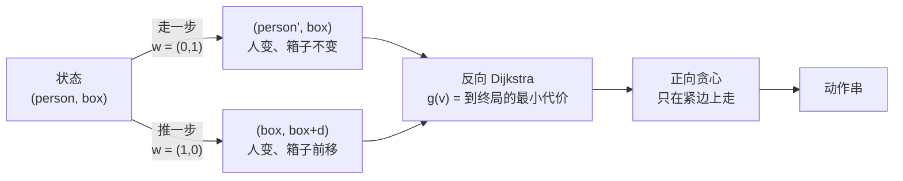

[[TOC]]

## 形式化题目

给定 $N \times M$ 的网格，每格是墙（`#`）或空地（`.`）。空地中有三个特殊格子：人 $S$、箱子 $B$、目标 $T$。

一步操作只有两种：

- **走**：人移动到相邻的空地，且该格不是箱子所在格；
- **推**：箱子恰好在人前方一格，人朝箱子方向走一步，于是箱子前进一格；要求箱子前方那格是空地。

要求把箱子推到 $T$ 上（箱子到达 $T$ 的那一刻即结束，不要求人停在某处），并输出操作序列。
记方案的推箱次数为 $P$、人走路步数为 $W$，则要求按以下顺序取最优：

1. $P$ 最小；
2. $P$ 相同时 $W$ 最小；
3. 前两者都相同时，动作串字典序最小。字符优先级为

$$N < S < W < E < n < s < w < e$$

其中大写是推箱、小写是走路。无解时输出 `Impossible.`。

把"人在 $p$、箱子在 $b$"记为一个状态，就得到一张有向图：

- **走边** $(p, b) \to (p', b)$：$p'$ 与 $p$ 四邻、$p'$ 非墙且 $p' \neq b$，代价 $(\text{push}, \text{walk}) = (0, 1)$；
- **推边** $(p, b) \to (b, b + d)$：其中 $b = p + d$ 且 $b + d$ 非墙，代价 $(1, 0)$。

于是问题就是：求从起点到任意"箱子在 $T$"状态的字典序最短路（先比 push 再比 walk），
并输出其中字符优先级字典序最小的边序列。注意第 3 条只在**代价完全相同**的方案之间做选择，
不会为了字典序而牺牲 $P$ 或 $W$。

## 正解

### 思路

**朴素做法是状态图上的 Dijkstra。** 状态只有 $(NM)^2$ 种，每种至多 5 条出边，用
`heapq` 以 $(\text{push}, \text{walk})$ 为键跑一遍最短路，就能求出最优的 $P$ 与 $W$。
这一步没有任何困难，困难全在第三级优先级上。

**瓶颈：堆比较不了动作串。** 想把"动作串字典序"塞进堆，就得让堆元素携带整条动作串：

```python
heappush(pq, (push, walk, action_string, state))
```

$O(L)$ 的字符串比较和复制会混进每个堆操作（$L$ 是答案串长度，真实数据中最长 588），
既慢又难以论证。另一种常见写法"按优先级顺序扩展、每个状态只记第一次访问"则**根本不对**：
第一次到达某状态的路径未必最优，把代价最优性和访问顺序耦合会直接丢掉正确答案。

**关键性质 1：二维代价可以压成一个整数。** 两种边权都是正的，所以**最优方案必定是状态图上的
简单路径**：若路径含环，删掉环只会让 $P$ 和 $W$ 都不变大，得到的方案更优或一样优。
状态数 $|V| = (NM)^2 \leqslant 160000 < 2^{20}$，所以最优方案的走路步数 $W < 2^{20}$。于是

$$c = P \cdot 2^{20} + W$$

把 $c$ 乘开就能看出：$P$ 不同则 $c$ 的大小完全由 $P$ 决定（低位最多影响 $2^{20}-1$），
$P$ 相同则退化成比 $W$。因此以 $c$ 为堆键跑出的最短路，就是 $P$ 最小、再 $W$ 最小的方案，
堆里也只剩整数。

**关键性质 2：贪心只需要"剩余代价"这一件信息。** 记 $g(v)$ 为从状态 $v$ 出发走到终局的
最小代价（按上面编码）。称边 $v \to u$ 是**紧的**，如果

$$g(v) = w(v,u) + g(u)$$

紧边恰好组成所有最优方案所在的子图。从起点出发，每一步只在紧边里挑优先级最高的动作，
得到的动作串就是所有最优方案里字典序最小的：

设已走代价为 `spent`、当前状态满足 `spent + g(v) = g(起点)`。最优方案的下一个动作必然来自某条
紧边（否则那条方案本身就非最优）。取所有紧边中优先级最高的动作 $a$，任取一个下一步走
$a' \neq a$ 的最优方案：因为 $a$ 是紧边，从它的目标状态出发存在代价恰为 $g(\text{next}_a)$
的后缀，接在 $a$ 后就是一个总代价相同、而下一个字符优先级更小的合法方案，
所以后者按第三级优先级更优；故必定存在下一步走 $a$ 的最优方案，贪心不劣。
对每一步重复同样的论证，贪心选出的动作串就是同代价方案中字典序最小的那个。

**关键性质 3：$g$ 要反向算。** 正向 Dijkstra 得到的是"从起点到 $v$ 的最小代价"，
而性质 2 需要的是"从 $v$ 到终局的最小代价"。区别只是把边反向：反向图的边权与正向完全相同，
所以从**所有**"箱子已在 $T$"的状态出发跑一次反向 Dijkstra，就一次性得到全部 $g(v)$。

$$g(v) = \min_{v \to u}\bigl(w(v,u) + g(u)\bigr), \qquad g\bigl((p, T)\bigr) = 0 \text{ 对任意空地 } p$$

反向边只有两种形态，都可以由正向规则直接读出来：

| 反向边 | 前驱状态 | 条件 | 权 |
| --- | --- | --- | --- |
| 反向走边 | $(p', b)$ | $p'$ 与 $p$ 四邻，$p'$ 非墙且 $p' \neq b$ | $1$ |
| 反向推边 | $(2p - b,\; p)$ | $b$ 与 $p$ 相邻（箱子和人贴在一起）且 $2p - b$ 非墙 | $2^{20}$ |

推边那一行要仔细：**推完后人站在箱子的旧格子上**，所以对当前状态 $(p, b)$（此时 $b$ 是推完
之后箱子所在的格子），推之前箱子在 $p$、人在 $2p - b$。

这两种边的关系可以用一张图说清：同一个局面出发，走路只改"人"这一半、代价走低位；
推箱同时改两半、代价走高位的 $2^{20}$。



图的左半部分解释了为什么每个状态恰好有两类边；右半部分说明 $g$ 只算数值、贪心只挑动作，
两者分工明确，谁都不需要比较动作串。

**完整的算法只有两步：**

1. `backward_cost`：把所有 $(p, T)$ 以代价 0 入堆，按上表松弛反向边，得到 `cost[v] = g(v)`。
   一弹出起点状态就停止——此时起点的 $g$ 已定稿，路径上其余状态的 $g$ 都比它小，也早已定稿。
2. `path_of`：从起点出发，每次先看能不能走一条紧推边（`spent + 2^20 + cost[next] == g(start)`），
   能就走；否则按 $n, s, w, e$ 的顺序找第一条紧走边。只取紧边，所以走的一定是最优方案；
   按优先级取第一条，所以是其中字典序最小的那条。

用样例 #4（题面第 4 组数据，8 行 4 列）看答案串的构成。下表按"连续同类动作"切成 6 段，
格子坐标写作 0 起的 `(行, 列)`：

| 段 | 动作 | 人移动到的格子 | 箱子所在格子 | 这一段在做什么 |
| :---: | :--- | :---: | :---: | :--- |
| 1 | `s` | (6, 3) | (4, 3) | 人从 `(5,3)` 下到 `(6,3)`，让开箱子所在的列 |
| 2 | `www` | (6, 0) | (4, 3) | 沿第 6 行向左走到第 0 列 |
| 3 | `nnnnnn` | (0, 0) | (4, 3) | 沿第 0 列一路向上爬到第 0 行 |
| 4 | `eee` | (0, 3) | (4, 3) | 沿第 0 行向右走到箱子所在列 |
| 5 | `sss` | (3, 3) | (4, 3) | 下到箱子北侧，贴住箱子 |
| 6 | `SSS` | (6, 3) | (7, 3) | 连续下推三次，把箱子从 `(4,3)` 推到 `T` 所在的 `(7,3)` |

推箱 3 次、走路 16 步。前 5 段全是绕路，只有最后 3 步 `SSS` 真正推动了箱子；
第 5 段结束时（人贴在箱子北侧）的局面是：

```text
....
.##.
.#..
.#.S
.#.B
.##.
....
###T
```

为什么必须绕这么远？箱子要从 `(4,3)` 被推到 `T` 所在的 `(7,3)`，只能由人从**北侧**往下推，
所以人必须先站到 `(3,3)`。但人从 `(5,3)` 出发时，向上的 `(4,3)` 被箱子占着，
向左的 `(5,2)` 和 `(5,1)` 都是墙，于是只能先下到第 6 行、沿它走到最左的 `(6,0)`，
再沿第 0 列一路爬到 `(0,0)`，最后从第 0 行折回 `(0,3)` 再往下走到 `(3,3)`。
推箱只需 3 次，人却走了 16 步——这就是 $P$ 与 $W$ 必须分开当两级优先级的原因：
绕路是推箱的必然代价，但代价相同的方案之间仍然要挑绕得最少的那条。

**无解**不是一个特例分支：如果起点状态松弛不到，"箱子在 T"的状态就永远到不了，
`cost[start]` 会保持哨兵值 `INF`，直接输出 `Impossible.` 即可。

### 代码

@include-code(./main.py, python)

### 复杂度

每组数据：状态数 $|V| = (NM)^2$，边数 $|E| \leqslant 5|V|$。

- 时间复杂度：$O\bigl((NM)^2 \log (NM)\bigr)$。$N = M = 20$ 时 $|V| = 1.6 \times 10^5$、
  $|E| < 8 \times 10^5$；真实数据 26 组、其中 8 个满盘，全部跑完约 0.33s。
- 空间复杂度：$O\bigl((NM)^2\bigr)$，`cost` 数组主导；满盘实测峰值 27MB，低于 128MB。

`STEP` 取 $2^{20}$ 而不是 $NM$：最长的简单路径有 $|V| - 1$ 条边，走路步数上界在
$10^5$ 量级，实测（真实数据 + 600 组随机 $20 \times 20$ 压力数据）最大值为 488，
$2^{20}$ 留了充足余量。

## 总结

- 遇到"既要最优、又要在同代价方案里挑字典序最小"的搜索题，都可以拆成
  **反向最短路算剩余代价 + 正向只在紧边上贪心** 两步。反向保证了 $g$ 是"从这里出发还要花多少"，
  贪心才有了裁判；正向保证了优先级顺序被逐位落实。
- 多级代价（推箱数、走路步数）压成一个整数 key 后，堆和紧边判定都退化成整数比较，
  这是本题在 Python 里能跑得动的前提。
- 状态图建模的要点是"两类边的定义与题面规则逐字对应"：走边要求目标格非墙且非箱子，
  推边要求箱子在人前方且前方非墙。反向推边的方向（推完人站在箱子旧格子）最容易写反，
  写反后样例里的长答案会直接变成 `Impossible.`。

## 图示解析

这张图串起本题从建模到输出动作串的主线：

```text
网格 + 行动规则
`- 状态 = (人的格子, 箱子的格子)，共 (NM)^2 个
   `- 边 = 人走一步 (推0,走1) / 推一步 (推1,走0)
      `- 反向 Dijkstra：所有「箱子在 T」的状态作源点
         |- 得到 g(v)：从 v 到终局的最少 (推箱数, 走路数)
         `- g(起点) 不可达 -> Impossible.
            `- 正向贪心：只在 spent + w + g(next) = g(起点) 的边里
               `- 按优先级 N < S < W < E < n < s < w < e 挑动作 -> 输出动作串
```

先看「状态」这一步：它把连续的手感问题变成了有限图上的最短路。
再看反向 Dijkstra 的产物 `g`：它精确回答「从这里出发还要花多少代价」，
因此正向每一步只要在保持最优性的边里挑优先级最高的动作，就得到字典序最小的方案。
最后注意 `Impossible.` 不是一个特例分支，而是 `g(起点)` 仍为无穷大的自然结果。
