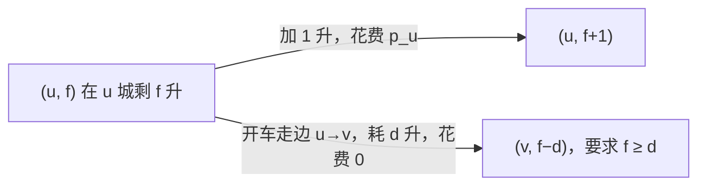
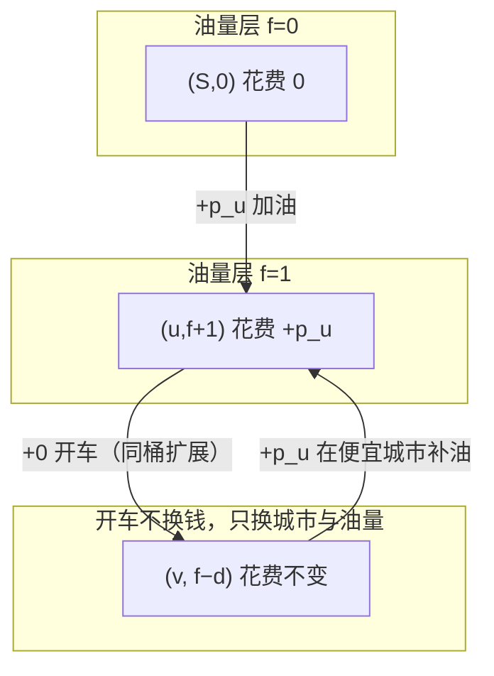

[[TOC]]

## 形式化题目

给定一张 $N$ 个点 $M$ 条边的无向图，每个点 $u$ 有油价 $p_u$，每条边 $(u,v,d)$ 走一趟要消耗 $d$ 升油。对每个询问 $(C, S, E)$：一辆油箱容量为 $C$、初始油量为 $0$ 的车从 $S$ 走到 $E$，途中可以在任意城市按该城市的单价购买任意数量的油（累计油量不超过 $C$），求到达 $E$ 的最少购油花费；若不存在可行方案输出 `impossible`。

样例中 $C=10, S=0, E=3$ 的最优路线是：在 0 号城买 9 升（花 90 元）开到 1 号城，再在油价同为 10 的 1 号城补 8 升，经 1→2→3 到达终点，共花 $9\times10+8\times10=170$ 元；而 $C=20$ 时 4 号城孤立无路，输出 `impossible`。

| 问询 | C | S | E | 答案 |
| --- | --- | --- | --- | --- |
| 1 | 10 | 0 | 3 | 170 |
| 2 | 20 | 1 | 4 | impossible |

## 正解

### 思路

**朴素做法的困境。** 最直观的想法是枚举路径：从 $S$ 出发 DFS 每一条到达 $E$ 的路线，并在沿途决定"在哪买、买几升"。但这样有两个致命问题：买油方案是连续的整数决策，方案数指数级；更重要的是，最优解可能**绕路**——特意经过一个油价便宜的城市加满油再折返，简单的路径枚举无法覆盖"同一城市走多次"的方案。

**关键观察：把油量塞进状态。** 车在一个城市"还剩多少油"决定了它接下来能走哪些边、还需要买多少油。所以真正的状态不是"城市"，而是二元组 $(u, f)$：当前在城市 $u$、油箱里剩 $f$ 升。在这个状态图上只有两种转移：

- **加油**：$(u, f) \to (u, f+1)$，花费 $p_u$；
- **开车**：$(u, f) \to (v, f-d)$，花费 $0$。

所有转移的权值都非负，"最少油钱"就是状态图上从 $(S, 0)$ 到任意 $(E, \cdot)$ 的最短路——这是一道**分层图最短路 / 优先队列 BFS**。油量这一维把"绕路买便宜油"自动纳入了搜索：绕路 = 状态图上的一条普通路径。

**从堆到桶。** 状态数 $N \times (C+1)$，每个状态两条出边，一次询问的复杂度 $O\big(NC + MC\big)$；$q \le 100$ 次询问各自独立跑一遍即可。注意到权值结构非常特殊：**只有加油产生正权（$\le 100$），开车永远是 0 权**。这意味着弹出序列里"已花费油钱"每次最多前进 100，可以用 **Dial 桶队列**代替二叉堆：开一排桶 `buckets[已花油钱]`，下标 $idx$ 从 0 往后扫；处理第 $idx$ 桶时，加油转移把状态丢进更贵的桶，开车转移产生的同层状态**留在当前桶里继续扩展**（零权边）。再配一个 `last` 记录最远的非空桶（只有加油会推远它），$idx$ 越过 `last` 仍没碰到 $E$ 就可以宣布 `impossible`。下面是样例 1 的分层扩展示意（只画到第二次加油）：

以样例 1（$C=10, S=0, E=3$）为例观察桶的推进（只列关键行）：起点在 0 城逐升加油，桶下标依次是 $10, 20, \ldots, 90$；处理桶 90 中的 $(0,9)$ 时开车零权转移到 $(1,0)$，它**留在桶 90 里**继续扩展，于是在 1 城加油进入桶 $100, 110, \ldots$；桶 170 里的 $(1,8)$ 开车到 $(2,7)$、$(3,0)$ 都仍在桶 170——**第一次从桶里取出 $(3,\cdot)$ 的时刻就是答案 170 出现的时刻**。

| 已花油钱 idx | 取出的状态 (城市, 剩油) | 本层发生的转移 |
| --- | --- | --- |
| 0 | (0, 0) | 起点；在 0 城 +1 升 → 桶 10 |
| 10, 20, … | (0, 1…8) | 连续在 0 城加到 9 升 |
| 90 | (0, 9) → 开车 | → (1, 0) 留在本桶继续扩展 |
| 100, …, 160 | (1, 1…7) | 在 1 城逐升补油 |
| 170 | (1, 8) → 开车 | → (2, 7) → (3, 0) 均留在本桶；**首次取出 (3, 0)，答案 170** |

这张表想说明的重点是：**油钱下标单调递增、同层零权开车不换桶**，这正是桶队列正确性的全部前提。

**正确性要点。** 弹出序列按已花油钱单调不减，所以第一次从桶里取出 $(E, \cdot)$ 时即最优；$dist[u][f]$ 保存每个状态的最优油钱，重复入桶的旧条目靠 `dist[u][f] != idx` 判过期；$S = E$ 时答案为 0。

### 代码

@include-code(./main.py, python)

### 复杂度

- 每个询问：状态 $O(NC)$、转移 $O(NC + MC)$，桶队列近似线性于状态数与转移数之和。
- 总复杂度 $O\big(q \cdot (NC + MC)\big)$，约 $100 \times 1.7 \times 10^6 \approx 2 \times 10^8$（C++ 轻松通过；Python 常数大，在 1s 限制下可能超时，属允许范围）。
- 空间 $O(NC)$：`dist` 表与桶。

## 总结

把"油量"升级成状态维度，购车钱最省问题变成标准分层图最短路；再利用"加油正权有界、开车零权"的权值结构，用 Dial 桶队列代替堆。核心一句话：**状态 $(u, f)$，加油 $+p_u$、开车 $+0$，跑最短路**。

## 图示解析

### 状态图视角

- 加油边只在同一列（同一城市）内向上走一格，权值为该城油价；
- 开车边跨越城市、油量下降，权值为 0；
- "绕路买便宜油"在图上表现为：先沿便宜城市的加油边爬升油量层，再横跨开车边消耗。

这份图和正解思路中的转移表共同说明：本题难点不在图论算法本身，而在**识别出资源约束可以作为图的第二维**，以及利用权值结构选择更快的队列实现。
