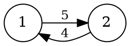

[[TOC]]

## 形式化题目

给定一张 $N$ 个点、$M$ 条边的**有向图**，边权 $L \geqslant 1$。定义一条从 $S$ 到 $T$ 的"路径"为任意一个沿有向边前进的边序列：允许重复经过点或边（可以绕环），但**至少要包含一条边**。路径的长度是其中所有边权之和。

把所有从 $S$ 到 $T$ 的路径按长度从小到大排序（长度相同的算多条），求第 $K$ 小的长度；若这样的路径不足 $K$ 条，输出 `-1`。

样例：$N=2$，两条边 $1\xrightarrow{5}2$ 与 $2\xrightarrow{4}1$，起点 $1$、终点 $2$、$K=2$。



样例只有两条边 $1\xrightarrow{5}2$ 和 $2\xrightarrow{4}1$，即起点 $1$、终点 $2$、$K=2$。从 $1$ 到 $2$ 的路径按长度排列：$1\xrightarrow{5}2$（长 5）、$1\xrightarrow{5}2\xrightarrow{4}1\xrightarrow{5}2$（长 14）、再绕一圈（长 23）……所以第 2 短路长度为 **14**，与样例输出一致。

## 正解

### 思路

**朴素想法为什么行不通。** 把"从 $S$ 出发的每一种走法"看成一棵搜索树：根是 $S$，一个节点的孩子是它沿着每条出边走一步后的位置。第 $K$ 短路就是这棵树里第 $K$ 个值为 $T$ 的节点（按根到节点的边权和从小到大数）。但路径允许绕环，这棵搜索树是**无穷**的——哪怕图里只有一个 $S$ 能到达的环，路径长度序列就没有上界，"先枚举全部路径再排序"根本无法完成。

**瓶颈在哪。** 仍然可以用堆做 best-first 搜索（每次取出当前边权和 $g$ 最小的部分路径并扩展），这样到达 $T$ 的次序天然就是第 1、2、3…短路。问题是这样会把大量"离终点还很远"的路径也一股脑展开：堆的排序只看了"已经走了多少"，完全没看"还剩多少要走"。

**A*：给搜索加一个"剩余距离"的估计。** 对每个点 $v$ 定义

$$h(v) = v \to T \text{ 的最短路长度}$$

它可以在**反图**上从 $T$ 跑一次 Dijkstra 一次性求出。然后把堆的排序键从 $g$ 换成

$$f = g + h(v)$$

即"已走代价 + 到终点的估计剩余代价"。这样堆顶总是"整体上最有希望成为下一条短路"的路径，搜索被集中到真正可能进入前 $K$ 短的路径上。

这个估计不会改变答案的顺序，原因有两层（边权全正是前提）：

1. **可采纳**：$h(v)$ 是真实剩余代价的下界，所以任何路径被弹出时的 $f$ 不小于它的真实长度——弹出 $T$ 的 $f$（此时 $f=g$）序列不会"提前"出现比真实第 $cnt$ 短路更小的值。
2. **一致**：对每条边 $u \xrightarrow{w} v$ 有 $h(v) \leqslant h(u) + w$（最短路满足三角不等式），于是 $f$ 沿路径单调不减。这保证第 $cnt$ 次弹出 $T$ 时，它的 $g$ 恰好就是第 $cnt$ 短路的长度——不会漏、不会乱序，也无需对同一状态重复展开。

归纳证明的骨架：设当前堆顶为 $x$，任取一条真实的第 $cnt$ 短路路径 $P$，取 $P$ 上第一个尚未被弹出过的点 $y$，则堆中存在条目 $(g_y + h(y),\, g_y,\, y)$，且由单调性 $f_y \leqslant$ 第 $cnt$ 短路长度；于是堆顶 $f \leqslant f_y \leqslant$ 第 $cnt$ 短路长度。若堆顶恰是 $T$，它的 $g = f - h(T) = f$ 既是某条真实路径的长度（$\geqslant$ 第 $cnt$ 短路），又 $\leqslant$ 第 $cnt$ 短路，故正好相等；若堆顶不是 $T$，弹出它继续扩展即可，不影响结论。

**两个工程细节：**

- 若 $h(v)=\infty$（$v$ 沿有向边根本到不了 $T$），扩展它永远产不出答案，直接不压堆；$h(S)=\infty$ 时整体无解，输出 `-1`。
- $S=T$ 时堆里初始就有 $(h(S),0,S)$，这个 $g=0$ 的"空路径"不含任何边，题目要求路径至少一条边，所以命中终点时要求 $g>0$。

用样例把 A* 的过程走一遍（起点 $1$、终点 $2$、$K=2$）。先在反图上求 $h$：$h(2)=0$，$h(1)=4$（$1$ 只能先花 5 到 $2$，但反图上是 $2 \xrightarrow{4} 1$，所以 $h(1)=4$）。A* 的堆变化如下，堆条目记为 $(f,g,u)$：

| 步骤 | 弹出 $(f,g,u)$ | 说明 | 新压入的条目 |
| :---: | :---: | --- | :---: |
| 1 | 初始化 | — | $(4,0,1)$ |
| 2 | $(4,0,1)$ | 非终点，扩展边 $1\xrightarrow{5}2$ | $(5,5,2)$ |
| 3 | $(5,5,2)$ | **第 1 次弹出终点**，$g=5$，计数 1 | $(14,14,2)$ |
| 4 | $(14,14,2)$ | **第 2 次弹出终点**，$g=14$，计数 2 = $K$，**停止** | — |

第 3 步弹出的路径是 $1\xrightarrow{5}2$（长 5），第 4 步弹出的是 $1\xrightarrow{5}2\xrightarrow{4}1\xrightarrow{5}2$（长 14）：弹出终点的 $g$ 序列 $5,14,23,\dots$ 正是按从小到大排列的全部路径长度，第 $K=2$ 个就是答案 14。注意第 3 步压入 $(14,14,2)$ 而不是继续绕环展开——因为 $f$ 单调不减，堆自然把"下一条可能的路"顶到最上面，绕环产生的更长路径在它之前根本不会被取出。

### 代码

@include-code(./main.py, python)

实现与推导一一对应：`h_values` 是反图 Dijkstra（预处理 $h$）；`kth_walks` 是 A* 主循环，用生成器按序产出每条到达终点的路径长度，产出满 $K$ 条立即停止（避免在可绕环的图上无限扩展）；`solve` 负责读入、建正反图、$h(S)=\infty$ 的早退，以及"不足 $K$ 条输出 `-1`"的收尾。

### 复杂度

反图 Dijkstra 为 $O(M \log N)$。A* 主过程弹出终点 $K$ 次后终止，处理过的条目至多 $O(KM)$ 个（每个被弹出的条目沿全部出边扩展，且只有 $f$ 不超过第 $K$ 短值的条目会被处理），总时间

$$O\bigl(KM \log(KM)\bigr)$$

与 C++ 正解同阶；空间同为堆中条目的 $O(KM)$ 上界（实践中 $h$ 的剪枝让有效状态远小于上界）。

## 总结

- 第 $K$ 短路的本质是在一棵**无穷**搜索树上按根到节点权求第 $K$ 个终点，不能枚举、只能 best-first。
- 把排序键从"已走代价 $g$"换成"$f = g + h$"，其中 $h$ 是反图 Dijkstra 预处理的到终点最短路，就把搜索集中在有希望的路径上。
- 边权全正使 $h$ 可采纳且一致，因此**第 $cnt$ 次弹出终点时的 $g$ 恰为第 $cnt$ 短路长度**；弹出 $K$ 次即得答案，堆空则无解。
- 实现要点：$h=\infty$ 的点不扩展；$S=T$ 时排除 $g=0$ 的零边路径；产出满 $K$ 条立即停止。

## 图示解析

从建模到答案的主线：

```text
有向图 (边权全正)
   │  建反图, 从 T 跑 Dijkstra
   ▼
h[v] = v→T 的最短路          ┌─ h 可采纳: 弹出序不提前 ─┐
   │                        │  h 一致:  f 沿路单调不减  │
   ▼                        └──────────┬───────────────┘
A* 堆, 键 f = g + h  ──────────────────┘
   │  第 cnt 次弹出 T  ⇒  g = 第 cnt 短路长度
   ▼
数到第 K 次  ──► 输出 g ；堆空 ──► 输出 -1
```

上半部分是预处理：反图一次 Dijkstra 得到每个点的"剩余距离估计" $h$；中间是核心性质：边权为正同时给出可采纳与一致两个保证，使"按 $f$ 弹出"与"按真实路径长度排序"等价；底部是停止条件——数满 $K$ 次提前终止（图可绕环，必须主动停），或堆空判定无解。
