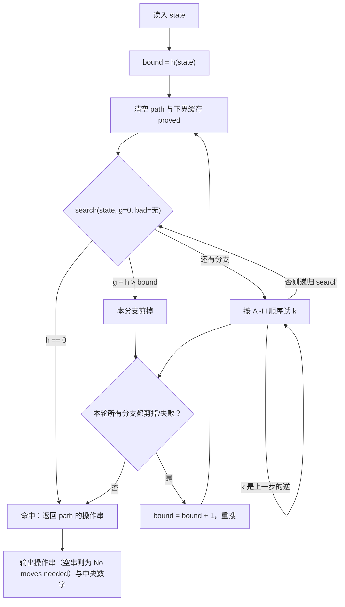

[[TOC]]

## 形式化题目

`#` 形棋盘固定 24 格，每格写着 $1/2/3$，三种数字各出现 8 次。棋盘由四条笔画构成：
两竖位于第 2、4 列，两横位于第 2、4 行，它们的交叉格只算一次。

输入把 24 个格子按**从上到下、同行从左到右**的顺序给出，据此给每个格子编号：

```text
 ·  ·  0  ·  1  ·  ·
 ·  ·  2  ·  3  ·  ·
 4  5  6  7  8  9 10
 ·  · 11  · 12  ·  ·
13 14 15 16 17 18 19
 ·  · 20  · 21  ·  ·
 ·  · 22  · 23  ·  ·
```

棋盘上可执行 8 种操作 `A`~`H`，每种操作沿一条笔画把 7 个格子循环滚动 1 格，首格移到末尾。
8 条笔画（箭头方向就是滚动方向）与它们覆盖的中央格是：

| 操作 | 环上的位置（首尾相接） | 覆盖的中央格 |
| --- | --- | --- |
| A | 0 → 2 → 6 → 11 → 15 → 20 → 22 | 6, 11, 15 |
| B | 1 → 3 → 8 → 12 → 17 → 21 → 23 | 8, 12, 17 |
| C | 10 → 9 → 8 → 7 → 6 → 5 → 4 | 8, 7, 6 |
| D | 19 → 18 → 17 → 16 → 15 → 14 → 13 | 17, 16, 15 |
| E | 23 → 21 → 17 → 12 → 8 → 3 → 1 | 17, 12, 8 |
| F | 22 → 20 → 15 → 11 → 6 → 2 → 0 | 15, 11, 6 |
| G | 13 → 14 → 15 → 16 → 17 → 18 → 19 | 15, 16, 17 |
| H | 4 → 5 → 6 → 7 → 8 → 9 → 10 | 6, 7, 8 |

中央 8 格的位置编号是 $6,7,8,11,12,15,16,17$。把棋盘看成 24 元组
$\text{state} \in \{1,2,3\}^{24}$，8 种操作就是 8 个固定的位置置换 $R_A,\dots,R_H$。要求找出
最短的 $k$ 与操作串 $m_1 m_2 \cdots m_k$，使 $R_{m_k}\circ\cdots\circ R_{m_1}(\text{state})$
的中央 8 个分量全部相等；若有多个长度相同的串，取字典序最小者。

注意读图的两个要点：**操作 A~H 的箭头方向对应上表从左到右**，而**中央格在每条笔画里都处于
下标 2、3、4 的位置**——这一点是整道题的突破口。

## 正解

### 思路

#### 朴素做法与它的瓶颈

最直接的思路是 BFS：从初始状态逐层扩展，第一次得到“中央同色”的状态就是最短步数。
它逻辑上完全正确，但代价无法接受。状态空间是 $3^{24} \approx 2.8 \times 10^{11}$，
而最短解可以到 11~12 步，BFS 必须在命中目标之前把**所有更浅的状态全部展开**；
即使每层剪掉逆操作把分支降到 7，第 10 层附近的状态数也已到 $7^{10} \approx 2.8 \times 10^{8}$ 量级。
无论是 128 MB 的内存还是 1000 ms 的时限都撑不住。

瓶颈在于 BFS **按广度展开、必须保存整层状态**；而我们真正需要的只是“某一条最短路径”。
既然如此，就把广度优先换成带深度限制的深度优先。

#### 迭代加深：把“最少步数”交给外层

设一个步数上限 `bound`，只在深度不超过 `bound` 的范围内做 DFS：

- 若在 `bound` 内找到了解，那 `bound` 就是最短步数；
- 若没找到，就把 `bound` 加 1 重搜。

`bound` 从某个下界开始逐次 +1，第一次成功的 `bound` 就是答案。这样内存只剩当前路径
$O(\text{bound})$，和 BFS 的整层状态相比是数量级的改善。

但只有迭代加深还不够：不带任何剪枝时，第 $L$ 层就有 $8 \times 7^{L-1}$ 个节点，
最深一层在 $L=11$ 时约 $2.3 \times 10^9$，$L=12$ 时约 $1.6 \times 10^{10}$，仍然跑不动。
所以必须让“深度限制”真正发挥作用——这就是估价函数。

#### 可采纳估价：$h = 8 - {}$众数个数

中央 8 格中出现次数最多的颜色记作**众数**，令

$$h = 8 - (\text{众数的出现次数}) = \text{非众数格的个数}$$

现在说明它是可采纳的（即永远不会高估真实剩余步数）。关键在于题目图形的一个结构性质：
**每条笔画与中央 8 格的交，恰好是该笔画里下标 2、3、4 的三个连续格。**
上表最后一列可以直接验证这一点。滚动一格相当于把整条笔画同时平移一位，于是原来下标 2 的格
移到下标 3、下标 3 的移到下标 4、下标 4 的移出中央，而原先在笔画外的下标 1 的格移进中央
（成为新的下标 2）。也就是说：

> 一次操作后，中央 8 格只是**恰好替换了 1 格**（丢掉原下标 4 的格，换成原下标 1 的格）。

既然只换 1 格，那么众数的出现次数每步至多增加 1，`h` 每步至多减少 1。要把 `h` 降到 0
至少还需要 `h` 步，因此 `h` 是可采纳下界。搜索时：

- `g + h > bound` 就回退（本分支在现有上限内不可能有解）；
- `h == 0` 就成功。

这里要抵抗一个诱惑：既然一次操作动 3 个中央格，`ceil(h / 3)` 看起来是更“聪明”的估价。
它确实也可采纳，但方向反了——**它是一个更小（更松）的下界，剪枝更弱**。
实测在 30 组数据上，用 `h` 需要约 2.4 s，而用 `ceil(h / 3)` 要 69.7 s，差 30 倍。
所以估价就取 `h`。

#### 字典序最小：靠枚举顺序而不是事后比较

每层都按 `A` 到 `H` 的顺序尝试，一旦命中就立刻返回。第 `bound` 轮首次命中时，
路径长度恰好是 `bound`（最短），而在所有长度为 `bound` 的解里，字典序最小的那个一定先被
访问到。所以不需要额外比较，顺序本身就是答案的保证。

#### 剪掉“立刻撤销”

观察操作之间的配对：`A↔F`、`B↔E`、`C↔H`、`D↔G` 互为逆操作，即
$R_{\overline{m}} \circ R_m = \mathrm{id}$。如果第 $k$ 步走了 $m$、第 $k+1$ 步走了它的逆，
这两步就白走了，删掉它们能得到更短的解。因此任何最短解都不会包含这种相邻对，
搜索时记住上一步是谁、直接跳过它的逆操作即可。

#### 转置剪枝：同一轮内复用已证下界

不同的操作顺序可能把棋盘带到同一个状态（转置）。仅靠估价函数，这些重复状态会被反复展开。
可以在本轮（同一个 `bound`）内记下已经确证的下界：若某个状态在本轮内被搜完仍未命中，
就说明“从它出发至少还要 `bound − g + 1` 步”。再次遇到它（可能在不同的深度）时，
取 `max(真实估价, 已证下界)` 作为 `h`，剪枝更强。
这个值来自本轮已经穷尽的搜索，不可能高于真实剩余步数，所以仍然可采纳。
实测它把 30 组数据的节点数从约 1585 万降到约 370 万，用时从 7.6 s 降到 2.4 s。

> 注意缓存的值是相对本轮 `bound` 推出的下界，所以实现里每轮重新建一张表；
> 这样既简单，又能保证它不会随着 `bound` 变大而失真。

#### 用样例验证这条路线

样例第二个用例的初始中央 8 格是 `1 1 1 1 2 2 2 2`，众数只有 4 个，故 `h = 4`。
答案 `ABHAB` 恰好 5 步，逐步推演如下：

| 步数 | 操作 | 中央 8 格 | 众数个数 | h = 8 − 众数 |
| --- | --- | --- | --- | --- |
| 0 | — 初始 | 1 1 1 1 2 2 2 2 | 4 | 4 |
| 1 | A | 1 1 1 2 2 2 2 2 | 5 | 3 |
| 2 | B | 1 1 2 2 2 2 2 2 | 6 | 2 |
| 3 | H | 1 2 3 2 2 2 2 2 | 6 | 2 |
| 4 | A | 2 2 3 2 2 2 2 2 | 7 | 1 |
| 5 | B | 2 2 2 2 2 2 2 2 | 8 | 0 |

可以看到众数的个数从 4 涨到 8，除第 3 步持平（`H` 顶掉一个 1、又换进一个 3）外每步 +1，
5 步正好走完。`2 2 3 2 2 2 2 2` 这一步很能说明问题：此时 `h = 1` 已经很小，
但距离终点还差整整一步，估价没有高估。

### 代码

`LINE` 是上表 8 条笔画，`CENTER` / `BACK` 分别是中央 8 格与逆操作，`ROTATE` 把每条笔画
预先编译成一张 24 位取数表，让一次状态转移只花一次函数调用。`lower_bound` 就是上面的
$h$，`solve_case` 负责迭代加深与 IDA\*，`search` 是唯一的热点递归。

@include-code(./main.py, python)

### 复杂度

- 时间复杂度：$O(T \cdot 7^{L})$，其中 $T \leqslant 30$ 是用例数、$L$ 是最短步数（实测最大 11）。
  根节点有 8 个分支，之后每层都剪掉了上一步的逆操作，分支因子降到 7；迭代加深重复搜索
  更浅的层只带来约 $7/6$ 的常数因子，不改变量级。实际展开节点数约 400 万（30 组），
  远低于这个上界。
- 空间复杂度：递归深度与路径长度都是 $O(L)$；主要占用是轮内下界缓存 `proved`
  （每轮 `bound` 递增时重建），实测峰值约 65 MB，在 128 MB 之内。
- 作为对比，朴素 BFS 的时间和空间都是整层状态规模（$10^8$ 量级），完全不可行。

## 总结

这道题的核心不是“怎么枚举 8 种操作”，而是**怎么把搜索深度受限、又不漏掉最优解**。

推导链条是：BFS 会因为必须保存整层状态而爆炸 → 改成带深度上限 `bound` 的迭代加深 DFS，
内存降到 $O(L)$ → 但裸 DFS 的节点数仍随层数指数增长（第 $L$ 层 $8 \times 7^{L-1}$），
所以需要可采纳估价来剪枝 →
利用“每条笔画与中央 8 格的交恰好是下标 2、3、4”这一图形性质，得出**一次操作只替换 1 个
中央格**，于是 $h = 8 - {}$众数个数 是可采纳下界 → 再补两个细节：按 `A`~`H` 顺序枚举并
命中即返回，天然得到字典序最小；剪掉上一步的逆操作，砍掉 $1/8$ 的无效分支。

容易踩的坑有三个：一是把估价取成 `ceil(h/3)`，方向搞反导致剪枝变弱（实测慢 30 倍）；
二是剪枝时误写成“跳过和上一步相同的操作”（应该是跳过它的**逆操作**），会剪掉大量最优解；
三是输出格式，零步时要输出 `No moves needed` 而不是空行。

## 图示解析

整条控制流如下：外层不断抬高 `bound`，内层做带剪枝的深度优先搜索，命中即一路返回。



读者应重点看两处：一是 `h == 0` 的判定与 `g + h > bound` 的剪枝共用同一个 `h`，
前者是终止条件、后者是剪枝条件；二是**只有外层在动 `bound`**，内层搜索从不放宽深度，
所以第一次命中的路径长度就是最短步数。图中“k 是上一步的逆”这条自环对应代码里的
`if k == bad: continue`，它把分支因子从 8 降到 7。
