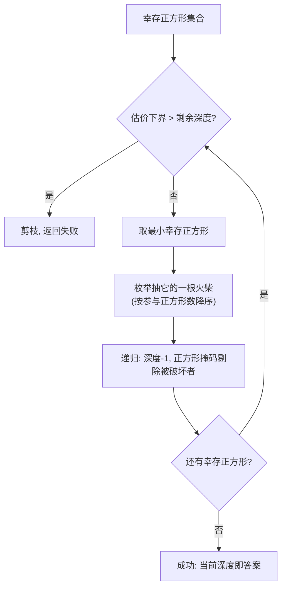

[[TOC]]

## 形式化题目

给定一个 $n \times n$（$n \leqslant 5$）的火柴网格，共 $2n(n+1)$ 根单位火柴，每根有唯一编号。其中 $k$ 根已经缺失（$k$ 可为 $0$，即完整网格）。一个正方形是完整的，当且仅当组成它的四条边的所有火柴都还在。求至少再抽走多少根火柴，才能使网格中不存在任何完整的正方形（任意边长 $1$ 到 $n$）。

题目中的火柴编号规则是本题的第一道坎：把网格逐行展平，每一行占 $2n+1$ 个位置——先是该横线上自左向右的 $n$ 根横火柴，再是该行上侧自左向右的 $n+1$ 根竖火柴；最底部的横线之后没有竖火柴。以 $n=3$ 为例：

| 横线（自上而下） | 横火柴 | 竖火柴（每列自上而下的第 $r$ 段） |
| --- | --- | --- |
| 第 0 条 | 1 2 3 | 4 5 6 7 |
| 第 1 条 | 8 9 10 | 11 12 13 14 |
| 第 2 条 | 15 16 17 | 18 19 20 21 |
| 第 3 条 | 22 23 24 | （无） |

用公式表述更清晰。设 $dd = 2n+1$，则第 $r$ 条横线上第 $j$ 段的编号是 $r \cdot dd + j + 1$，第 $c$ 条竖线（自左向右）上第 $r$ 段（自上而下）的编号是 $r \cdot dd + c + n + 1$。题面样例里缺的 12、17、23 分别是 $n=3$ 网格中"第 1 列第 1 段竖火柴、第 2 条横线第 2 段横火柴、第 3 条横线第 1 段横火柴"。

## 正解

### 思路

**朴素做法。** 最直接的想法是枚举还剩下的每根火柴的每个子集，判断抽走后是否没有完整正方形。剩余火柴最多 60 根，子集数 $2^{60}$，完全不可行。稍好一点的做法是不定深度优先搜索：一层一层地决定"再抽哪根火柴"，搜到某个深度还没有消灭所有正方形就放弃。这本质上是**迭代加深**，但它没有启发信息，最坏情况下仍然是指数级盲搜。

**转化为重复覆盖。** 关键观察：**一根火柴一旦被抽走，就同时破坏了所有用到它的正方形**。所以问题等价于——有若干"幸存"的正方形（题面已缺失的火柴已经破坏了一部分），每个正方形对应一个"必须被覆盖"的列；每根还在的火柴对应一个"行"，能覆盖它参与的所有幸存正方形。要选最少的行，把每一列都覆盖至少一次。这正是经典的**重复覆盖问题**（每列至少一个 1，允许行相交），标准武器是迭代加深搜索配合估价函数剪枝，即 IDA*。

**两个搜索加速点。**

1. **分支时选最小正方形。** 每一层搜索中，任选一个幸存正方形，它迟早要被破坏，破坏它的唯一途径是抽走它四条边上的某根火柴。所以只需枚举"抽走这个正方形的哪根火柴"作为分支，不会漏解。选**边长最小**（用到的火柴最少）的正方形来分支，分支因子最小（边长 1 的正方形只有 4 根火柴可枚举），剪枝最强。
2. **估价函数用互不相交的正方形数。** 若当前有若干个幸存正方形**两两不共用任何火柴**，那么一根火柴至多破坏其中一个，所以至少需要这么多次抽取——这是答案的一个下界。贪心地从左到右扫描幸存正方形，每碰到一个与已选正方形不共用火柴的就计入，即得下界。这个下界永远不会高估，满足 IDA* 估价函数的可采纳性；而它通常接近真实答案，剪枝非常有效。

**迭代加深的主循环。** 从下界开始逐层加深深度上限 $d$；在限制 $d$ 内 DFS：若没有幸存正方形则成功；若 $d = 0$ 或下界超过 $d$ 则剪掉；否则取最小幸存正方形，枚举抽它的一根火柴（按"这根火柴参与的正方形数从多到少"排序分支，优先破坏面大的火柴），递归深度 $d-1$。第一个搜索成功的 $d$ 就是最少抽取数。注意：如果题面已缺失的火柴已经破坏了所有正方形，答案是 $0$，这也是"先过滤幸存正方形"的直接收获。

下面用题面第二个测试点（$n=3$，缺 12、17、23）展示"分支选最小正方形"的过程。幸存的正方形如下（编号即火柴编号）：

| 幸存正方形 | 用到的火柴 |
| --- | --- |
| 边长 1，位置 (0,0) | 1, 4, 5, 8 |
| 边长 1，位置 (0,1) | 2, 5, 6, 9 |
| 边长 1，位置 (0,2) | 3, 6, 7, 10 |
| 边长 1，位置 (2,0) | 15, 18, 19, 22 |
| 边长 2，位置 (0,0) | 1, 2, 4, 6, 11, 13, 15, 16 |

这 5 个正方形里，前三个（顶部一行的三个单位正方形）两两通过 5、6、9 等中间火柴相连，但与后两个完全无交集；后两个之间也不共用火柴。估价函数贪心扫描：先取 (0,0)，它与 (0,1) 共用 5 跳过，与 (0,2) 共用 6 跳过，与 (2,0) 无交集计入，与 (0,0) 的边长 2 无交集计入——下界为 3，恰好等于答案 3。于是搜索从 $d=3$ 开始，第一层分支枚举破坏 (0,0) 的 1/4/5/8，往下两层依次处理 (2,0) 和边长 2 的正方形，剪枝后很快锁定方案（例如抽 4、18、16）。

### 代码

Python 版：

@include-code(./main.py, python)

C++ 版（同一算法）：

@include-code(./main.cpp, cpp)

几个实现细节：

- `build_grid(n)` 用上述编号公式生成所有正方形用到火柴的集合，按边长升序排列——这保证了后面"第一个幸存的正方形就是最小的"。
- 每根火柴参与哪些幸存正方形用**位掩码** `stick_sq` 表示；DFS 状态里的"还剩哪些幸存正方形" `full` 也是位掩码，"抽走火柴 s"就是 `full &= ~stick_sq[s]`，一次位运算同时注销所有被破坏的正方形。
- 分支用的火柴列表预先按 `stick_sq[s].bit_count()`（参与的正方形数）降序排好，DFS 时按此顺序尝试。
- 多测：$T$ 组数据，每组重建网格（$n$ 可能不同）。

### 复杂度

幸存正方形数不超过 $S = \sum_{k=1}^{n} k^2 \leqslant 55$，火柴数 $2n(n+1) \leqslant 60$。设答案为 $d$，IDA* 的搜索树规模上界为 $O(c^d)$（$c \leqslant 4$，是最小正方形的分支因子），每层还要做 $O(S)$ 的估价下界计算，总复杂度约 $O(T \cdot c^d \cdot S)$。由于 $n \leqslant 5$ 且估价下界接近真实答案，$d$ 实际很小（样例中最大为 13），运行非常快。

## 总结

- **建模**：把"抽火柴破坏正方形"看作重复覆盖——每根火柴是行，覆盖它参与的所有幸存正方形（列），求覆盖所有列的最少行数。
- **搜索框架**：IDA*（迭代加深 + 可采纳估价函数），从贪心下界开始逐层加深。
- **两个剪枝**：分支永远只枚举"破坏最小幸存正方形"的 4 根火柴；估价函数取"两两不共用火柴的正方形个数"。
- **位运算实现**：火柴 → 正方形集合、剩余正方形集合都用 64 位以内的位掩码表达，"抽一根火柴"合并成一次 `&= ~mask`。
- **易错点**：火柴编号规则（每行 $2n+1$ 个位置、横前竖后交错、最底行无竖火柴）必须先用题面样例反推验证；多组数据的 $n$ 变化时网格要重建。

## 图示解析

### 火柴编号规则（n=3）

下图把 $n=3$ 网格按编号规则排列，每个单元格是"该行横火柴 + 该行上侧竖火柴"的展平片段：

| 展平行 | 内容（编号） | 位置数 |
| --- | --- | --- |
| 行 0 | 横 1 2 3，竖 4 5 6 7 | $2n+1 = 7$ |
| 行 1 | 横 8 9 10，竖 11 12 13 14 | 7 |
| 行 2 | 横 15 16 17，竖 18 19 20 21 | 7 |
| 行 3 | 横 22 23 24，竖（无） | $n = 3$ |

编号公式 $r \cdot dd + j + 1$（横）与 $r \cdot dd + c + n + 1$（竖）与表一一对应。观察重点：竖火柴编号"挂在所在行的展平片段里"，例如编号 12 是第 1 列、第 1 段的竖火柴，这正是题面样例删除的火柴之一。只有把编号规则与题面图对上，后面的"正方形 → 火柴集合"建模才不会出错。

### 样例 2 的幸存正方形与分支选择

| 边长 | 左上角 | 火柴 | 状态 |
| --- | --- | --- | --- |
| 1 | (0,0) | 1 4 5 8 | 幸存 |
| 1 | (0,1) | 2 5 6 9 | 幸存 |
| 1 | (0,2) | 3 6 7 10 | 幸存 |
| 1 | (1,0) | 8 11 12 15 | 已破坏（含 12） |
| 1 | (1,1) | 9 12 13 16 | 已破坏（含 12） |
| 1 | (1,2) | 10 13 14 17 | 已破坏（含 17） |
| 1 | (2,0) | 15 18 19 22 | 幸存 |
| 1 | (2,1) | 16 19 20 23 | 已破坏（含 23） |
| 1 | (2,2) | 17 20 21 24 | 已破坏（含 17） |
| 2 | (0,0) | 1 2 4 6 11 13 15 16 | 幸存 |
| 2 | (0,1) | 2 3 5 7 12 14 16 17 | 已破坏 |
| 2 | (1,0) | 8 9 11 13 18 20 22 23 | 已破坏 |
| 2 | (1,1) | 9 10 12 14 19 21 23 24 | 已破坏 |
| 3 | (0,0) | 1 2 3 4 7 11 14 18 21 22 23 24 | 已破坏 |

表格按 `build_grid` 的生成顺序（边长升序）排列，与代码中"第一个幸存正方形即最小正方形"的分支策略一致。观察重点：5 个幸存正方形中，(0,0)、(0,1)、(0,2) 通过火柴 5、6、9 链式相连，(2,0) 和边长 2 的 (0,0) 与它们无交集，因此估价下界为 3；这也解释了为什么答案恰好是 3——必须分别破坏顶部三个相连正方形、左下正方形和边长 2 正方形。
