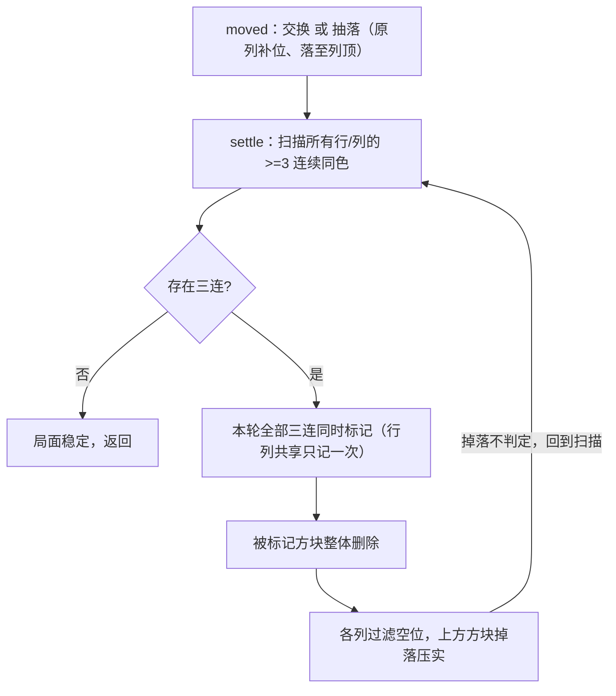

[[TOC]]

## 形式化题目

棋盘为 $7$ 行 $5$ 列的网格，坐标 $x \in [0,4]$ 从左到右、$y \in [0,6]$ 从下到上，每格为空或放一个颜色为 $1 \sim 10$ 的方块；方块不悬空（每列方块从 $y=0$ 起连续堆叠），且初始局面不含任何三连。

一步移动选定有方块的格子 $(x,y)$，沿横向 $g \in \{1,-1\}$ 拖动一格：

- 目标格 $(x+g,y)$ **有方块**：两方块交换位置；
- 目标格 **为空**：该方块从原竖列抽出（原列上方方块随即下落补位），落到目标位置后继续掉落，直到落在这列当前最上方。

移动后立即**结算**：只要任一行或任一列出现连续 $\geqslant 3$ 个同色方块，就把所有满足条件的方块**同时消除**（行列共享的方块只消一次，多组同时触发），然后上方方块整体掉落；掉落过程中不判定消除，如此循环直到局面稳定。

给定正整数 $n$，求**恰好** $n$ 步后棋盘为空的移动序列；多组解时输出按 $(x,y,g)$ 逐位比较（$g$ 中 $1$ 优先于 $-1$）字典序最小的一组，无解输出 $-1$。

样例初始局面与答案三步移动（`·` 为空格）：

```text
 y\x   0   1   2   3   4
  3    .   .   .   .   4
  2    .   .   4   .   3
  1    .   1   3   1   4
  0    1   2   2   3   2
```

依次走 $(2,1,1)$、$(3,1,1)$、$(3,0,1)$ 后棋盘恰好清空（逐步结算过程见文末「图示解析」）。

把「棋盘」看作状态、「移动 + 结算」看作转移，本题就是：在一张隐式状态图上，求**长度恰好为 $n$、终点为空棋盘、且移动序列字典序最小**的路径；无解要求穷尽整棵搜索树后才能断言。

## 正解

### 思路

**朴素做法：直接 DFS 枚举。** 每层枚举所有合法 $(x,y,g)$（最多 $5 \times 7 \times 2 = 70$ 个），模拟结算得到新局面，递归 $n$ 层；剩余步数为 $0$ 时检查棋盘是否为空。这个框架本身就是正确答案的骨架，但裸跑规模太大：分支随方块数增长，且**无解数据必须穷尽全树**。实测去掉全部剪枝后，三组数据的搜索节点与耗时如下（Python 3，本机）：

| 数据 | $n$ | 无剪枝节点 | 无剪枝耗时 | 剪枝后节点 | 剪枝后耗时 |
| --- | --- | --- | --- | --- | --- |
| mayan6（无解） | 4 | $1.95\times10^{6}$ | 11.3 s | $5.1\times10^{4}$ | 0.29 s |
| mayan7 | 5 | $4.18\times10^{6}$ | 24.5 s | $1.2\times10^{5}$ | 0.65 s |
| mayan10 | 5 | $6.16\times10^{6}$ | 36.8 s | $2.5\times10^{5}$ | 1.46 s |

题面时限 $1$ 秒，裸 DFS 必然超时。优化全部来自对搜索树的**结构性观察**，且每条剪枝都只删「必败」或「与更小字典序解重复」的子树，不删任何真解。

**观察 1：枚举顺序就是字典序，第一个解即最小解。** 所有候选解等长（都是 $n$ 行），按 $x$ 升序、$y$ 升序、每个位置先 $g=1$ 后 $g=-1$ 的顺序深搜，先搜到的解在每一位上都不劣于后搜到的解。因此不必收集全部解再比较，回溯时第一次到达叶子且棋盘为空就直接输出。

**观察 2：左移交换与右邻右移是同一条转移。** $(x,y,-1)$ 若目标 $(x-1,y)$ 有方块，效果等于把 $(x-1,y)$ 的方块右移——二者交换的方块对相同、新局面完全相同。而 $(x-1,y,1)$ 的 $x$ 更小、在观察 1 的顺序里**先**被枚举，所以任何含「左移交换」的解都能替换成一个字典序更小、局面轨迹相同的解：字典序最小解中不可能出现左移交换，整棵子树可剪。注意**左移到空位**（抽落）没有等价的更小移动，必须保留——样例数据 mayan2 的解 `(4,0,-1)` 正是左移到空位，剪掉它会把正解误判成无解。

**观察 3：同色交换是空转步。** 目标方块与移动方块同色时，交换后局面与移动前完全一致，这一步不推进「清空」的任何进度，只会把同一局面复制成多耗一步的子树。直接剪掉它与所有公开题解的实现一致；本题数据上去掉该剪枝重跑全部 10 组，输出完全不变。

**观察 4：颜色计数是不变量。** 方块只能被三连消除，某颜色全场只剩 $1 \sim 2$ 块时永远凑不出三连，它将永远留在棋盘上，整个子树必败，整层剪断。

**观察 5：失败局面可记忆化。** 一个局面之后能否在剩余步数内清空，只取决于「局面 + 剩余步数」，与路径无关；把搜过且失败的 `(局面, 剩余步数)` 记入集合，重复到达时直接返回。无解数据要穷尽全树，这条剪枝收益最大（观察 3 已剪掉原地耗步，记忆化不会与「空转等待」交互出漏洞）。

四条剪枝分别消除四类浪费：空转步、左右对称的重复子树、必败局面的重复搜索、无望颜色的继续展开。上表右两列就是它们把 $6\times10^{6}$ 压到 $2.5\times10^{5}$ 的效果。

**结算模拟是正确性的另一半**，有三个容易写错的点，整体流程如下图：



1. **整体标记**：先把本轮所有三连（横、竖、行列共享）标在同一张 $5\times7$ 布尔网格上，再统一删除——边扫边删会让后续三连的判定建立在已残缺的棋盘上，行列共享的情形（题面图 5）会漏消。
2. **掉落不判定**：删除后只压实、不立即检查，回到扫描入口再判——否则掉落中途的半成品局面会触发规则不允许的消除。
3. **恰好 $n$ 步**：若棋盘在剩余步数 $>0$ 时已清空，后续没有方块可移动，枚举自然为空，该分支判负——恰好语义在叶子检查里自然成立。

### 代码

主解把观察 1 的枚举序写进三重循环顺序，把四条剪枝分别放在移动生成（越界、同色、左移交换）、递归入口（颜色计数、失败记忆化）两处，结算由 `three_run_grid` + `settle` 完成：

@include-code(./main.py, python)

### 复杂度

- 时间：搜索树深度为 $n$（数据中 $n \leqslant 5$），每层分支不超过 $2 \times$ 方块数（$\leqslant 70$），裸枚举上界 $O(70^{n})$；剪枝后实测最大访问 $2.5\times10^{5}$ 个搜索节点（mayan10），10 组数据单组 $0.19 \sim 1.5$ s，无剪枝对照组最坏 $6.16\times10^{6}$ 节点 / 36.8 s。
- 空间：棋盘 $O(35)$，递归栈 $O(n)$，失败记忆集合 $O(\text{访问的不同局面数})$，实测峰值约 17~19 MB（限制 128 MB）。

## 总结

- 本题 = **规则模拟 + 状态空间搜索**：模拟负责把一步移动映射成新局面（整体标记、掉落不判定、循环到稳定），搜索负责在恰好 $n$ 步的约束下找字典序最小路径。
- 剪枝的合法性必须逐条论证，而不是「跑了没 WA 就行」：左移交换靠**替换论证**（等价转移中它字典序最大）、颜色计数靠**不变量**、记忆化靠**后效性缺失**（局面 + 剩余步数充分）、同色空转靠**局面不变**。任何删掉真解的剪枝都会把正解误判成 $-1$，这类错误比 WA 更难发现。
- 「恰好 $n$ 步」与「字典序最小」两条输出语义分别落在**叶子判空的时机**与**枚举循环的顺序**上——把语义写进循环顺序，第一个解就是答案，省掉全解收集与比较。
- Python 落地该题的胜负手是剪枝：同样算法不去重是 $6\times10^{6}$ 节点的 30 s 级别，剪完是 $2.5\times10^{5}$ 节点的秒级。

## 图示解析

下表用样例的第三步展示一次完整的「交换 → 双组同时消除 → 掉落 → 连锁消除 → 再掉落 → 再连锁」结算。每格是该列**自下而上**的方块串，`×` 表示该方块本轮被标记消除，`·` 表示空列：

| 阶段 | x=0 | x=1 | x=2 | x=3 | x=4 | 观察重点 |
| --- | --- | --- | --- | --- | --- | --- |
| 第 2 步后 | `1` | `2 1` | `2 1 4` | `3 4` | `2 3 3 4` | 起点 |
| 移动 (3,0,1) 交换 | `1` | `2 1` | `2 1 4` | `2 4` | `3 3 3 4` | $(3,0)$ 的 3 与 $(4,0)$ 的 2 交换 |
| 第①轮标记 | `1` | `× 1` | `× 1 4` | `× 4` | `× × × 4` | 同时触发**横** $y{=}0$ 的 $x1{\sim}x3$ 三个 2 与**竖** $x{=}4$ 的 $y0{\sim}y2$ 三个 3 |
| 删除后掉落 | `1` | `1` | `1 4` | `4` | `4` | `x2` 的 4 不动，`x1/x2/x3` 顶部落下 |
| 第②轮标记 | `×` | `×` | `× 4` | `4` | `4` | 掉落连锁出横 $y{=}0$ 的三个 1 |
| 删除后掉落 | `·` | `·` | `4` | `4` | `4` | 只剩三个 4 压在底部 |
| 第③轮标记 | `·` | `·` | `×` | `×` | `×` | 横 $y{=}0$ 三个 4 全消 |
| 最终 | `·` | `·` | `·` | `·` | `·` | 第 3 步结算完恰好清空 |

这张表印证三点：**同一轮里横、竖可以各自成组地同时消除**（第①轮），这正是题面规则 2a/2b 要求整体标记的原因；**每轮消除后必须先掉落再扫描**，第②、③轮的三连都是掉落之后才出现的；**一步移动可以触发多轮连锁**，结算必须循环到稳定才算走完这一步。
