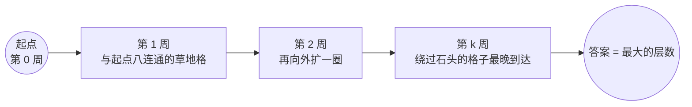

[[TOC]]

## 形式化题目

给定一个 $Y$ 行 $X$ 列的网格，格子要么是草地 `.`，要么是石头 `*`。起点格 $(M_x, M_y)$ 在第 $0$ 周被占领；此后每一周，所有已占领的格子同时向它八连通方向（上下左右加四条对角线）相邻的、格子为 `.` 且尚未被占领的格子扩散。保证草地能被完全占领，求整个网格被完全占领所需要的星期数。

例如 $X=4, Y=3$，起点在左下角 $(1,1)$，`*` 是石头：

| 周 | 0 | 1 | 2 | 3 | 4 |
| --- | --- | --- | --- | --- | --- |
| 第 3 行 | `....` | `....` | `MMM.` | `MMMM` | `MMMM` |
| 第 2 行 | `..*.` | `MM*.` | `MM*.` | `MM*M` | `MM*M` |
| 第 1 行 | `M**.` | `M**.` | `M**.` | `M**.` | `M**M` |

图前的观察：每一周新染上的格子（`M`）恰好是上一周已染格子向外扩一圈的草地格，扩散是逐层推进的。图后的观察：左下角的草地被两块石头挡住，要绕行 $3$ 周才在第 $4$ 周被占到，因此答案由"最晚被占到的格子"决定，而不是起点到达每格的最短路的平均值。

## 正解

### 思路

**朴素做法。** 直接模拟题意：每一周扫描全图，把所有与已占领格子八连通相邻的草地格标记为新占领，重复到整张图全是 `M` 为止。模拟一轮是 $O(XY)$，最多要模拟 $O(XY)$ 轮，总复杂度 $O((XY)^2)$。$X, Y \le 100$ 时约 $10^8$ 次操作，Python 侧勉强能过，但这个"每一轮都重新扫全图"的模式可以消除。

**关键观察。** 传播过程和经典的洪水填充完全一致：格子按"到起点的最短传播周数"分层，第 $k$ 周被占领的格子恰好是起点到它的八连通最短路长度等于 $k$ 的格子。这是因为每个格子一旦被任何一个更早占领的相邻格子碰到，就在下一周立即被占领——它取的是所有相邻格子占领时间的最小值 $+1$，这正是 BFS 求最短路的更新式。石头不可通过，天然对应"图中不存在的边"。于是答案就是所有格子里最大的那个最短距离。

用 BFS 从起点一次扩散即可：出队的第 $i$ 个格子的层数单调不减，记录每个格子首次入队时的层数，最后取全图最大值。每个格子至多入队一次，配合八方向常数，总复杂度 $O(XY)$，比逐周模拟的全图重扫快了一个 $XY$ 因子。

图前的说明：把每个格子看成一个点，占领时间就是 BFS 的层数。图后的观察：同一层的格子互不影响，第 $k+1$ 层只由第 $k$ 层生成一次，所以每个格子只会被处理一次；最后一层被生成时，答案也就确定了。

**实现细节。**

- 坐标 $(M_x, M_y)$ 是第 $M_y$ 行第 $M_x$ 列，地图输入顺序也是第 $1$ 行在前，所以 `grid[ny-1][nx-1]` 对应格子 $(n_x, n_y)$。
- 石头格子标记为不可达，既不标记距离也不入队；它们不会出现在 `dist` 的更新路径里。
- 起点算第 $0$ 周，`dist` 初值取 $-1$ 表示未访问；由于题目保证全图被占领，$-1$ 只会留在石头上，取最大值时天然被排除，不需要特殊处理。

### 代码

@include-code(./main.py, python)

### 复杂度

每个格子至多入队一次、出队一次，每次检查 $8$ 个方向，时间复杂度 $O(XY)$，$X, Y \le 100$ 时约 $8 \times 10^4$ 次操作。`dist` 与队列同规模，空间复杂度 $O(XY)$。Python 实现远低于本题 $1$ 秒的限制（本地实测单组约 $20$ 毫秒）。

## 总结

本题是八连通 BFS 的模板题：把"每周向外扩散一圈"直接对应到 BFS 的层间推进，答案是最晚被占领格子的层数。相比逐周模拟全图重扫的 $O((XY)^2)$，BFS 用"每个格子只入队一次"把复杂度降到 $O(XY)$。要点有二：一是起点记为第 $0$ 周、答案取全图最大距离；二是方向数组必须写全 $8$ 个，别只写上下左右四方向。
