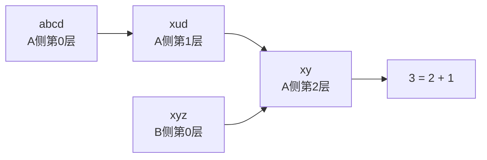

[[TOC]]

## 形式化题目

给定两个字符串 $A$、$B$（长度都不超过 20）和至多 6 条改写规则 $A_i \to B_i$（规则两侧长度也都不超过 20）。一步变换是指：选取当前串中某一次出现的某个 $A_i$，把它替换成对应的 $B_i$，得到一个新串。

求从 $A$ 变换到 $B$ 所需的最少步数；若 10 步以内（含 10 步）无法完成，输出 `NO ANSWER!`。

例如 $A=$ `abcd`，$B=$ `xyz`，规则为 `abc -> xu`、`ud -> y`、`y -> yz`，则
`abcd -> xud -> xy -> xyz`，最少 3 步。

## 正解

### 思路

把每个长度不超过 20 的字符串看作图中的一个点，一条规则 $A_i \to B_i$ 在"某次出现恰好是 $A_i$"的所有位置上各连出一条边。答案就是从 $A$ 到 $B$ 的最短路，边权全是 1，天然应该用 BFS；"10 步以内"这个限制则把整张图限制在深度 10 以内。

先考虑朴素 BFS：从 $A$ 出发，每层把当前串里所有规则的所有出现位置都替换一遍。问题在于每个串的每个位置都可能命中规则，一层扩展能产生的新串数量很大，第 10 层的规模是指数级的，朴素单侧 BFS 很容易在深度较大的数据上爆炸。

**双向 BFS** 消除这个瓶颈：从 $A$ 和 $B$ 两端各做 BFS。反向那一侧沿的是**逆规则** $B_i \to A_i$——因为"正向串 $s$ 走一步到 $t$"等价于"反向串 $t$ 逆着走一步到 $s$"，两侧扩展出来的距离才能在中间接上。每轮两侧各扩一层，扩到第 $k$ 层时若两侧的已发现集合有交点 $s$，则 $dist_A(s) + dist_B(s)$ 就是一条完整路径的长度。

**为什么可以在 $dist_A(s) + dist_B(s) \leqslant 2k$ 时直接停**：设最短路长度为 $ans \leqslant 2k$，在路径上取离 $A$ 端 $\min(k, ans)$ 步的点 $m$：

- 若 $ans \leqslant k$，则 $m = B$，两侧早已在第一轮就发现了它，交点和会被某一轮统计到；
- 若 $k < ans \leqslant 2k$，则 $dist_A(m) = k \leqslant SIDE\_STEPS$ 且 $dist_B(m) = ans - k \leqslant k$，两侧都在前 $k$ 层内发现了 $m$。

而 $k$ 层扩展完之后所有距离 $\leqslant k$ 的点都已入队，所以此时枚举交集得到的
$\min(dist_A(s) + dist_B(s))$ 恰等于 $ans$——既不遗漏（上面的 $m$ 必在交集中），也不会更小（任何交点都对应一条真实存在的合法路径）。因此每轮扩完就用"交集最小和 $\leqslant 2k$"作为停止条件，总共只需每侧扩展 5 层，比单侧 BFS 浅一倍。

以样例为例，两侧各扩 2 层就已在 `xy` 处接上（路径 `abcd -> xud -> xy <- xyz`，$2 + 1 = 3$ 步）：

$B$ 侧第 1 层能到 `xy`，靠的是逆规则 $yz \to y$（`xyz` 里的 `yz` 换回 `y`）；
第 2 轮结束时 $A$ 侧也扩到 `xy`，交集出现，距离和 $2 + 1 = 3 \leqslant 2k = 4$，直接返回 3。

两个实现细节：

- 规则左串在原串中可能**重叠出现**（如 `aaaa` 中 `a -> b` 命中 4 次），找到一个出现后要从下一位继续 `find`，不能跳过；
- 两侧分别用 `dist` 字典兼当 visited 与距离表，队列中串的距离就是字典里存的值，不需要另外编码。

### 代码

@include-code(./main.py, python)

### 复杂度

设串长上限 $L = 20$，规则数 $R \leqslant 6$，每侧扩展深度 $k = 5$。每层的状态串数量在最坏情况下按 $R \cdot L$ 的分支因子指数增长，但深度只有 10；双向 BFS 把单侧深度砍半，状态规模从 $b^{10}$ 降到约 $2 b^5$（$b$ 为等效分支因子），这正是本题卡时限的关键。单次匹配替换是 $O(L)$ 的，总时间约为 $O(2 b^5 \cdot R \cdot L)$，在本题 10 步的深度限制下可以接受；空间同样是两侧已发现串的总量。

## 图示解析

### 为什么反向侧要用逆规则

正向规则 $ud \to y$ 表示串里出现 `ud` 可以换成 `y`。从 $B$ 端往回找"谁能一步走到我"时，要看的是"哪个串替换一次能得到我"，也就是把 $y$ 换回 $ud$。下表用样例的第 2 轮说明两侧如何在 `xy` 接上：

| 层数 $k$ | A 侧（正向扩展，规则 $A_i \to B_i$） | B 侧（逆向扩展，规则 $B_i \to A_i$） |
| --- | --- | --- |
| 0 | `abcd` | `xyz` |
| 1 | `xud`（`abc` 换成 `xu`） | `udxz`（`y` 换回 `ud`）、**`xy`**（`yz` 换回 `y`） |
| 2 | **`xy`**（`ud` 换成 `y`） | —— 扩展时发现交集 |

两侧集合的交集 `xy` 满足 $dist_A(xy) + dist_B(xy) = 2 + 1 = 3$，且 $3 \leqslant 2k = 4$，所以 3 就是最少步数。若忘了把反向规则取逆，$B$ 侧扩出来的串全都和正向语义对不上，交集永远为空——这是本题最常见的错误。

## 总结

1. 本题是"字符串改写"型最短路：串是点、规则的一次命中是一条边，边权为 1，BFS 求最少步数。
2. 深度上限 10 保证答案存在时一定能搜到，但单侧 BFS 第 10 层会指数爆炸；双向 BFS 每侧只扩 5 层，在中间接上，复杂度从 $b^{10}$ 量级降到 $b^5$ 量级。
3. 三个易错点：反向侧必须用**逆规则**扩展；规则左串的重叠出现要逐位 `find` 找全；停止条件是"交集最小距离和 $\leqslant 2k$"而不是"一出现交集就返回"（后者可能错过更短的、中间点还没被两侧同时发现的路径）。
4. 若 10 步内两侧始终没有交点，输出 `NO ANSWER!`。
