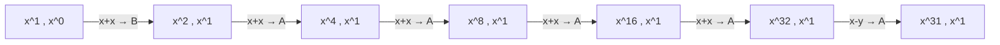

[[TOC]]

## 形式化题目

有两个工作变量 A、B，初值分别是 $x$ 与 $1$，也就是 $x^1$ 和 $x^0$。每一步可以取任意两个
工作变量做一次乘法或除法，把结果写回任意一个工作变量，并且要求结果仍是整数。
求让某个工作变量的指数恰好等于 $P$ 的最少操作步数。

由于两个工作变量在任何时刻都是 $x$ 的整数次幂，可以把它们的指数 $(a,b)$ 当作状态：
起点是 $(1,0)$，一步操作得到的新指数只能是

$$
a+b,\qquad a-b,\qquad a+a,\qquad b+b
$$

四者之一（减法只在结果非负时合法，否则 $\dfrac{x^a}{x^b}$ 不再是整数指数），
并且可以写回 $a$ 位或 $b$ 位。

例如 $P=31$ 时从 $(1,0)$ 出发需要 6 步：



前五步不断把较大的指数翻倍到 $32$，最后一步用 $32-1$ 落回 $31$。这一步减法正是本题
区别于经典「加法链」的地方：只允许相加时 $31$ 需要 7 步，允许相减后压到了 6 步。

## 正解

### 思路

**先想最直接的做法。** 把指数对 $(a,b)$ 看成无权图上的一个点，从 $(1,0)$ 出发做 BFS，
第一次出现某个坐标等于 $P$ 的层数就是答案。每步的出边最多 8 条（4 种结果 × 2 个写入位置）。
这个做法绝对正确，但在本题规模下跑不动：**层数小、宽度大**。

答案是 $O(\log P)$ 级别的，因为每步都能让指数翻倍，$P \leqslant 20000 < 2^{15}$，
答案最多 20 左右（实际最大 18）。可是每层分支是 8，状态数近似按 $8^{\text{深度}}$ 增长，
展开到第 10 层就已经是 $10^9$ 量级；而状态是二维的 $(a,b)$，又不能用一维数组打表，
用 `set` 存全部访问过的状态则会吃掉大量内存。

**换一个方向：用深度换宽度。** 既然层数很少，就从小到大枚举步数上限 `limit`，
每轮只回答一个问题——「只用 `limit` 步能不能到 $P$」——第一次回答「能」时的 `limit`
就是最少步数。这就是**迭代加深 DFS**。它按层数递增枚举，所以第一次成功必然是最短步数；
每层虽然从头重搜，但搜索规模随层数快速增长，重复的总代价只是常数倍。

**迭代加深必须配合剪枝。** 每轮都从头 DFS，若不加剪枝，重复搜索反而更慢。四把刀：

1. **归一化 $a \geqslant b$。** 交换两个工作变量只是重新命名，后续可行的操作集合完全一样，
   所以 $(a,b)$ 与 $(b,a)$ 是同一个局面。每步写回后按大小排一下序，直接砍掉一半分支。
2. **上界剪枝。** 设当前较大指数为 $a$，还剩 $k$ 步。一步操作的结果最大是 $2a$，
   所以 $k$ 步内指数的最大值不超过 $a \cdot 2^k$。若 $a \cdot 2^k < P$，
   后续所有状态的坐标都小于 $P$，**永远到不了** $P$，整枝剪掉。
   代码里写成 `x << rest < p`，`<<` 就是乘 $2^{\text{rest}}$。
   这相当于 A\* 里的启发函数 $h = \lceil \log_2 (P/a) \rceil$，而且它是 admissible 的
   ——它假设的是最快增长，不会高估，因此不会误杀最优解。
3. **整除剪枝。** 设 $g = \gcd(a,b)$，四种结果 $a+b$、$a-b$、$a+a$、$b+b$ 全是 $g$ 的倍数，
   于是整棵子树里所有坐标都是 $g$ 的倍数。若 $P \bmod g \neq 0$，$P$ 根本不在这个格子里，
   剪掉。$P=31$ 是质数这一点让这条剪枝特别有效：任何 $\gcd \geqslant 2$ 的状态直接出局。
   初始 $b=0$ 时 $\gcd(a,0)=a$，不特判也正确：$1 \mid P$ 恒成立所以初始态不被剪，
   而 $a \geqslant 2$ 时正好砍掉「从此只会走 $a$ 的倍数」的分支。
4. **单层记忆化。** 同一轮 `limit` 里，同一个 $(a,b)$ 可能被多条路径到达，
   只需保留「剩余步数最大」的那一次——它的搜索空间严格包含剩余步数更小的那些，
   更大的预算都失败了，更小的必然失败。实现上用一个 `dict`，值是见过的最大剩余步数。

两条剪枝在小数据上的效果可以直接看出来（$P=31$）：

| 状态 $(a,b)$ | 剩余步数 | 判定 | 原因 |
| --- | --- | --- | --- |
| $(1,0)$ | 3 | 剪枝 | $1 \times 2^{3} = 8 < 31$，上界不足 |
| $(2,1)$ | 3 | 剪枝 | $2 \times 2^{3} = 16 < 31$，上界不足 |
| $(4,1)$ | 2 | 剪枝 | $4 \times 2^{2} = 16 < 31$，上界不足 |
| $(6,3)$ | 3 | 剪枝 | $\gcd(6,3) = 3 \nmid 31$，整除失败 |

表的第二列是「还剩几步可走」，第三列是判定结果，第四列是给出判定依据的那条不等式：
前两行是「数值还没长够」，最后一行是「数值格局不对」。读者应注意到，同一个状态在
剩余步数不同时结论会变——$(1,0)$ 若剩 5 步（$1 \times 2^5 = 32 \geqslant 31$）就不会被剪，
这正是上界剪枝必须和剩余步数绑定的原因。

迭代加深本身的每层规模也确实很小：$P=31$ 时前 4 轮一个状态都展开不了（上界剪枝在
还没出发时就把它们剪掉），第 5 轮把整个搜索树展开完也只有 5 个状态且失败，
第 6 轮就在很小的规模内搜到了。这说明「重复搜索」不构成问题：真正的代价集中在
最后成功的那一轮，前几轮失败的代价可以忽略。观察重点在于，迭代加深把 BFS 里那棵
「宽度爆炸」的树换成了每轮都被剪枝削得很窄的 DFS，而层序保证仍然由 `limit`
从小到大枚举来提供。

最后是正确性的两点交代。**上界剪枝不会误杀**：$k$ 步内指数最大值不超过 $a\cdot 2^k$，
所以 $a \cdot 2^k < P$ 时该子树确实无解，返回 False 安全。**整除剪枝不会误杀**：
$g$ 只会被保持或放大，子树坐标恒为 $g$ 的倍数，$P$ 不是 $g$ 的倍数时确实到不了。
于是对 $limit < D$（$D$ 为真实答案），所有分支都被证明无解，返回 False；
对 $limit = D$，最优走法的每一步都不触发剪枝，一定被搜到。所以第一次成功的
`limit` 恰好是 $D$。

### 代码

@include-code(./main.py, python)

### 复杂度

- 时间复杂度：单轮 `can_finish(limit)` 的规模为剪枝后的搜索树 $S(\text{limit})$，
  上界 $O(8^{\text{limit}})$，实际被两条剪枝压到很小。
  总代价是 $\sum_{\text{limit} \leqslant D} S(\text{limit})$，因为 $S$ 随层数快速增长，
  这个和是 $O(S(D))$ 的常数倍，$D$ 为答案（$D \leqslant 20$，实际最大 18）。
- 空间复杂度：递归栈 $O(D)$，加上每轮 `widest` 字典保存该轮状态，
  实测最坏约 22.6 万条（十余 MB，远低于 128 MB），每轮结束即丢弃。

## 总结

- 把两个工作变量的指数 $(a,b)$ 当状态，一步操作就是 $a+b$、$a-b$、$a+a$、$b+b$
  写回任意一个变量，题目变成二维无权图上的最短步数。
- 直接 BFS 会状态爆炸：答案只有 18 左右，但宽度按 $8^{\text{深度}}$ 增长，
  二维状态又无法用数组打表。形状是「层数小、宽度大」。
- 迭代加深 DFS 用深度换宽度：从小到大枚举步数上限，第一次成功就是最少步数，
  重复搜索的代价只是常数倍。
- 迭代加深必须配剪枝：归一化 $a \geqslant b$、上界剪枝 $a \cdot 2^{\text{rest}} < P$、
  整除剪枝 $P \bmod \gcd(a,b) \neq 0$、以及同一轮内的记忆化。
- 两条剪枝的安全性都有明确理由：前者是 admissible 的启发式，后者来自
  「$g$ 只会被保持或放大」这条不变量。

## 图示解析

上文的推导可以压成一条主线：

```text
状态建模              (a,b) ← 工作变量指数对，起点 (1,0)
   │
   ├─ 朴素 BFS ──────► 正确，但宽度 ~8^深度，二维状态无法打表 ⇒ 爆炸
   │
   ▼
迭代加深 DFS          limit = 0,1,2,… 第一次「能到 P」的 limit 即答案
   │
   ├─ 剪枝：归一化 a ≥ b            (交换变量是同一局面)
   ├─ 剪枝：a · 2^rest < P          (k 步内最大指数是 a·2^k，到不了 P)
   ├─ 剪枝：P % gcd(a,b) ≠ 0        (g 只被保持/放大，P 不在该格子)
   └─ 记忆化：(a,b) 只留剩余步数最大的一次
   │
   ▼
输出 limit = D                     (第一个成功的层数 = 最少操作数)
```

图中的关键读法是：从 $(a,b)$ 建模出发，朴素 BFS 的死因是「宽度」而不是「深度」，
所以解法不是加快 BFS，而是换成迭代加深，让剪枝在每一层把宽度削掉；
两条剪枝分别对应「数值还没长够」和「数值格局不对」这两类必然无解的状态。
