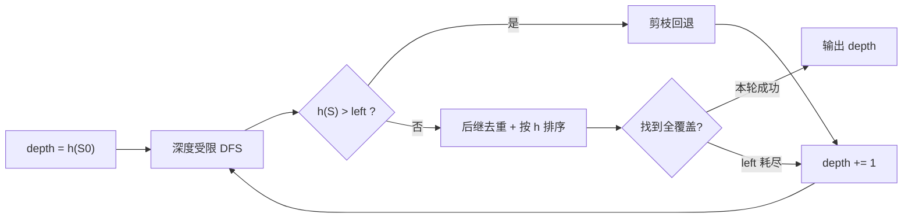

[[TOC]]

## 形式化题目

给定一个 $N \times N$ 的网格（$2 \leqslant N \leqslant 8$），每个格子有一种颜色，颜色是 $0 \sim 5$ 中的整数。定义两个格子连通，当且仅当它们有公共边且颜色相同。

每一步操作：选定一种颜色 $c$，把所有与左上角连通的格子（包括左上角本身）都改成颜色 $c$。

求最少多少步操作后，所有格子的颜色相同。

多组数据（不超过 20 组），$N = 0$ 表示输入结束。

**样例解释**：第一个样例 $2\times 2$ 全是颜色 0，天然同色，答案 0；第二个样例 $3\times 3$ 如下（`*` 表示当前与左上角连通的区域，初始只有左上角自己）：

| 初始 | 选颜色 1 后 | 选颜色 2 后 | 选颜色 1 后 |
| --- | --- | --- | --- |
| `*12` | `**2` | `***` | `***` |
| `112` | `**2` | `***` | `***` |
| `221` | `221` | `**1` | `***` |

第一步把左上角染成 1，吞并了左列和上中的两个 1；第二步染成 2，吞并右边一列的 2；第三步染成 1，吞并剩下的 1。三步是最少的，所以答案为 3。

## 暴力解法

### 思路

把游戏过程看成一个最短路问题：状态是当前"与左上角连通的格子集合" $S$，每个状态有 6 条出边（选 6 种颜色），从初始状态 $S_0$ 出发做 BFS，第一次到达"覆盖全图"的状态时的层数就是答案。

这里有一个关键的抽象：**连通块内部的颜色不重要**。因为无论连通块是什么颜色，下一步能吞并谁都只取决于 $S$ 的形状和 $S$ 外部邻居的颜色；染色时整个连通块会被统一改成新颜色。所以状态可以只用格子集合表示，$N \leqslant 8$ 时一个 64 位整数就能编码。

但这个朴素 BFS 走不远：$S$ 的可能形态是"包含左上角的任意连通格集"，数量随 $N$ 指数级增长；搜索深度可达 15 步以上，每层 6 个分支，BFS 需要把整层状态都存进队列，内存和时间同时爆炸。

### 代码

<!-- 暴力 BFS 只作为推导台阶，状态规模过大无法在本题约束内跑完，不单独给出代码。 -->

### 复杂度

状态数为指数级，深度 $d$ 时内存 $O(6^d)$，在 $N = 8$、答案可达 16 的数据下不可行。

### 瓶颈

- **内存瓶颈**：BFS 必须存储整层状态，状态总量指数级。
- **无效搜索**：大量分支明显不可能在剩余步数内完成，朴素 BFS/DFS 对此毫无察觉。

## 正解

### 思路

两个瓶颈分别指向两个经典武器：**迭代加深搜索（IDDFS）** 把内存从"存整层"降到"存一条 DFS 路径"；**A\* 估价剪枝** 排掉明显无望的分支。两者结合就是 IDA*。

**第一步：找一个可采纳的估价函数。** 注意每一步操作后，新并入连通块的格子颜色全部相同（都等于所选颜色）。因此每一步至多把棋盘上"尚未被吞并的某种颜色"全部消灭掉一种——反过来说，如果棋盘上还有 $k$ 种颜色出现在连通块之外，那么至少还需要 $k$ 步。于是定义

$$h(S) = \text{集合 } S \text{ 之外出现的颜色种数}$$

它永远不会高估真实剩余步数（可采纳性），这正是 IDA* 需要的估价函数。

**第二步：IDA* 框架。** 最优解不会小于 $h(S_0)$，所以从 `depth = h(S_0)` 开始，每轮做深度受限 DFS：若当前 $h(S) > left$（剩余允许步数）直接回退；`left` 耗尽还没覆盖全图就回退。某轮成功时的 `depth` 就是最少步数；失败则 `depth += 1` 再来。迭代加深保证了第一个被找到的可行深度就是最优深度。

**第三步：两个工程优化。**

1. **同层去重**：同一状态下选不同颜色可能得到相同的 $S$（例如两种颜色都只能吞到同一批格子），把后继放进集合去重，避免同一子树被搜多遍。
2. **分支排序**：按 $h(S‘)$ 从小到大尝试后继，优先走向"剩余颜色更少"的局面，让最优解尽早出现、剪枝尽早生效。

**实现要点**：格子按 $r \cdot N + c$ 编号，状态用位掩码表示；转移时收集紧贴 $S$ 边界的所选颜色格子作种子，沿同色格 BFS 扩张；6 种颜色各存一个全量掩码，`color_mask[c] & ~mask != 0` 即可 $O(1)$ 判断颜色 $c$ 是否还没被吞完。

### 代码

@include-code(./main.py, python)

### 复杂度

单次染色转移用 BFS 扩张，$O(N^2)$；估价函数 $O(6)$。IDA* 的最坏复杂度仍是指数级的（分支 6、深度 $\leqslant 16$），但估价剪枝 + 去重 + 排序让实际搜索树非常小，$N \leqslant 8$ 的数据跑得很快。DFS 只维护一条搜索路径，额外内存 $O(\text{depth})$，彻底消除 BFS 的内存瓶颈。

## 总结

- 核心抽象：连通块内部颜色不影响未来，状态 = 已吞并格子集合，可用 64 位位掩码编码。
- 下界：每步至多消灭一种剩余颜色，故 $h(S)$ = 剩余颜色种数是可采纳估价函数。
- 算法：IDA* 迭代加深，估价剪枝，后继去重 + 按 $h$ 排序；深度从 $h(S_0)$ 起递增，首个可行深度即答案。
- 朴素 BFS 的内存瓶颈由迭代加深消除，无效搜索由估价函数消除——这是"从暴力到正解"的完整推导链。

## 图示解析

### 搜索空间的剪枝效果

以样例 2 的 $3\times 3$ 棋盘为例，$S_0$ 只含左上角，$S$ 外出现颜色 $\{1, 2\}$，所以 $h(S_0) = 2$，IDA* 从 `depth = 2` 开始：

- `depth = 2`：任何第一步染色后 $h$ 至多是 1，若两步真能完成需要每步恰好消灭一种颜色；实际试遍所有分支（去重后）都失败——例如先染 2 只能吞到 `*22 / 112 / 221` 的右上角，剩两个 1 不相连无法一步消灭。
- `depth = 3`：按 $h$ 排序后先试染颜色 1，得到 `**2/**2/221`，此时 $h = 1$；再染 2、染 1 即完成，搜索在 3 步内命中。

可见估价函数把"先染 1"这种正确开局排到了最前，而 `depth = 2` 那一轮的失败又保证 3 就是最优解：既没有搜多余的最优深度以下的层，也没有在任何一层里漫无目的地枚举。
