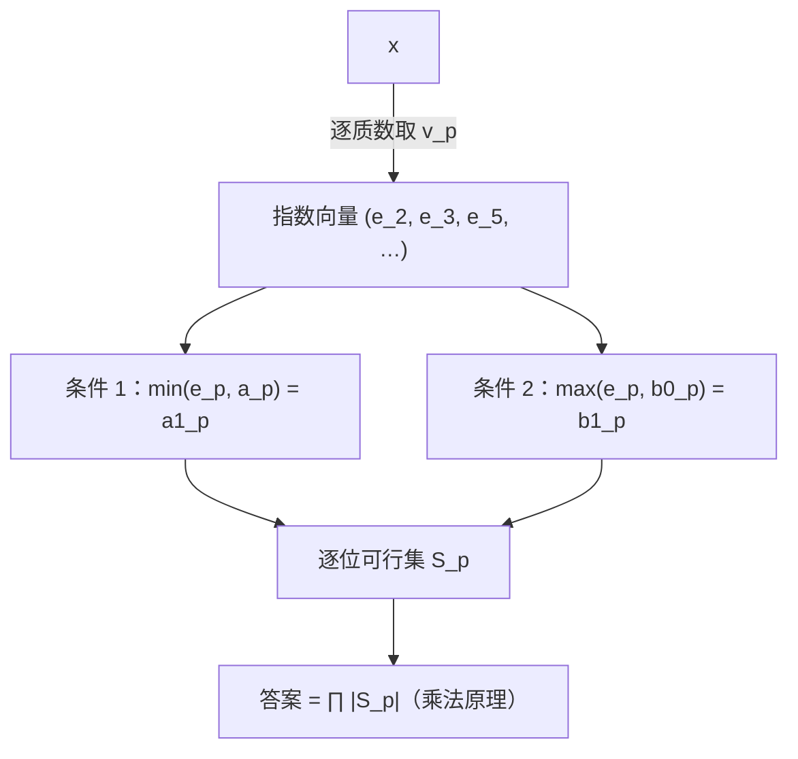

[[TOC]]

## 形式化题目

给定四个正整数 $a_0,a_1,b_0,b_1$（保证 $a_1\mid a_0$、$b_0\mid b_1$），求正整数 $x$ 的**个数**，使得

$$
\gcd(x,a_0)=a_1,\qquad \operatorname{lcm}(x,b_0)=b_1
$$

条件 2 直接给出 $x\mid b_1$，所以 $x$ 一定落在 $b_1$ 的约数集合内，而不是落在 $[1,b_1]$ 内。

样例 1 是 $a_0=41,a_1=1,b_0=96,b_1=288$，答案为 $6$；样例 2 是
$a_0=95,a_1=1,b_0=37,b_1=1776$，答案为 $2$。两个样例的答案都不大，说明合法 $x$ 是稀有事件，
而要找的是「有多少个」而不是「有哪些」——这提示我们从计数结构而不是从枚举取值入手。

## 正解

### 思路

**先想最直接的做法。** 既然 $x\mid b_1$，就枚举 $b_1$ 的每个约数 $d$，检验
$\gcd(d,a_0)=a_1$ 与 $\operatorname{lcm}(d,b_0)=b_1$ 是否同时成立，答案就是满足条件的 $d$ 的个数。

这个做法绝对正确，但**瓶颈在「枚举约数」这一步**：题目有 $n\leqslant 2000$ 组询问，
四个数都不超过 $2\times10^9$，对 $b_1\leqslant 2\times10^9$ 试除求约数需要
$O(\sqrt{b_1})\approx 4.5\times10^4$ 次循环，$n=2000$ 组就是 $9\times10^7$ 次，Python 里跑不动。
更重要的是，它冤枉地枚举了 $x$ 的**取值**，而 gcd / lcm 条件其实只在**质因数分解**的层面说话。

**换成枚举「指数」。** 记 $v_p(y)$ 为 $y$ 中质数 $p$ 的指数，$e_p=v_p(x)$。由 $\gcd$ 与
$\operatorname{lcm}$ 的质因数分解定义：

$$v_p(\gcd(x,a_0))=\min(e_p,v_p(a_0)),\qquad v_p(\operatorname{lcm}(x,b_0))=\max(e_p,v_p(b_0))$$

于是两条条件拆成**逐质数位**的约束：对每个质数 $p$，

$$\min\bigl(e_p,v_p(a_0)\bigr)=v_p(a_1),\qquad \max\bigl(e_p,v_p(b_0)\bigr)=v_p(b_1)$$

因为正整数由它的全部质数位指数唯一确定，而每个 $p$ 位的约束只涉及 $e_p$，
所以**各位互不干扰**，总的方案数就是各位方案数的**乘积**：

$$\text{答案}=\prod_{p}\bigl|\{\,e_p:\ \min(e_p,a_p)=a_{1,p}\ \text{且}\ \max(e_p,b_{0,p})=b_{1,p}\,\}\bigr|$$

（下文在 $p$ 位内部把 $v_p(a_0),v_p(a_1),v_p(b_0),v_p(b_1)$ 简写成 $a,a_1',b_0',b_1'$。）

图展示题目的两条整体条件如何被拆开再合回去：上端把 $x$ 拆成指数向量，中间两个分支是同一
质数位上两条独立的约束，下端先算出该位的可行集 $S_p$，最后用乘法原理把各质数位的方案数相乘。
关键词是「**逐位独立**」：$p$ 位的约束只涉及 $e_p$，与其他位完全无关，这正是能把枚举约数
换成逐位计数的原因。

**每一位上到底有几种取法？** 由于题面保证 $a_1\mid a_0$、$b_0\mid b_1$，必有
$a_1'\leqslant a$、$b_0'\leqslant b_1'$，分别只有两种可能：

- 若 $a_1'<a$：$e<a$ 时 $\min=e$ 逼出 $e=a_1'$，$e\geqslant a$ 时 $\min=a\ne a_1'$，
  所以**只有 $e=a_1'$ 一个解**（单点约束）。若 $a_1'=a$：$\min(e,a)=a$ 等价于 $e\geqslant a$（单侧下界）。
- 若 $b_0'<b_1'$：$e>b_0'$ 时 $\max=e$ 逼出 $e=b_1'$，$e\leqslant b_0'$ 时 $\max=b_0'\ne b_1'$，
  所以**只有 $e=b_1'$ 一个解**（单点约束）。若 $b_0'=b_1'$：等价于 $e\leqslant b_1'$（单侧上界）。

两条约束取交，就得到这一位的取法数：

| $a_1'$ 与 $a$ | $b_0'$ 与 $b_1'$ | 条件 1 的解集 | 条件 2 的解集 | 交集大小 |
| --- | --- | --- | --- | --- |
| $a_1'<a$ | $b_0'<b_1'$ | $\{a_1'\}$ | $\{b_1'\}$ | $a_1'=b_1'$ 时为 $1$，否则 $0$ |
| $a_1'<a$ | $b_0'=b_1'$ | $\{a_1'\}$ | $[\,0,b_1'\,]$ | $a_1'\leqslant b_1'$ 时为 $1$，否则 $0$ |
| $a_1'=a$ | $b_0'<b_1'$ | $[\,a,+\infty)$ | $\{b_1'\}$ | $b_1'\geqslant a$ 时为 $1$，否则 $0$ |
| $a_1'=a$ | $b_0'=b_1'$ | $[\,a,+\infty)$ | $[\,0,b_1'\,]$ | $a\leqslant b_1'$ 时为 $b_1'-a+1$，否则 $0$ |

表的每一行是一种指数格局，第三四列是该行两个条件各自允许的 $e$ 集合，最后一列是区间求交后的
整数个数。**只有右下角一格能贡献大于 $1$ 的因子**，其余三格都是「有就 $1$、没有就 $0$」，
所以正确答案常常是 $0$、$1$ 或 $2$。右下角的 $b_1'-a+1$ 正是「这一段指数可以自由滑动」的体现，
它也是本题唯一需要真正数数的位置：例如 $a_0=a_1=1$、$b_0=b_1=2^3\cdot3^2=72$ 时，
$2$ 位给 $[0,3]$、$3$ 位给 $[0,2]$，两位各自都能滑动，答案就是 $4\times3=12$（枚举 $72$ 的
$12$ 个约数可逐个验证）——同一时刻**可以有多个质数位一起贡献大于 $1$ 的因子**，
这正是乘法原理在起作用。

代码把四格统一成区间求交：单点写成 $[\,x,x\,]$，单侧上界用哨兵 `UNBOUNDED = 10**9`
（任何真实指数都远小于它），最后返回 `max(0, high - low + 1)`。交集为空返回 $0$，
乘进总答案后整题即为 $0$，不需要额外的「无解」特判。

**用样例核对。** 样例 1 是 $a_0=41,a_1=1,b_0=96=2^5\cdot3,b_1=288=2^5\cdot3^2$：

| 质数 $p$ | $a$ | $a_1'$ | $b_0'$ | $b_1'$ | 可行 $e$ | 方案数 |
| --- | --- | --- | --- | --- | --- | --- |
| $2$ | $0$ | $0$ | $5$ | $5$ | $a_1'=a$ 给 $e\geqslant0$，$b_0'=b_1'$ 给 $e\leqslant5$，故 $[0,5]$ | $6$ |
| $3$ | $0$ | $0$ | $1$ | $2$ | $a_1'=a$ 给 $e\geqslant0$，$b_0'<b_1'$ 逼出 $e=2$，故只剩 $e=2$ | $1$ |
| $41$ | $1$ | $0$ | $0$ | $0$ | $a_1'<a$ 逼出 $e=0$，与 $e\leqslant0$ 相容 | $1$ |

乘积 $6\times1\times1=6$。把各位回代成 $x=2^{e}\cdot3^{2}$（$e\in[0,5]$）得到
$x\in\{9,18,36,72,144,288\}$，与枚举 $288$ 的约数结果一致——区间长度 $6$ 在这里直观地对应
「$2$ 的幂可以取 $0$ 到 $5$ 次」。样例 2（$a_0=95,a_1=1,b_0=37,b_1=1776$）同理：
$2,3$ 两位被逼成定点，$37$ 位给出 $[0,1]$，乘积 $2$，对应 $x\in\{48,1776\}$。

**实现上的两个细节。** 第一，试除只需用到 $\sqrt{2\times10^9}\approx44721$ 以内的质数，
预先筛一次表可把每组的取模次数从 $4.5\times10^4$ 压到最多 $4648$ 次；边除边缩小 $a_0,b_1$，
一旦 $p^2>\max(a_0,b_1)$ 就跳出，实际远快于这个上界。第二，试除结束后四个数剩下的部分都是
$1$ 或一个大质数（指数只能是 $0$ 或 $1$），把它们当作新的质数 $q$ 用同一个函数收尾即可，
不需要单独写分支。

### 代码

@include-code(./main.py, python)

### 复杂度

设 $V=2\times10^9$。预处理筛出 $\pi(\sqrt V)\approx4648$ 个质数，花费 $O(\sqrt V\log\log V)$ 时间与
$O(\sqrt V)$ 空间（只做一次）。单组询问在试除上界处跳出，最多检查 $\pi(\sqrt V)$ 个质数，
再加上 $O(\log V)$ 位的大质数收尾，时间 $O\bigl(\pi(\sqrt V)\bigr)$；总时间
$O\bigl(\pi(\sqrt V)\cdot n\bigr)$，$n=2000$ 时上界约 $9\times10^6$ 次取模。
这与标准 C++ 正解（试除到 $\sqrt{b_1}$ 分解质因数）同阶，实际还更省：实测 10 组真实数据
最大 $0.088$ 秒，构造的最坏情形（$n=2000$ 组 $a_0=1999999973$ 大质数）约 $0.52$ 秒。

## 总结

题目的两条 gcd / lcm 条件在质因数分解下会**逐位解耦**，每一位的合法指数只有「一个点」或
「一段区间」两种形态，答案就是各位区间长度之积。这样就把「枚举 $b_1$ 的全部约数」的
$O(\sqrt{b_1})$ 换成了对 $\sqrt{2\times10^9}$ 以内质数的试除，与 C++ 正解同阶而常数更小。
关键在于先由 $x\mid b_1$ 收窄范围，再**改变枚举对象**——不枚举 $x$ 的取值，而枚举 $x$ 的指数。
