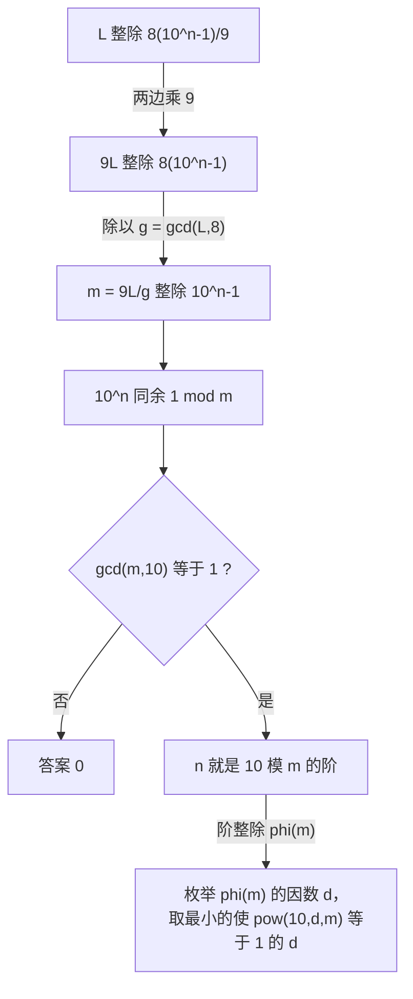

[[TOC]]

## 形式化题目

记 $R_n = \underbrace{88\cdots8}_{n\ \text{位}} = \dfrac{8(10^n-1)}{9}$。给定正整数 $L$，求最小的 $n \ge 1$ 使 $L \mid R_n$；若不存在这样的 $n$，答案为 $0$。

## 正解

### 思路

答案是位数 $n$，而 $n$ 可以极大：真实数据里 $L = 12984753$ 的答案是 $31920$；再试几个 $10^9$ 量级的 $L$，答案轻易升到 $10^8$ 量级（例如 $L = 1999999999$ 时是 $161290320$）。所以既不能逐位拼出 $88\cdots8$ 再取模，也不能把 $n$ 当成搜索变量去试。必须把"最小 $n$"一次算出来。

**第一步：把 $R_n$ 写成闭式。** $n$ 位全 8 数就是 $\dfrac{8(10^n-1)}{9}$，于是

$$
L \mid \frac{8(10^n-1)}{9} \iff 9L \mid 8(10^n-1).
$$

**第二步：约掉公共因子。** 令 $g = \gcd(9L, 8) = \gcd(L, 8)$，两边同除以 $g$，整除条件不变形为

$$
m \mid 10^n-1, \qquad m = \frac{9L}{g}.
$$

**第三步：认出这是"阶"。** $m \mid 10^n-1$ 就是 $10^n \equiv 1 \pmod m$。要求的"最小 $n$"正是 $10$ 模 $m$ 的乘法阶 $\operatorname{ord}_m(10)$。同余式有解当且仅当 $\gcd(10, m) = 1$：若 $m$ 含因子 $2$ 或 $5$，则 $10^n$ 与 $m$ 不互素，$10^n \equiv 1$ 永远不成立，此时输出 $0$。

**第四步：把候选集缩到 $\varphi(m)$ 的因数。** 欧拉定理给出 $10^{\varphi(m)} \equiv 1 \pmod m$；把"$a^k \equiv 1$ 的解集恰是阶的倍数集"这条性质用在 $k = \varphi(m)$ 上，就得到

$$
\operatorname{ord}_m(10) \mid \varphi(m).
$$

于是把 $m$ 试除分解一次算出 $\varphi(m)$，再把 $\varphi(m)$ 分解一次列出它的全部因数（升序），从小到大对每个因数 $d$ 做一次快速幂 `pow(10, d, m)`，第一个等于 $1$ 的 $d$ 就是答案。因数个数只有千级，全部验证也不过几千次模幂，而 $\sqrt{m}$ 的试除也只有 $1.3 \times 10^5$ 次循环。

下图是上面四步的等价变形链：

每个箭头都是一次可逆的等价变形，因此链尾的 $n$ 与题目要求的最小位数逐字对应；分岔点只有"$10$ 与 $m$ 是否互素"一处。

用真实数据里的几个用例核对每一步的数值：

| $L$ | $g=\gcd(L,8)$ | $m=9L/g$ | $\gcd(m,10)$ | $\varphi(m)$ | 最小可行 $d$ |
| --- | --- | --- | --- | --- | --- |
| $8$ | $8$ | $9$ | $1$ | $6$ | $d=1$ |
| $11$ | $1$ | $99$ | $1$ | $60$ | $d=2$ |
| $16$ | $8$ | $18$ | $2$ | 不计算 | 无解，输出 $0$ |
| $82$ | $2$ | $369$ | $1$ | $240$ | $d=5$ |
| $540$ | $4$ | $1215$ | $5$ | 不计算 | 无解，输出 $0$ |

表中三个有解用例的答案依次是 $1, 2, 5$：前两个就是题面样例 `8`、`11` 的输出，$5$ 与真实数据 `data/0.out` 中 $L=82$ 一行一致；剩下两行无解，对应样例里输出 $0$ 的 `16`。$L=82$ 那一行可以手工验证：$10^5 = 100000 = 271 \times 369 + 1$，而 $d=1,2,3,4$ 时 $10^d \bmod 369 = 10, 100, 262, 37$，都不为 $1$，所以 $5$ 就是阶。

### 代码

@include-code(./main.py, python)

`factorize` 做一次 $O(\sqrt{n})$ 的试除，$\varphi(m)$ 和 $m$ 的因数表都只在这份分解上做乘积与笛卡尔展开；`multiplicative_order` 里再对 $\varphi(m)$ 分解一次，然后把"升序因数 + `pow` 验证"压成一行 `next(...)`，升序由 `all_divisors` 末尾的 `sorted` 保证。

### 复杂度

单组测试的瓶颈是两次 $O(\sqrt{n})$ 的质因数分解：一次分解 $m = \dfrac{9L}{\gcd(L,8)} \le 1.8 \times 10^{10}$，约 $1.3 \times 10^5$ 次循环；一次分解 $\varphi(m) < m$，同量级。因数表由分解结果直接展开。随后对 $\varphi(m)$ 的每个因数做一次快速幂，共 $O(d(\varphi(m)) \log \varphi(m))$ 次模乘，因数个数为千级。总时间 $O(T\sqrt{L})$，空间 $O(d(\varphi(m)))$。与逐位模拟的 $O(\text{答案})$ 相比，把搜索量从 $10^8$ 量级降到了 $10^5$ 量级。

## 总结

题目问"多少个 $8$ 连起来能被 $L$ 整除"，直接逐位拼数会死在位数上。把它化成 $10^n \equiv 1 \pmod m$ 之后，"最小的 $n$" 就是 $10$ 模 $m$ 的乘法阶；再用阶整除 $\varphi(m)$ 这一性质把候选集压缩到 $\varphi(m)$ 的因数，配合快速幂，整个问题只需两次 $O(\sqrt{L})$ 量级的试除分解。两个易错点：约分时要用 $\gcd(9L,8)=\gcd(L,8)$ 而不是 $\gcd(L,9)$；判定无解要用 $\gcd(m,10)=1$，这正好覆盖了 $16$、$540$ 这类含因子 $2$ 或 $5$ 的用例。
